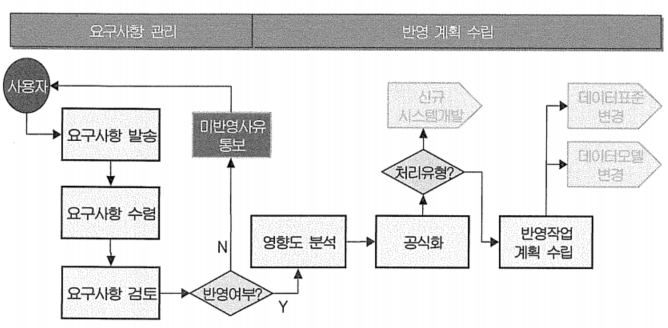

# 41 ~ 60

1. K대리는 그 동안 현장에서 영업을 하면서 불편했던 업무적인 보완사항과 신규 개발사항들을 이번 프로젝트를 통해서 시스템에 적용하고자 한다. 이러한 상황에서 프로젝트 팀에게 전달해야하는 문서로 가장 적합한 것은?
    1. 정보 분석서 → 대상이 되는 시스템을 분석한 후 결과를 정리한 문서
    2. *정보 요구 사항*
    3. 정보 목록 → 취합된 요구 사항을 목록화 한 것이나 어떤 프로그램을 목록화 한 것
    4. 정보 항목 분류표 → 정보 요구 사항에 포함된 항목을 분류한 것

2. A기업은 재무정보시스템 구축 프로젝트의 분석단계에서 사용자의 정보 요구 사항을 수집 및 정리하는 작업을 진행 중이다. 수집된 정보 요구 사항을 정리하는 과정에서 정보 요구 사항의 유형을 외부 인터페이스, 기능, 성능, 보안 등의 개선요건으로 구분하였다. 다음 중 정보 요구 사항 유형별 관리기준으로 부적절한 것은?
    1. 외부 인터페이스: 기존과 동일한 형태의 인터페이스 존재 여부
    2. ~~보안 개선: 측정이 불가능한 형태 판단 여부~~ → 성능 개선 요건에 대한 관리기준
    3. 기능 개선: 많은 사용자가 편리하게 사용할 수 있는 요건의 우선 적용 여부
    4. 성능 개선: 현행 기술 수준과 서비스 특성을 고려한 구현 가능 여부
    
    → 보안 개선 요건에 대한 관리 기준
    
    - 불가변성: 향후에 재 변경 되지 않도록 근본적인 개선 방안인지 여부
    - 실현 가능성: 현행 기술 수준과 서비스 특성을 고려하여 구현 가능 여부

3. K대리는 전사 자원관리 프로젝트를 위해 사내 부서들과 사전 협의를 통해 분석 단계의 주요 소스로 사용될 사용자 및 시스템 관점의 정보 요구 사항들을 수집하고 있다. 정보 요구사항의 소스 문서로 가장 부적합한 것은?
    1. 현행 시스템 분석서
    2. 현행 사용자 요구 사항 정리문서
    3. ~~현행 업무처리 매뉴얼~~
    4. 현행 시스템 개선과제 및 문제점 정리문서
    
    → 형행 업무 처리 매뉴얼은 세부 분석 단계에 있어서 개별 업무를 정확하게 이해하기 위해서는 꼭 필요한 문서이지만, 초기에 정보 요구 사항을 수립하기에는 세 가지 문서에 비해 부적절
    

4. 다음 정보 요구 사항 관리 프로세스의 요소들이다. 프로세스를 순서대로 바르게 나열한 것은?
    
    
    | 아래 |  |
    | --- | --- |
    | 가. 정보 요구 사항 검토 | 나. 영향도 분석 |
    | 다. 반영 작업 계획 수립 | 라. 정보 요구 사항 발송 |
    | 마. 정보 요구 사항 수렴 | 바. 공식화 |
    1. 라 - 마 - 가 - 나 - 다 - 바
    2. *라 - 마 - 가 - 나 - 바 - 다*
    3. 가 - 마 - 라 - 나 - 바 - 다
    4. 가 - 마 - 라 - 나 - 다 - 바
    
    
    
5. 다음 중 요구 사항을 명확하게 정의하고 개발하기 위해서 필수적으로 진행할 단계가 아닌 것은?
    1. 정보 요구 사항 상세화
    2. 정보 요구 사항 분석 및 정의
    3. 정보 요구 사항 검토 및 리뷰
    4. ~~정보 요구 사항 표준화~~

6. A기업의 H대리는 회계팀 P과장으로부터 현행 시스템의 불편사항을 해결해달라는 요건을 접수받았다. P과장의 불편사항 중 하나는 매일아침 당일의 B/S(재무제표) 실적을 조회하는데, 처리시간이 과다하게 소요되어 불편하다는 것이었다. 접수받은 요건을 분류하여 담당자에게 할당하려고 할 때, 분류 유형으로 적합한 것은?
    1. 보안 개선 요건
    2. *성능 개선 요건*
    3. 기능 개선 요건
    4. 외부 인터페이스 개선 요건
    
    → P과장에게 접수한 요건은 사용자 인터페이스 성능을 개선해 달라는 시스템의 성능에 관한 요건
    

7. 프로젝트 관리자인 K부장은 참여자로부터 새로운 요구 사항에 대한 의견과 아이디어도 얻고, 방향을 도출하고자 질문법(Questioning)으로 세션을 진행하기로 하였다. 다음 중 K가 선택할 수 있는 질문법의 종류로 거리가 먼 것은?
    1. 타이-다운(Tie-down) 질문법 → 어떤 사항에 대한 승인이나 동의, 사고, 현안점검 등에 대한 반응을 조사하는 질문
    2. 대안 진보(Alternate Advance) 질문법 → 선택사항을 제시하고 어떤 사실을 확인하는데 사용되는 질문
    3. 포커핀 또는 부메랑(Porcupine or Boomerang) 질문법 → 대안의 그래프가 포커핀과 유사하여 이름지어진 질문법이며, 부메랑은 어떤 질문에 대하여 질문으로 응답하는 방식
    4. ~~노미날 그룹(Nominal Group Technique) 질문법~~ → 정보수집법의 일종

8. 사용자의 정보 요구 사항을 수집하는 방법으로 관련 문서 조사, 업무조사서 작성, 사용자면담 실시, 워크숍 수행, 설문조사 등 여러 가지 방법이 있다. 다음 중 워크숍 수행의 목적으로 부적당한 것은?
    1. ~~정보시스템에 대한 관리 수준, 문제점, 현안 등을 파악한다.~~ → 전산 부서 면담 수행 목적
    2. 경영층 또는 현업 부서장의 공통된 의견을 도출한다.
    3. 유사업무 또는 관련업무를 수행하는 부서에 대한 면담비용을 절감한다.
    4. 전문가들의 판단력을 이용하여 최적의 결론을 도출한다.
    
    → 사용자 면담은 크게 경영층 면담, 현업부서 면담, 전산부서 면담으로 구성되며, 각 이해관계자별로 조사내용 및 수행 목적도 상이함
    

9. 기획부서로부터 ‘월별 영업점 상품 실적’ 화면에 대한 수정·보완 의뢰서를 접수하였다. 이를 반영하기 위해 어떤 영향이 있는지 전체적으로 영향도 분석 및 조사를 실시하기에 가장 적합한 사람은?
    1. 요구 사항을 요청한 사람
    2. *전사 관점의 데이터아키텍처 담당자*
    3. 요구 사항을 개발하는 담당자
    4. 담당 부서의 관리자
    
    → 전체적인 프로그램이나 데이터베이스 관리요소에 대한 이해를 하고 있고, 표준 절차에 따라 수행이 가능한 데이터아키텍처 담당자가 가장 적합
    

10. K기업은 지난해 수립된 ‘정보시스템 중장기 발전방안 마스터 플랜(Master Plan)’에 따라 금년 상반기부터 구매시스템을 신규로 구축하고자 한다. 이에 전산기획부서 및 구매부서에서는 전산시스템 개발에 필요한 서류와 문서들을 수집·정리하고 있다. 다음 중 구매시스템을 신규로 구축하기 위하여 수집하고 있는 문서로 가장 비효율적인 것은?
    1. 현행 시스템 데이터 모델(ERD)
    2. 현행 시스템 문제점 및 개선사항
    3. ~~현행 시스템 전산출력 의뢰서~~ → 전산 처리 의뢰서
    4. 신규 시스템에 대한 구매부서 요구 사항 정의서
    
    → 현 구매시스템에 대부분 반영이 되어 있겠지만 사안이 커서 현재 반영 중인 것과 아직 미반영된 것들이 있을 수 있기 때문에 필요하다면 전산 처리 의뢰서를 수집
    

11. 팀 및 개인의 역할과 책임을 기술해 제출하라는 프로젝트 관리자의 지시사항이 있었다. 데이터아키텍처 담당자인 Y는 본인의 역할을 정리하는 과정에서 데이터베이스 관리자(DBA)와의 역할과 혼동하고 있다. 다음 중 Y가 수행할 역할로 부적합한 것은?
    1. 변경 및 신규개발 요건에 대한 검토
    2. 요청 사항 내용 중 미결 사항에 대한 검토
    3. ~~개발요건에 대한 테스트 및 검증~~ → 요구 사항을 직접 개발하는 담당자나 개발자의 역할
    4. 데이터에 대한 표준제시 및 검토

12. 프로젝트 분석 단계 초기에 업무요건이나 업무절차의 조사방법 중에는 면담 기법이 있다. 각 면담을 진행하기 위해 2명 이상으로 면담 진행팀을 구성하고자 할 때, 다음 중 면담 대상자와 면담 진행팀의 역할에 대한 설명으로 틀린 것은?
    1. 면담 대상자: 업무에 대해서 면담자에게 명확하고 이해하기 쉽게 설명해 주어야 한다.
    2. 기록자: 면담 종료 시에 기록 내용 중에 주요 사항을 확인한다.
    3. ~~면담자: 면담의 취지를 설명하고 면담 주제의 범위에서 이탈 시에는 주의를 환기시킨다.~~ → 관찰자의 역할
    4. 관찰자: 수행 의도대로 면담진행 여부 및 최종적 면담종료에 대해 판단한다.

13. 새로운 방법으로 창구직원에 대한 활동원가를 집계하고자 기준을 제시하였으나, 기준에 따라 이해당자사의 득실에 차이가 많아 결론을 내리지 못하였다. 효율적으로 결론을 도출할 수 있는 기법으로 적합한 것은?
    1. *워크샵 기법*
    2. 사용자 면담 기법
    3. 브레인 스토밍 기법
    4. 업무 메뉴얼 조사 기법
    
    → 이해당사자 및 부서가 있는 경우에는 워크샵이 정해진 장소에서 같은 주제를 가지고 부서간에 심도있게 토의할 수 있어서 다른 조사 기법보다  효과적
    
14. 다음 중 면담팀 구성 단계에 있어서 반드시 고려해야 할 내용이 아닌 것은?
    1. 면담팀은 가능하다면 2~3인으로 구성하도록 한다.
    2. 면담 팀원간 역할을 구분하도록 한다.
    3. 면담 기록자나 관찰자는 사전에 업무를 습득하도록 한다.
    4. ~~프로젝트 후원자의 추천을 받아 선별하도록 한다.~~ → 면담 대상자 선별시
    
    → 면담팀은 프로젝트 수행팀이기 때문에 관리자나 후원자의 추천을 받아 선별할 필요가 없음
    

15. ‘New Feature’ 프로젝트를 통해 A기업의 경영환경을 정리한 후 경영전략을 체계적으로 정리하고, 현재 적용하고 있는 정보기술, 전산장비, 정보시스템, 데이터저장소 등의 현황을 조사하고, 활용도를 평가하기로 하였다. 다음 중 이를 위한 조사기법으로 부적합한 것은?
    1. 경쟁환경 분석
    2. SWOT 분석
    3. RAEW 분석
    4. Activity 분석 → 기업차원의 데이터 모델을 도출하는 방법
    
    → 기업의 경영환경을 분석하고 정리하기 위해서는 처해있는 시장환경, 경쟁자, 강점과 약점, 위협과 기회 등을 정확하게 조사해야 함
    

16. 수집된 사용자 정보 요구 사항에 대해 우선순위를 부여하고, 부여된 우선순위에 맞게 절차적으로 진행되기 위해서 적용할 수 있는 기법이 있다. 이 중 화폐가치 산출법에 대한 설명으로 틀린 것은?
    1. ~~정보 요구 사항 간의 상호 관련성을 평가하여 1점부터 3점까지 점수를 부여한다.~~
    2. 시스템 차원의 중요성을 평가하여 1점부터 3점까지 점수를 부여한다.
    3. 기업 차원의 중요성을 평가하여 1점부터 3점까지 점수를 부여한다.
    4. 3가지 점수를 곱하여 총점 대비 각각의 정보 요구 사항 가치를 백분율(%)로 환산한다.
    
    → 화폐가치 산출법을 적용할 때는 각각의 정보 요구 사항이 다른 정보 요구 사항에 영향도를 평가하여 1점부터 5점까지의 점수를 부여
    

17. 현업의 정보 요구 사항 파악을 위해 사용자 면담이 계획되어 있다. 다음 중 현업 내 사용자 면담 대상자를 선발하는 방법으로 가장 적합한 것은?
    1. *업무에 대해 명확하게 설명할 수 있는 사람으로 선발한다.*
    2. 면담은 통상적으로 2인으로 구성하여 면담 기록에 누락이 없도록 한다.
    3. 현업의 관련 분야에 정통한 전문가를 집중적으로 선발한다.
    4. 면담에 대한 부담을 줄이기 위하여 면담 진행자와 안면이 있는 사람으로 구성한다.
    
    → 업무에 대한 전체적인 이해가 있고 이를 통해 문제점이나 요구 사항을 도출할 수 있는 사용자를 면담 대상자로 선정하는 것이 가장 효율적
    

18. L컨설턴트는 고객관계관리(CRM) 시스템을 구축하기 위해 정보 요구 사항을 수집하고자 해당 은행 마케팅 담당자와 면담을 수행하기로 했다. 다음 중 면담 수행시 고려해야 할 사항으로 가장 부적합한 것은?
    1. 면담 내용에 대하여 문서화 작업을 수행한다.
    2. ~~전문가 의견을 토대로 결과를 작성한다.~~
    3. 면담 대상자의 업무 범위를 준수한다.
    4. 면담 시간을 준수한다.
    
    → 정보 요구 사항 수집 기법 중에 면담을 수행할 때 고려사항: 면담시간준수, 비밀보장, 기대수준 설정, 면담 범위 준수, 적절한 대상자 선정, 질문에 대한 응답 유도, 면담 내용 문서화, 잘못된 선입견의 배제 등
    
    → 면담 결과 작성은 전문가의 의견을 이용하기 보다는 면담자와 추가적이 의견을 나누고 이를 공유해서 대안을 작성하는 것이 효율적
    

19. A기업은 ‘신규대출처리’에 대한 기능정의와 하부 프로세스를 분해하여 논리적으로 계층화 하고자 한다. 다음 중 분석 기법으로 가장 부적합한 것은?
    1. 가치사슬 분석
    2. 전문성에 의한 분석
    3. 생명주기에 의한 분석
    4. ~~본원적 분석~~
    
    → 가치사슬 분석, 전문성에 의한 분해, 생명주기에 의한 분해 등은 모두 기업의 활동을 본원적활동과 지원활동으로 분류하고 체계화하기 위한 기법
    

20. H대리는 고객사의 경영기획부서 사용자들과 인터뷰를 진행해야 한다. 사용자 인터뷰를 준비하는 단계마다 많은 주의사항과 고려사항들이 있으나 면담팀의 구성여부에 따라 면담의 성패가 좌우될 수 있다. 다음 중 H대리가 면담팀 구성 단계에서 반드시 고려해야 할 내용이 아닌 것은?
    1. 사용자 부서를 위한 면담팀은 가능하다면 2~3인으로 구성한다.
    2. 면담을 원활하게 하고 내용을 누락없이 기술하기 위해서 팀원 간의 역할을 구분한다.
    3. 면담 기록자나 관찰자는 경영기획부서의 업무를 사전 습득해야 한다.
    4. ~~프로젝트 후원자나 관리자의 추천을 받아 선별하도록 한다.~~
    
    → 후원자나 관리자의 추천이 필요한 것은 면담 대상자를 선별하는 시기