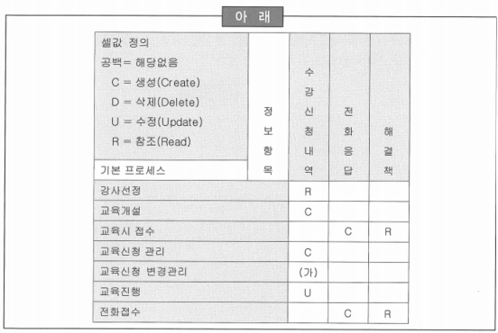

# 61 ~ 75

1. 수집, 정리된 정보 요구사항에 대하여 시스템 차원의 중요성을 평가하여 점수를 부여하고, 각 점수의 합을 통해 정보가치의 퍼센트를 산정하였다. 이러한 정보 요구 사항의 우선순위를 분석하는 방법으로 옳은 것은?
    1. *화폐가치 산출방법*
    2. 정보 요구 매트릭스 분석방법 → 정보 요구의 도출이 정확히 되었는지 검증하는 기법
    3. CRUD 분석방법 → 정보 요구의 도출이 정확히 되었는지 검증하는 기법
    4. 상대적 중요도 산정방법 → 부여된 가중치를 이용하여 중요도를 산정하는 방법

2. 프로젝트 관리자인 L부장은 본사의 지원(Staff)부서, 지방 및 지점부서 등으로부터 많은 사용자 요구 사항을 접수했다. 이에 L부장은 각 요구사항이 목적을 지원하면 5점, 목표를 지원하면 4점, 전략을 지원하면 3점 등으로 표현되는 매트릭스를 작성하여 개별적인 가중치를 부여하고, 가중 평균을 이용하여 개별 요구 사항에 대한 중요도를 산출한 후에 우선 순위를 부여했다. L부장이 사용한 우선순위 분석방법으로 적합한 것은?
    1. *상대적 중요도 산정 방법*
    2. 요구 사항 가치평가 방법
    3. 화폐가치 산출 방법
    4. 우선순위 중요도 분류 방법
    
    → 화폐가치 산출법과 상대적 중요도 산정법이 이론적으로 정리되어 있으나, 실제 프로젝트에서는 프로젝트 특성을 감안하여 몇가지 변수를 고려하여 적용
    

3. K대리는 업무영역/현행시스템 매트릭스 기법을 이용하여 분석대상 현행시스템을 정의한 후에 해당 현행시스템 관련 문서를 수집하였다. 다음 중 필요한 문서들을 빠짐없이 수집하였는지 평가하기 위해 K대리가 검토하는 기준으로 부적합한 것은?
    1. 유용성: 수집된 문서가 활용가능한지 검토한다.
    2. 완전성: 문서의 내용에 누락된 부분이 없는지 검토한다.
    3. 정확성: 문서의 내용이 현재 시스템과 일치하는지 검토한다.
    4. ~~확장성: 문서가 최신의 내용을 반영하고 있는지 검토한다~~. → 확장성이 아니라 유효성에 대한 내용

4. H대리는 현행 업무 분석 대상을 정의하기 위해서 업무영역 선정 작업과 현행 시스템 선정 작업을 진행하였다. 매트릭스 기법을 이용하여 업무영역 1현행시스템 매트릭스를 분석하기에 앞서 관련 시스템에서 문서들을 빠짐없이 수집했는지 평가하기 위해 H대리가 검토해야 하는 기준이 아닌 것은?
    1. 유용성
    2. 완전성
    3. 정확성
    4. ~~적시성~~ → 검토 기준이 아님
    
    → 최신 버전으로 문서가 현재 시스템과 일치하는지에 대한 유효성 검토가 필요함
    

5. 프로세스 계층도를 도식화 하는 이유는 정보 요구 사항을 상세화하기 위한 기본 단계로 단위업무 기능별로 기본 프로세스를 도출하기 위함이다. 다음 중 프로세스 계층도의 모듈성이 확보되기 위한 분해 기준으로 적합한 것은?
    1. *응집도가 높을수록, 결합도가 낮을수록*
    2. 응집도가 낮을수록, 결합도가 높을수록
    3. 응집도가 높을수록, 결합도가 낮을수록
    4. 응집도가 낮을수록, 결합도가 낮을수록
    
    → 응집도(Cohension): 하나의 프로세스가 해당 업무 고유의 기능을 효과적으로 처리할 수 있는지에 대한 정도
    
    → 결합도(Coupling): 하나의 프로세스가 다른 계층의 업무 활동과의 연관되어 있는지를 나타내는 정도
    
    → 프로세스 계층도는 응집도가 높고 결합도가 낮을수록 분석의 복잡도 및 모호성이 감소됨
    

6. 프로세스는 실제 업무가 수행되는 행위로써 입력과 출력을 가지며 내부 로직(Logic)을 수행한다. 따라서, 프로세스를 정확하게 분석하는 일은 사용자 업무를 이해하는 첫걸음이 된다. 다음 중 프로세스 관점에서 정보 요구를 상세화하는 작업 내용으로 부적합한 것은?
    1. 프로세스별로 정보 항목의 통합성 및 분리성 여부를 검토한다.
    2. 프로세스별로 정보 항목을 도출하고 표준화 한다.
    3. ~~프로세스별로 CRUD 분석을 실시한다.~~
    4. 프로세스 분해 및 상세화 작업을 수행한다.

7. 다음 중 정보 요구 사항 상세화 방법 중 객체지향 관점에서 사용자와 의사소통을 원활하게 도와주고, 시스템과 사용자간의 관계흐름을 표현하여 요구 사항을 쉽게 파악할 수 있는 방법으로 적합한 것은?
    1. 정보 요구 사항 맵
    2. *유즈케이스 다이어그램*
    3. 클래스
    4. 액터

8. 다음 중 요구 사항 분석가가 상관분석을 수행할 경우에 나타나는 현상으로 옳은 것은?
    1. 상관분석 수행에 있어 가장 중요한 요소인 객관성을 확보할 수 있다.
    2. 프로젝트 내부 인력의 적극적인 참여와 지원이 필요하다.
    3. 상관분석 수행에 필요한 업무 파악의 한계점이 존재한다.
    4. *정보 요구 사항과 관련된 업무팀과 의사소통이 원활하므로 프로젝트를 인력 변동 없이 원활하게 수행할 수 있다.*
    
    → 1, 2, 3번은 품질보증팀(또는 외부감리)에 의해 상관분석이 수행될 경우에 장, 단점에 해당
    

9. 사용자와 의사소통이 원활하게 되도록 도움을 주는 유즈케이스 다이어그램 분석기법의 필수적 구성요소로 거리가 먼 것은?
    1. 액터(Actor)
    2. 유즈케이스(Usecase)
    3. 유즈케이스 관계
    4. ~~시스템 경계~~
    
    → 유즈케이스 다이어그램의 구성요소: 액터(Actor), 유즈케이스(Usecase), 유즈케이스 관계
    

10. H대리는 약 3개월간 진행된 분석단계에서 사용자의 요구 사항들이 잘 반영되었는지 확인하기 위해 1박 2일로 사용자가 포함된 상태에서 검토회의를 진행할 예정이다. 현재 회의 계획서를 작성하던 중 사용자는 자신의 요구 사항이 잘 반영되었는지, 분석/설계자는 사용자의 요구 사항을 잘 이해하여 처리하였는지를 검토할 수 있는 재검토 기준을 도출하였다. 다음 중 재검토 기준에 포함되지 않는 것은?
    1. 사용자의 정보 요구 사항의 누락 여부에 대한 검토 기준 → 완전성
    2. 사용자의 정보 요구 사항이 정확성 검토 기준 → 정확성
    3. 사용자의 정보 요구 사항에 따른 영향도 파악에 대한 검토 기준 → 안정성
    4. ~~사용자의 정보 요구 사항에 대한 주도성 검토 기준~~
    
    → 분석대상 결과 산출물에 대한 리뷰 기준: 완전성, 정확성, 일관성, 안정성
    
    → 일관성: 표준화 준수여부 확인
    

11. K과장은 약 1.5개월간의 분석공정을 거쳐 H대리의 정보 요구 사항을 반영하였는데 요구 사항이 정확하게 반영 되었는지 시스템 및 산출물에 대한 리뷰를 실시하고자 한다. 다음 중 산출물별 체크리스트 기준에 일반적으로 포함되지 않는 것은?
    1. 일관성 → 표준화 준수여부 확인
    2. ~~주관성~~
    3. 정확성 → 사용자의 정보 요구 사항이 정확히 표현되었는지의 여부
    4. 완전성 → 사용자의 정보 요구 사항이 누락됨이 없이 모두 정의되었는지 확인
    
    → 분석대상 결과 산출물에 대한 리뷰 기준: 완전성, 정확성, 일관성, 안정성
    
    → 안전성: 추가 정보 요구 사항 변경에 따른 영향도 파악
    

12. 일반적으로 정의된 정보 요구 사항은 정보항목/애플리케이션 상관분석, 정보항목/업무기능 상관분석, 정보항목/조직 상관분석 등의 기법으로 수집된 사용자 정보 요구 사항이 적절하게 반영되었는지를 검증한다. 다음 중 상관분석 기법의 설명으로 틀린 것은?
    1. CRUD 매트릭스 분석 수행 과정에서 기본 프로세스가 사용하는 정보항목에서 복수의 액션이 발생하는 경우에는 C > D > U > R의 우선순위에 따라 기술한다.
    2. 모든 정보항목이 모든 기본 프로세스에서 사용되는지 혹은 기본 프로세스가 모든 정보항목을 사용하고 있는지를 확인한다.
    3. 업무기능/조직 대 정보항목의 상관분석에서 정보항목의 생성, 수정, 삭제 등을 ‘C(Create, Change)’로 표시한다.
    4. 업무기능/조직 대 정보항목의 상관분석에서 정보항목 값의 변경 없이 검색만 하는 경우에는 ‘R(Read)’로 표시한다. → ‘U(Use)’로 표시

13. 다음 중 사용자의 정보 요구 사항이 완전하게 도출 되었는지를 검증하기 위해서 ‘정보 요구 사항 대 애플리케이션 상관분석’ 기법을 이용하고자 할 때, 가장 적합한 것은?
    1. *CRUD 매트릭스 분석기법*
    2. RAEW 매트릭스 분석기법
    3. 변환 매트릭스 분석기법
    4. 요구 사항 추적 매트릭스 분석기법
    
    → 정보 요구 사항과 기본 프로세스의 상호 연관 관계를 C, R, U, D로 나타내는 CRUD 매트릭스를 통해 정보 요구 도출의 완전성을 검증
    

14. 아래 정보항목/애플리케이션 CRUD 매트릭스의 정보항목 중에서 교과목, 담당교수, 교육시간, 교육장소, 수강일자 등을 관리하는 수강신청내역은 교육신청관리 프로세스에 의해 등록되며 교육신청변경관리 프로세스는 등록된 수강신청내역을 검색 후 변경사항을 처리하거나 재등록하기 위하여 등록된 내역을 취소한다는 가정하에 (가)로 표시된 셀의 내용으로 가장 적합한 것은?
    
    
    
    1. R(Read)
    2. U(Update)
    3. *D(Delete)*
    4. C(Create)
    
    → ‘교육신청 변경관리’에서 가능한 액션은 U(Update),  D(Delete), R(Read)이며, C > D > U > R 순으로 우선순위를 고려하면 D가 올바름
    

15. CRUD 매트릭스 분석을 실시할 때 하나의 정보 항목에 대하여 여러 개의 프로세스 액션이 발생할 경우가 있다. 이런 경우 CRUD의 셀값 입력 우선순위로 가장 적절한 것은?
    1. C > D > R > U
    2. C > R > U > D
    3. *C > D > U > R*
    4. C > U > R > D
    
    → 매트릭스의 각 셀에는 기본 프로세스가 사용하는 정보항목에 대한 액션이 생성(C), 조회(R), 수정(U), 삭제(D)로 표현됨
    
    → 복수의 액션이 발생할 경우에는 C > D > U > R의 우선순위에 따라 하나만을 기록하도록 함