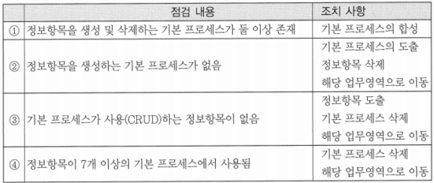
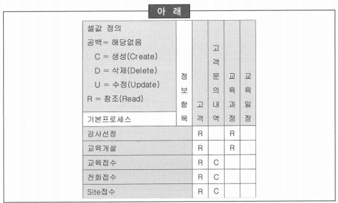
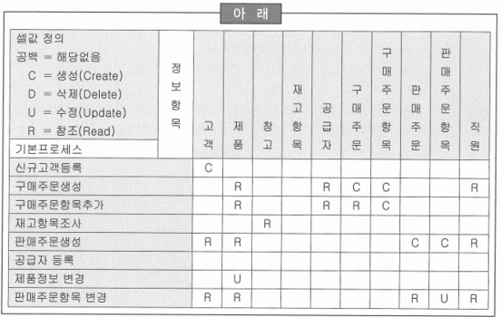
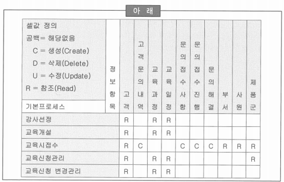
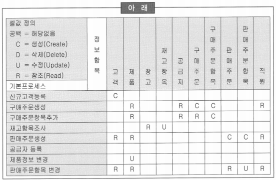

# 76 ~ 80

1. 다음 중 정보항목/애플리케이션 상관분석 매트릭스의 점검 내용과 조치사항에 대한 설명으로 부적절한 것은?
    
    
    
    → 4
    
    → 정보항목의 범위가 너무 크기 때문에 7개 이상의 기본 프로세스에서 사용되는 경우에는 정보 항목의 세분화가 필요함
    
2. 사용자 요구 사항을 애플리케이션과 상관분석한 결과 아래와 같이 도출되었다고 가정할 때, 다음 중 조치사항으로 가장 적절한 것은?
    
    
    
    1. ‘교육과정’을 생성하는 프로세스가 누락되었다.
    2. ‘교육접수’, ‘전화접수’, ‘Site접수’ 등은 프로세스를 통합한다.
    3. ‘고객문의내역’의 정보항목을 세분화 한다.
    4. *‘교육일정’은 삭제하거나 사용 프로세스를 도출한다.*
    
    → ‘교육일정’ 정보항목이 불필요하게 도출되었는지 아니면 사용하거나 생성하는 프로세스가 존재하는데 도출되지 않았는지를 검토해야 함
    

3. 정보 요구 사항을 애플리케이션과 상관분석한 결과가 아래 매트릭스와 같이 도출되었다고 가정할 때, 다음 중 분석 및 조치사항으로 가장 부적절한 것은?
    
    
    
    1. ‘공급자’, ‘직원’, ‘창고’ 등의 정보항목을 생성하는 프로세스가 누락되었다.
    2. ‘판매주문항목’은 생성 및 변경 프로세스만 존재하고 사용 프로세스를 도출한다.
    3. ‘구매주문항목’은 기본 프로세스의 중복에 해당하므로 통합해야 한다.
    4. ~~‘재고항목’을 생성하는 프로세스가 누락되었다.~~
    
    → 재고항목이 불필요하게 도출되었는지 아니면 사용하거나 생성하는 프로세스가 존재하는데 정보항목이 누락되었는지를 검토해야 함
    

4. 분석결과 아래와 같이 ‘문의접수사항’, ‘문의접수진행’, ‘문의해결’에서 문제가 발견되었다. 다음 중 3가지 정보항목에 대한 조치사항으로 가장 적절한 것은?
    
    
    
    1. *참조하는 신규 프로세스의 도출이 필요하다.*
    2. 3개의 정보항목을 통합한다.
    3. 기본프로세스가 분석대상 업무영역에 속하지 않는다.
    4. 정보항목이 지나치게 크므로 정보항목의 세분화가 필요하다.
    
    → ‘문의접수사항’, ‘문의접수진행’, ‘문의해결’ 항목은 정보항목이 생성만 되고 사용되는 곳이 없으므로 기본 프로세스가 누락되어 신규 프로세스의 도출이 필요한지 검토
    

5. 아래 매트릭스의 분석결과 창고, 공급자, 직원 등의 정보항목에서 문제가 발견되었다. 다음 중 문제가 발생한 3가지 정보항목에 대한 조치사항으로 부적합한 것은?
    
    
    
    1. 생성하는 기본프로세스의 도출이 필요하다.
    2. 불필요한 정보에 해당할 수 있으므로 정보항목 삭제 여부를 검토한다.
    3. 분석 대상의 업무영역 범위 외에 해당하므로 해당 업무영역으로 이동한다.
    4. ~~기본 프로세스의 통합 여부를 고려한다.~~
    
    → 정보항목을 생성하는 기본 프로세스가 없는 경우에는 기본 프로세스의 도출, 정보항목 삭제, 해당 업무영역으로 이동 등의 조치사항이 존재함