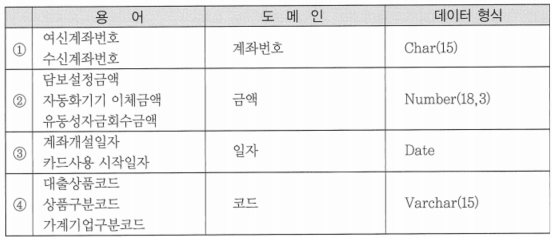
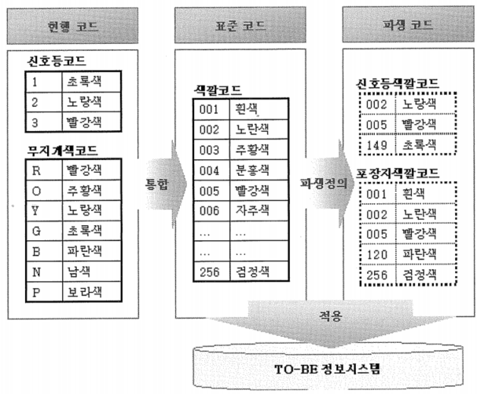

# 101 ~ 120

1. 프로젝트 수행 계획서에 의해 내년 1/4분기에 프로젝트를 진행해야 한다. K 대리는 데이터 표준화 담당자로써 내년도 진행 예정인 프로젝트에 적용할 표준안을 신규로 정의하고자 할 때, 다음 중 필수 필요 절차가 아닌 것은?
    1. 데이터 표준화에 대한 요구 사항과 현행 문서를 수집한다.
    2. 수립된 데이터 표준화의 문제점을 도출한다.
    3. 데이터 표준을 정의하기 위한 원칙과 절차를 수립한다.
    4. ~~표준화 변경에 따른 프로그램 영향도를 파악한다.~~ → 이미 수립된 정의가 변경될 때 수행하는 절차

2. K과장은 팀원에게 표준 단어를 생성하기 위해 현행 용어들을 분석하여 업무적으로 의미를 갖고 사용되는 단어를 최소 단위의 언어로 분할하고 동음이의어에 대한 정련을 지시하였다. 그러나 팀원은 의미가 동일한 단어에 대한 정련기법을 잘 이해하지 못하고 있는 상태다. 다음 중 팀원이 단어 분할을 위해 이용해야 하는 정련기법으로 가장 적합한 것은?
    1. *한글명 및 영문명을 분석 후에 업무적으로 가장 대표적인 표준 단어를 선택한다.*
    2. 이음동의어의 경우에는 영문 약어를 기준으로 표준 단어를 선택한다.
    3. 동음이의어의 경우에는 활용빈도가 낮은 것을 표준 단어로 선택한다.
    4. 시스템에서 가장 많이 사용한 대표 속성을 표준 단어로 선택한다.
    
    → 이음동의어와 동음이의어 처리는 한글명과 영문명을 전체적으로 검토하게 하고 업무적인 관점에서 부담이 적은 단어를 표준 단어로 선택하도록 함
    

3. A부서에서는 신입사원을 대상으로 표준화에 대한 필요성과 개념, 그리고 구성요소에 대한 설명회를 가졌다. 다음 중 데이터의 표준의 구성요소에 대한 설명으로 부적절한 것은?
    1. 표준 용어는 업무적으로 사용하는 용어에 대한 표준을 정의한 것이다.
    2. 표준 단어는 표준 용어를 구성하는 단어에 대한 표준을 정의한 것이다.
    3. ~~표준 코드는 개별 업무시스템의 코드체계를 수립한 것을 의미한다.~~
    4. 표준 도메인은 칼럼에 대한 성질을 그룹핑한 것으로 형식에 대한 표준을 정의한 것이다.
    
    → 표준 코드는 전사에 산재된 코드를 취합하여 통합 과정을 거친 전사 표준 코드를 의미
    

4. B은행의 전사적 데이터에 대해 표준화 수립 작업을 진행하는 과정에서 각 정보시스템별로 사용되고 있는 현행 업무용어들을 수집하고, 이를 바탕으로 표준 용어를 생성하여 각 칼럼에 적용할 표준 도메인을 정의하였다. 다음의 정의된 표준 도메인 중 가장 비효율적인 것은?
    
    
    
    → 4
    
    → 코드 15자리를 도메인으로 정의하게 되면 칼럼 타입과 도메인 개수가 동일하게 되어서 관리 및 적용이 비효율적이 때문에, 대표성만 가지도록 도메인을 부여해야 함
    

5. 데이터 관리자(DA)는 현행 시스템에서 사용하는 수 많은 용어들을 분석하여 표준단어를 생성한 뒤, 별도의 리뷰 과정을 통해 표준 단어에 대한 정련을 진행하였다. 다음 중 리뷰 과정에서 별도의 의견 없이 통과된 표준 단어로 적합한 것은?
    1. 고객계좌번호 → 표준 용어
    2. 입력자사원번호
    3. 최종학력코드
    4. *주소*
    
    → 표준 단어: 가장 작은 최소 단위
    
    → 고객계좌번호를 표준 단어로 분리 시에는 고객, 계좌번호 등과 같이 분리
    

6. 기업에서 사용하는 코드의 표준화 수립은 정형화된 절차에 의해서 수행돼야 한다. 아래의 코드 표준화 요소들을 코드 표준화 순서에 맞게 바르게 나열한 것은?
    
    
    | 아래 |  |
    | --- | --- |
    | ㄱ. As-Is 코드와 To-Be 코드 매핑 | ㄴ. 현행 코드 관련 자료 수집 |
    | ㄷ. 코드도메인 분류 및 중복 제거 | ㄹ. 동일 의미 코드의 통합 |
    1. ㄴ - ㄱ - ㄹ - ㄷ
    2. ㄴ - ㄱ - ㄷ - ㄹ
    3. *ㄴ - ㄷ - ㄹ - ㄱ*
    4. ㄴ - ㄷ - ㄱ - ㄹ
    
    
    
    ㄴ.  현행 코드 관련 자료 수집
    
        - 현행 코드 목록 수집, 코드값 수집, 코드성 컬럼 파악
    
    ㄷ. 코드 도메인 분류 및 중복 제거
    
        - 코드를 유형별로 분류, 코드 유사성 코드 목록 추출 및 중복여부 체크, 유사코드 목록 작성 및 데이터값 표준화, 중복코드 제거
    
    ㄹ. 동일의미 코드의 통합
    
        - 유사 코드 목록을 토대로 표준 코드명을 정한 후 분할 및 통합
    
    ㄱ. As-Is 코드와 To-Be 코드매핑
    
        - As-Is, To-Be 코드 ID, 코드 매핑, To-Be 컬럼에 대한 매핑

7. 표준화 원칙의 수립과정에서 ‘미완성’, ‘불만족’ 의 접두어 ‘미’, ‘불’ 처럼 한자리로 구성된 단어들을 개별 단어로 관리하지 않고 합성 단어로 관리하는 방식을 채택하고자 할 때, 다음 중 이에 대한 설명으로 부적합한 것은?
    1. 일관된 단어 사전의 모습을 가지지 못한다.
    2. ~~단어 사전의 단어 개수가 많아지지 않는다.~~
    3. 사용자가 이해하기가 쉽고 사용의 편의성이 높다.
    4. 물리DB의 허용 길이를 넘는 경우가 발생할 가능성이 낮다.
    
    → 접두·접미어를 합성단어로 관리하게 될 경우에는 ‘미완성’, ‘미지급’, ‘미등록’ 등 접두·접미어를 일일이 합성하여 표준 단어로 신규 등록해야 하므로 단어 사전의 단어 갯수가 많아짐
    

8. 다음 중 기업에서 데이터를 활용할 때 일반적으로 나타나는 문제점으로 부적합한 것은?
    1. 데이터의 중복 및 데이터 불일치 현상이 발생한다.
    2. 데이터 명칭이나 표준화에 대한 미준수로 동일 데이터의 구별이 어렵다.
    3. 데이터 의미에 대한 파악이 어려워서 사용자가 이용하기 어려운 현상이 발생한다.
    4. ~~업무 요건 변경에 대해 유연성 있는 대응이 어렵다.~~ → 데이터 구조의 문제점

9. 개별 시스템에서 사용되고 있는 업무 용어를 이용하여 표준 용어를 생성하고, 각 칼럼에 적용할 표준 도메인을 정의하였다. 다음 중 도메인으로 가장 부적절하게 정의된 것은?
    1. ~~코드 15자리~~
    2. 계좌번호 14자리
    3. 상품코드 8자리
    4. 주민등록번호 13자리
    
    → 코드 15자리도 도메인으로 정의할 수 있지만, 이런 형태로 정의하게 되면 칼럼의 타입과 도메인의 갯수가 동일하게 되어 관리 및 적용이 비효율적이므로 가능하면 대표성만을 도메인으로 부여
    

10. K과장과 팀원들은 수개월 동안의 노력 끝에 전사 데이터 표준 원칙을 수립하였다. 전사 공표에 앞서 현재 공청회를 진행하여 표준 원칙을 최종적으로 검토하고자 한다. 다음 중 공청회에서 검토해야 할 사항으로 가장 거리가 먼 것은?
    1. 표준 단어와 표준 용어 간의 정합성 검토
    2. 데이터 표준별 필수입력 사항에 대한 검토
    3. ~~현행 데이터 모델과 데이터 표준의 비교 검토~~
    4. 표준 용어들 사이에 유사 용어가 존재하는지 검토
    
     → 데이터 표준은 향후 정보시스템에 적용하기 위해서 정의하는 것으로 기존 정보시스템 및 데이터 모델과 비교 검토는 필요 없음
    

11. 기업에서 사용하는 현행 코드를 조사하여 코드 표준을 실시하고자 한다. 다음 중 코드 표준화를 위한 수집 소스로 가장 적합한 것은?
    1. *시스템별 단독/통합코드 관리 테이블*
    2. 전산담당자 운영 매뉴얼
    3. 애플리케이션 내 구현된 로직
    4. 화면별 코드 덤프 리스트
    
    → 현행 코드를 수집하기 위한 소스로 전부 유용하지만, 수집 후 분석 작업에서 가장 용이한 것은 코드만을 별도로 관리하는 테이블을 소스로 하는 것
    

12. 다음 중 데이터 표준화 구성요소로 부적절한 것은?
    1. 표준화를 위한 별도의 데이터 관리 조직
    2. ~~전사 관점의 데이터 구조~~ → 데이터 구조는 데이터 표준화 구성요소에 포함되지 않음
    3. 실제 원칙이 정립된 데이터 표준
    4. 데이터 표준화를 잘 진행할 수 있는 표준 절차

13. 데이터 모델링을 진행하는 A대리는 전사적으로 수립된 표준 용어 중 ‘사번’이 ‘사원번호’로 변경되었다는 통보와 함께 관련된 모든 문서를 변경하라는 지시를 받았다. 다음 중 A대리가 검토해야 할 문서로 가장 적합한 것은?
    1. 사용자 업무 매뉴얼
    2. 전산처리 지침서
    3. 보고서 레이아웃
    4. *신규로 정의된 코드 명칭*
    
    → 정의된 코드 명칭은 표준 용어가 변경됨에 따라 새로운 용어로 다시 생성되어야 하기 때문에 변경 할 때는 영향도 분석에 포함되어야 함
    

14. 데이터 표준을 관리하기 위해 프로세스를 도입하여 4가지 직무를 정의하고, 각 직무별 역할을 기술했다. 다음 중 각 직무별 업무내용으로 가장 부적절한 것은?
    1. 업무 담당자: 표준 변경을 신청한다.
    2. ~~데이터 관리자: 표준 변경 내용을 업무에 적용한다.~~
    3. 전사 데이터 관리자: 전사 표준 원칙의 준수 여부를 검토한다.
    4. 데이터베이스 관리자: 표준의 변경으로 인한 물리 DB의 변경사항을 반영한다.
    
    → 변경된 표준을 업무에 적용하는 것은 업무 담당자의 역할에 적합
    

15. 다음 중 표준 용어 지침에 대한 설명으로 가장 부적절한 것은?
    1. 한글명 및 영문명은 30자 이내로 정의한다.
    2. 테이블 및 칼럼명에는 특수문자를 사용할 수 없다.
    3. ~~접두(미)사 자체는 반드시 단일어로 등록한다.~~ → 표준 단어 지침에 대한 내용
    4. 엔터티명은 엔터티 고유명 및 엔터티 유형을 고려하여 정의한다.
    
    → 표준 용어 지침
    
    - 데이터 명칭에 대한 구조 체계
    - 한글명/영문명에 대한 허용 길이
    - 테이블명/칼럼명에 사용 시 준수해야 할 특이한 명명규칙
    - 용어를 칼럼으로 사용할 경우 데이터 형식 표준화에 대한 기준 및 표준 도메인 적용 여부

16. K프로젝트의 데이터아키텍처 담당자인 A대리는 전사 표준 용어에 대한 변경 사항을 통보 받았다. 이에 변경된 전사 표준 용어가 어떤 표준 문서까지 영향을 주는지 검토 중이다. 만약 변경된 표준 용어가 ‘원금상환합계금액’에서 ‘원금상환합계’일 때, 다음 중 상대적으로 영향이 가장 적은 것은?
    1. 표준 도메인 명칭
    2. *표준 전산 지침* → 표준 용어가 변경되어도 타 문서대비 시스템의 입장에서 해석에 무리가 없으면 변경이 필요 없음
    3. 표준 단어
    4. 표준 코드 명칭

17. 데이터 표준 관리의 전반적인 프로세스에서 신규 및 변경 영향도를 분석하기에 가장 적합한 담당자는?
    1. 업무 담당자
    2. 데이터베이스 관리자
    3. *데이터 관리자*
    4. 현업 사용자
    
    → 데이터베이스 관리자도 영향도를 파악할 수 있으나 데이터 관리자가 데이터베이스 관리자와 함께 전체적인 영향을 파악하는 것이 효율적
    

18. B은행 표준 관리자는 신규 표준 및 표준 변경에 대한 요청과 승인을 사내 인트라넷 계정을 통하여 메일링 하도록 표준 관리 시스템을 운영하고 있다. 다음 중 표준 관리 시스템의 기능이 아닌 것은?
    1. 표준 준수 검토
    2. ~~물리 DB 반영~~
    3. 변경 영향 파악
    4. 표준 등록
    
    → 데이터 관리자로부터 배포된 표준에 대해서 변경작업을 지시 받은 데이터베이스 관리자는 물리 데이터 모델의 변경 작업을 수행할 때 DBMS에서 DDL문을 이용하여 물리DB에 변경 내용을 반영
    

19. 다음 중 데이터 표준 수립 수 지속적인 데이터 표준 관리를 위해 수립해야 하는 업무 프로세스로서 가장 부적합한 것은?
    1. 데이터 표준 변경 관리 프로세스
    2. 데이터 표준 변경에 따른 영향도 분석 프로세스
    3. 데이터 표준 준수 체크 프로세스
    4. ~~데이터 표준 정의 프로세스~~ → 전사적인 데이터 표준화 추진 시에 전사적인 데이터 표준을 정의하는 작업과 관련된 프로세스

20. 다음 중 데이터 관리자(DA)의 담당 업무로 가장 거리가 먼 것은?
    1. 표준 준수여부를 체크하거나 검토한다.
    2. 업무 담당자에게 변경작업 지시 후에 결과를 확인한다.
    3. ~~전사 관점에서 가이드 자문 및 방향을 제시한다.~~ → 전사 데이터 관리자가 진행하는 것이 효과적
    4. 신규 및 변경사항에 대한 업무 범위를 체크한다.