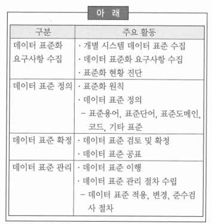

# 81 ~ 100

1. A기업은 데이터 통합 프로젝트를 수행하는 과정에서 현행 시스템에서 사용한 데이터 표준화 문서를 검토하고자 한다. 다음 중 데이터 표준화의 일반적인 정의로 가장 적합한 것은?
    1. 데이터 코드값에 대한 불일치를 파악하고 정의한다.
    2. 데이터 명칭에 대한 현행수준을 진단한다.
    3. *데이터 표준요소에 대한 명칭, 정의, 형식 등을 수립하고 적용하는 것을 말한다.*
    4. 데이터 표준에 대한 영향도 분석을 수립한다.

2. 다음 중 데이터 표준화 수립의 기대효과로 가장 부적합한 것은?
    1. 표준화된 명칭을 사용하여 다양한 계층 간의 명확한 의사소통이 가능해진다.
    2. 각 업무 시스템 간의 데이터 인터페이스 시에 데이터 변환 및 정제 비용이 감소한다.
    3. ~~일관성 있는 명칭을 사용하여 시스템 운용 시간 및 개발 생산성이 감소한다.~~
    4. 데이터 사용자들이 필요한 데이터의 소재 파악에 소요되는 시간 및 노력이 감소한다.
    
    → 전사 표준화 수립을 통해 일관성 있고 명확히 표준화된 명칭을 재사용함으로써 시스템에 대한 이해를 향상시켜 시스템 운용 및 개발생산성이 증가함
    

3. 데이터 표준화의 구성요소 중에 하나인 데이터 명칭 표준화를 진행하고자 한다. 다음 중 데이터 관리자로써 데이터 명칭에 대한 표준화 원칙을 수립하고자 할 때, 고려할 사항으로 가장 부적합한 것은?
    1. 데이터 명칭은 해당 개념을 유일하게 구분 해주는 이름이어야 한다.
    2. ~~데이터 명칭은 업무적 명칭과 기술적 명칭을 구별하여 활용해야 한다.~~
    3. 데이터 명칭은 업무적 관점에서 보편적으로 인지되는 이름이어야 한다.
    4. 데이터 명칭은 그 이름만으로도 데이터의 의미 및 범위가 파악될 수 있어야 한다.
    
    → 데이터 명칭은 현업에서 활용하는 업무적 용어를 정보시스템 구현에 활용함으로써 상호간의 의사소통을 명확히 할 수 있어야 하기 때문에, 특별한 경우를 제외하고는 기술적인 명칭을 별도로 사용하지 많고 업무적인 용어로 통일
    

4. 다음 중 데이터 표준 관리시스템을 도입할 때 고려사항으로 부적절한 것은?
    1. 편의성: 사용자 관점에서 화면 구성 및 수작업 최소화 기능 제공 여부
    2. 확장성: 다양한 DBMS의 정보 수집 및 각종 데이터 관리 도구와 연동 지원 여부
    3. 유연성: 단계적 적용을 위한 복수 표준 관리 기능 존재 여부
    4. ~~특수성: 특정 업무 및 상황에 맞는 요건 중심의 시스템 기능 존재 여부~~
    
    → 데이터 표준 관리 시스템 도입 시 시스템의 확장성, 유연성, 편의성 관점에서 충분한 검토가 이루어져야 함
    

5. A기업의 데이터 표준에 대한 전사 기본 원칙이 수립되었다. 다음 중 전사적 관점에서 데이터 표준화 기본 원칙으로 채택하기에 가장 부적절한 것은?
    1. ~~한글명에 대해서는 복수개의 영문명을 허용한다.~~
    2. 영문명(물리명) 전환 시 발음식(예: 번지 → BUNJI)도 허용한다.
    3. 한글명 및 영문명 부여 시 띄어쓰기는 허용하지 않는다.
    4. 영문명에 대해서는 복수개의 한글명을 허용한다.
    
    → 한글명 복수 개의 영문명을 허용할 경우, 해당 용어를 데이터베이스에 반영할 때 어떠한 물리명을 써야 할 지에 대한 판단이 불가능하기 때문에 하나의 한글명에 대해서는 반드시 하나의 영문명만 허용
    

6. 데이터 형식은 데이터 표현형태 정의를 통해 데이터 입력오류와 통제위험을 최소화하는 역할을 하고 업무규칙 및 사용 목적과 일관되도록 한다. 다음 중 전사차원의 데이터 표준을 정의할 때 데이터 형식의 데이터 타입으로 부적절한 것은?
    1. Char
    2. Date
    3. Numeric
    4. ~~Long Raw~~
    
    → 특수 데이터 타입(CLOB, Long Raw 등)은 데이터 조회, 백업, 이행 등을 수행하는데 제약사항이 많이 존재하기 때문에 표준 데이터 타입으로 적절하지 않음
    

7. 다음 중 화면으로부터 어떠한 값의 입력도 없는 경우 ‘아니오’라고 미리 정의된 값이 입력될 수 있도록 하기 위해 사용하는 것은?
    1. 허용 범위
    2. 허용 값
    3. *기본 값*
    4. 코드 값
    
    → 기본 값을 정의함으로써 값이 없을 때에는 사용자로부터 아무 입력이 없으면 자동적으로 사전에 정의된 값으로 입력되게 하여 사용자의 편의성을 도와줄 수 있음
    

8. 데이터아키텍처 담당자로써 데이터 명칭에 대한 표준화 원칙을 보완하고자 할 때, 다음 중 고려할 사항으로 가장 부적절한 것은?
    1. ~~업무적 명칭과 기술적 명칭을 구별하여 활용해야 한다.~~
    2. 해당 개념을 유일하게 구분해주는 이름으로 명명되어야 한다.
    3. 업무적 관점에서 보편적으로 인지되는 이름이어야 한다.
    4. 이름만으로 데이터의 의미 및 범위가 파악될 수 있도록 명명되어야 한다.
    
    → 기술적 명칭을 별도로 구별하여 사용하지 말고 가능하다면 의사소통이 원활한 업무적 명칭을 사용하는 것을 권장
    
    → 기술적 명칭은 전산시스템을 위한 것으로 이해하고 가급적 사용하지 않는 것이 좋음
    

9. 칼럼(Column)에 대한 성질을 그룹핑한 개념으로 문자형, 숫자형, 일자형, 시간형과 같이 동일한 형식을 부여하기 위해 사용하는 표준화 요소로 적절한 것은?
    1. 표준 용어
    2. 표준 코드
    3. 도메인 유형
    4. *표준 도메인* → 칼럼에 동일한 형식을 부여하기 위해 사용하는 표준화
    
    → 도메인 유형: 표준 도메인의 상위 개념으로 칼럼에 적용하고자 정의하기 보다는 표준 도메인의 유형을 효과적으로 분류하기 위해 정의
    

10. 다음 중 데이터 관리자와 데이터베이스 관리자의 각 직무별 내용으로 부적절한 것은?
    
    
    |  | 구분 | 데이터 관리자(DA) | 데이터베이스 관리자(DBA) |
    | --- | --- | --- | --- |
    | 1 | 주요 활동 | 데이터에 대한 정책 및 표준 정의 | 데이터베이스 성능 개선 방안 수립 |
    | 2 | 품질 수준 확보 | 데이터 정합성 검증을 통한 품질 확보 | 데이터 표준 적용을 통한 품질 확보 |
    | 3 | 전문 기술 | 담당 업무분야별 업무지식 및 데이터 모델링 | 데이터 모델 해독 능력 및 특정 DBMS 제품에 대한 전문지식 |
    | 4 | 주요 관리기능 | 데이터 모델 관리 및 데이터 표준 관리 | 데이터 보안 관리 및 데이터 성능 관리 |
    
    → 2
    
    - 데이터베이스 관리자(DBA): 데이터의 정합성 검증을 통해서 데이터 품질을 확보
    - 데이터 관리자(DA): 데이터 표준의 정의 밎 적용을 통해서 데이터 품질 확보

11. 일관성 있는 표준 단어를 생성하기 위해서 현행 사용자와 시스템이 사용하는 용어들을 수집하여 표준 지침을 작성하려고 한다. 다음 중 작성된 표준 지침과 가장 거리가 먼 것은?
    1. 영문 약어명과 영문 약어명에 대한 허용 길이를 정의한다.
    2. 표준 단어에 대한 정의 기술 방법을 정의한다.
    3. ~~데이터 형식(숫자, 문자)을 어떻게 적용 할 것인가를 정의한다.~~ → 데이터 형식은 표준 단어와는 관련이 없음
    4. 동음이의어, 이음동의어에 대한 처리 기준을 정의한다.
    
    → DBMS마다 길이제약이 있기 때문에 표준 단어에서 영문 약어명의 허용 길이를 제한함으로써 용어의 물리명 길이를 최소화할 수 있음
    
    → 표준화를 위해 수 많은 동음이의어, 이음동의어에 대한 처리방안이 필요하며, 동음이의어일 경우 어느 의미를 나타내는지를 명확하게 하기 위해서 표준 단어에 대한 정의를 정확히 기술해야 함
    

12. 기업의 데이터 표준화 수립은 정형화된 절차에 의해서 수행되어야 한다. 아래의 표준화 수립에 필요한 요소들을 순서대로 바르게 나열한 것은?
    
    
    | 아래 |  |
    | --- | --- |
    | ㄱ. 표준화 원칙 수립 | ㄴ. 데이터 표준화 요구사항 수집 |
    | ㄷ. 데이터 표준 검토 및 확정 | ㄹ. 데이터 표준 이행 |
    | ㅁ. 데이터 표준 공표 |  |
    1. ㄱ - ㄴ - ㄷ - ㄹ - ㅁ
    2. *ㄴ - ㄱ - ㄷ - ㅁ - ㄹ*
    3. ㄴ - ㄱ - ㄷ - ㄹ - ㅁ
    4. ㄱ - ㄴ - ㄹ - ㄷ - ㅁ
    
    → 데이터 표준화 수립 절차: 요구 사항 수집, 표준 정의, 표준 확정, 표준 관리 순으로 이루어짐
    
    
    

13. 현업 부서와 전산 부서간에 데이터 표준화의 필요성 문제로 많은 논란 끝에 전사적인 관점에서 데이터 표준화를 수립하였다. 다음 중 수립된 데이터 표준화가 가져올 기대효과로 가장 부적합한 것은?
    1. 사용하는 명칭이 통일됨으로써 명확한 의사소통이 가능해진다.
    2. 일관된 데이터 형식 및 규칙의 적용으로 인한 데이터 품질이 향상된다.
    3. ~~동일한 형식으로 변환되어 인터페이스 데이터의 재변환 시간이 증가한다.~~
    4. 필요한 데이터의 위치를 파악하는 시간 및 노력이 감소한다.
    
    → 데이터 표준화로 인한 인터페이스 시에 변환 및 정제를 위한 시간 감소
    

14. Y지역본부 대출담당인 C씨는 데이터아키텍처 담당자인 K대리에게 불편사항을 설명했다. 그 내용은 C씨가 신규로 심사하는 신규고객의 95% 이상이 국내 직장에서 근무하는 일반급여 생활자였다. 그래서 고객평점 항목 입력화면에서 ‘해외자동차보유여부’ 항목의 값으로 ‘아니로’라고 선택하는 경우가 빈번했다. C사원은 화면에서 어떠한 값의 입력도 없는 경우 ‘아니오’라고 미리 정의된 값이 입력되도록 요청했다. 다음 중 이 요청사항을 해결하기 위해 사용할 수 있는 설정으로 적합한 것은?
    1. 코드 허용 범위 설정
    2. 코드 허용값 설정
    3. 코드 인스턴스 설정
    4. *기본 값 설정*
    
    → 기본값을 사전에 정의함으로써 사용자가 별도의 값을 입력하지 않은 경우에 정의된 기본값이 적용되어 사용자의 불편함을 덜어주고, 아울러 데이터의 표준화 및 품질차원에서 효과를 얻을 수 있음
    

15. 표준 용어가 만들어진 후 변경이 되면 파급효과가 크기 때문에 현행에서 사용하고 있는 용어들에 대한 면밀한 분석을 통하여 표준 용어를 생성해야 한다. 다음 중 표준 용어의 생성 과정이나 표준 용어의 변경에 있어 직접적인 영향으로 거리가 먼 것은?
    1. 표준 단어
    2. 표준 도메인
    3. ~~표준 코드값~~ → 일종의 데이터 값이기 때문에 상관 없음
    4. 기존 업무 용어
    
    → 표준 용어는 기존 업무 용어를 토대로 하여 표준 단어 사전에 등록된 관련 표준 단어의 조합으로 구성하며 속성과 관련된 용어일 경우에는 표준 도메인을 적용하여 데이터 형식을 부여할 수 있음
    

16. 다음 중 전사적 관점에서 수립된 데이터 표준화의 기본 원칙으로 가장 부적절한 것은?
    1. 영문명(물리명) 전환 시에 발음식(예: 주소 → Juso, 시 → Si 등)도 허용한다.
    2. 기업 내에서 빈도수 및 업무를 고려하여 사용하는 관용어를 우선 사용한다.
    3. ~~한글명에 대해서는 복수의 영문명을 허용한다.~~
    4. 한글명 및 영문명에 특수먼자(/, _, -, +, (, )) 및 띄어쓰기를 허용하지 않는다.
    
    → 한글명에 대해서 복수개의 영문명을 허용하면 해당 용어를 데이터베이스에 반영할 때 어떤 물리명을 써야할 지에 대한 판단이 불가능하기 때문에 하나의 한글명에 대해서는 반드시 하나의 영문명만 허용하도록 함
    

17. 기업에는 각자에게 부여된 역할과 책임에 따라 임무를 수행하는 많은 직책들이 있다. 데이터 관리자(DA)도 이 중 한 사람이다. 다음 중 DA가 수행하는 역할로 가장 거리가 먼 것은?
    1. 데이터에 대한 정책과 표준을 정의한다.
    2. 부서간 데이터 구조에 대한 이견을 조율한다.
    3. ~~데이터베이스에 대한 성능 개선 방안을 수립한다.~~ → 데이터베이스 관리자의 주된 역할
    4. 데이터 모델을 관리하고 유지한다.

18. K과장은 데이터 표준화 수립을 위한 전체적인 구성요소에 대해 팀원 교육을 실시하고자 한다. 다음 중 K과장이 교육을 위해 선정한 데이터 표준화 구성요소로 부적합한 것은?
    1. 데이터 표준화를 위한 별도의 데이터 관리 조직
    2. 데이터 표준화를 효과적으로 진행할 수 있는 표준 절차
    3. 실제 원칙이 정립된 데이터 표준
    4. ~~전사 관점의 데이터 구조~~
    
    → 데이터 구조는 데이터 표준화가 효과적으로 적용되어 최종적으로 산출되는 데이터 모델의 구조로, 데이터 표준화 구성요소에 포함되지 않음
    

19. 일관성 있고 효과적인 전사 데이터 표준화를 수립하였어도 이를 지속적으로 유지하기 위해서는 시스템과 프로세스가 필요하다. 일반적인 데이터 표준화 관리도구들이 표준화에 관련된 시스템과 프로세스를 지원하는데, 다음 중 관리도구들의 지원 기능과 가장 거리가 먼 것은?
    1. 표준 단어 및 용어를 관리하는 기능 지원
    2. 원천 코드에 대한 신규코드 매핑 기능 지원
    3. 코드에 대한 코드값을 조회할 수 있는 기능 지원
    4. ~~데이터 모델의 변경에 대한 영향도 분석 기능 지원~~
    
    → 데이터 모델 변경 영향도 분석은 애플리케이션 프로그램과 데이터 인터페이스 프로그램 등의 관리를 통해 데이터 모델과 프로그램간의 영향도 분석을 시행하는 메타데이서 시스템의 주요 기능
    

20. K과장은 정보시스템 부서의 신입사원을 대상으로 표준화에 대한 필요성과 개념, 구성요소 등에 대해 설명했다. 이를 통해 신입사원은 데이터 표준화에 대한 중요성 및 정의를 정확히 이해하게 되었는데, 다음 중 K과장이 신입사원에게 설명한 내용으로 부적절한 것은?
    1. 업무적으로 사용하는 용어에 대한 사내 표준을 정하는 것이 표준 용어 작업이다.
    2. ~~개별 업무 시스템의 코드 체계를 수립하는 것이 표준 코드 작업이다.~~
    3. 표준 용어를 구성하는 단어에 대한 표준을 정의하는 것이 표준 단어 작업이다.
    4. 칼럼에 대한 성질을 그룹핑한 것으로 형식에 대한 표준을 정의하는 것이 도메인 작업이다.
    
    → 표준 코드 작업에는 개별 업무시스템에서 사용할 코드를 정의하는 것도 포함될 수 있으나 데이터아키텍처 담당자가 작업하는 표준 코드 작업은 복수개의 업무 시스템에서 사용하고 있는 서로 다른 코드들을 전사 차원으로 통합하고 조정하는 작업을 의미