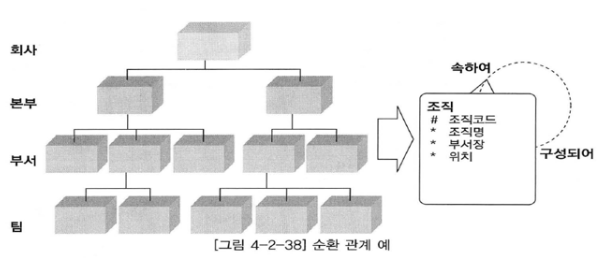
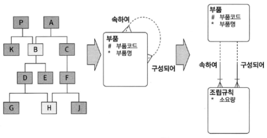
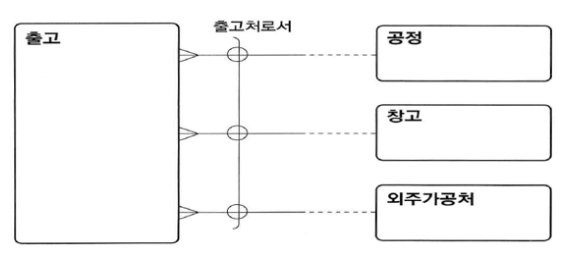

# 121 ~ 135

1. 프로젝트의 어려움 정도 또는 도구와 기술에 상관없이 좋은 설계를 포함한 훌륭한 시스템 개발은 기본 원칙 단계로부터 시작한다. 다음 중 데이터 모델링의 기본원칙으로 거리가 먼 것은?
    1. 커뮤니케이션 원칙: 요구 사항은 모든 사람들이 이해할 수 있도록 명확하게 공표됨은 물론 최종 사용자 지향적으로 분명하게 파악되는 수준으로 작성되어야 한다.
    2. ~~솔루션 구체화 원칙~~
    3. 모델링의 상세화 원칙: 데이터의 상세화 정도를 제시하고, 조직이 사용하는 정보 구조의 ‘최소 공통 분모’를 제시해야 한다.
    4. 논리적 표현 원칙: 모델은 물리적 제약조건 없이 비즈니스를 그대로 반영해야 한다. 즉, 논리적 데이터 모델은 특정 아키텍처, 기술 또는 제품 등에 독립적이어야 한다.
    
2. ‘관계 실체의 모든 외부 식별자 값은 관련 있는 관계 실체에 주 식별자 값이 존재해야 한다.’ 에 해당하는 규칙으로 적합한 것은?
    1. _실체 무결성 규칙_
    2. 참조 무결성 규칙
    3. 영역 무결성 규칙
    4. 속성 무결성 규칙
    
    → 이러한 모델에서의 참조 무결성 규칙은 실제 스키마의 제약조건으로 생성되게 되면 관련된 테이블 레코드간의 관계를 유효하게 하고 사용자 실수로 데이터를 삭제하거나 변경하지 않도록 하기 위한 규칙이라고 정의할 수 있음
    

1. 개체-관계 모델에 대한 설명으로 틀린 것은?
    1. 모델의 단순성 때문에 현재 광범위하게 사용되고 있다.
    2. 확장된 개체-관계 모델은 서브타입을 포함한다.
    3. ~~연관과 상속의 개념을 통해 객체들을 연결한다.~~ → 객체지향 모델링에 대한 설명
    4. 서로 다른 뷰들을 하나로 통합할 수 있는 단일화된 설계안을 만들 수 있다.

1. 다음 중 데이터의 특성이 아닌 것은?
    1. ~~데이터는 중복적이다.~~ 
    2. 데이터는 조직과 기술에 비해 독립적이다.
    3. 데이터는 프로세스에 비해 안정적이다. 즉, 변화가 적다.
    4. 데이터는 여러 프로세스 또는 기능에서 사용된다.
    
    → 데이터를 중복해서 가지고 있으면 데이터의 무결성이 깨질 수 있으므로 중복을 피해야 함
    

1. 다음 중 소프트웨어 생산성 향상을 위한 객체지향 모델링의 장점이 아닌 것은?
    1. 재사용 코드와 같은 개념이 실제로 가능한 환경을 제공한다.
    2. 모든 비즈니스 규칙이 표현될 수 있는 유일한 환경을 제공한다.
    3. 프로세스와 데이터 모델링을 함께 운영한다.
    4. ~~데이터는 프로세스에 종속되어 운영된다.~~
    
    → 데이터가 프로세스에 종속하지 않는 방식으로 데이터와 프로세스의 개념을 결합
    
    → 객체지향 모델링에 기반한 애플리케이션을 연구하고 이해하기 때문
    

1. ‘논리 데이터 모델링’이라는 용어에서 ‘논리’라는 단어가 사용된 이유로 가장 적합한 것은?
    1. ‘논리 데이터 모델링’은 비즈니스에서 발생하는 사실을 중심으로 데이터 구조와 규칙을 파악하기 때문에 ‘논리’라는 단어를 사용한다.
    2. _‘논리 데이터 모델링’은 현실 세계에 실제로 존재하는 장표나 보고서, 데이터베이스 시스템 등과는 독립적으로 비즈니스에 존재하는 사실을 일반화 및 추상화하기 때문에 ‘논리’라는 단어를 사용한다._
    3. 데이터 모델러가 현실 세계의 비즈니스를 논리적으로 분석해 나가기 때문에 ‘논리’라는 단어를 사용한다.
    4. ‘논리 데이터 모델링’은 시스템 구축을 위하여 기초적인 분석부터 시스템 설계까지 인간이 수행해야 할 일들을 실제 구현하지 않고 인간의 사고력으로 구현하기 때문에 ‘논리’라는 단어를 사용한다.
    
    → ‘논리적’이라는 용어는 논리 데이터 모델링이 현실 세계를 추상화하기 때문에 사용함
    
    → 개념화 기법을 적용하여 모델을 만드는데도 이유가 될 수 있음
    
    → 현실의 물리적인 장표나 데이터베이스 같은 것이 실질적인 개념이 아니기 때문에 논리적(개념적)이라는 용어를 사용하는 것
    

1. 다음 중 사원에 대한 엔터티를 구성하려고 할 때, 다음 중 식별자로 가장 적합한 속성은?
    1. 사원명
    2. _사원번호_
    3. 근무부서
    4. 담당업무
    
    → 엔터티의 유일성을 보장해주는 것이 식별자
    
    → 다른 것들은 복수개의 값들이 존재할 수 있기 때문에 유일성을 보장해 주지 못함
    

1. 다음 중 ‘관계형 모델 이론’과 ‘비관계형 모델 이론’의 차이점으로 가장 부적합한 것은?
    1. 관계형 모델 이론은 데이터 중심의 분석 기법이고, 비관계형 모델 이론은 일반적으로 프로세스 중심의 분석 기법이다.
    2. 관계형 모델 이론은 데이터 구조와 조작 및 무결성을 정의하고, 비관계형 모델 이론은 데이터의 구조와 조작을 정의한다.
    3. 관계형 모델 이론은 데이터를 집합적으로 처리를 요구하고, 비관계형 모델 이론은 데이터의 레코드 처리(한 건씩 처리)를 요구한다.
    4. ~~관계형 모델 이론은 비관계형 모델 이론에 비하여 데이터를 분석하는데 있어 우수한 분석 기법이다.~~
    
    → 관계형 모델 이론이 데이터를 분석하는데 비관계형 이론보다 반드시 우수하지는 않음
    

1. 다음 중 논리 데이터 모델링에 대한 설명으로 부적절한 것은?
    1. 논리 데이터 모델의 특징은 초기에 엔터티 사이가 다대다 관계, 순환 관계, 배타적 관계 등의 관계로 연결된 엔터티들이 많이 보인다.
    2. ~~논리 데이터 모델은 업무 영역이 바뀌지 않아도 업무 방식이 변경되면 반드시 설계 변경이 이루어져야 한다.~~
    3. 논리 데이터 모델링은 프로세스 중심의 설계보다 데이터 중심 설계를 주로 사용한다.
    4. 논리 데이터 모델은 하나의 엔터티가 반드시 물리적으로 하나의 테이블이나 세그먼트가 되지 않을 수 있다.
    
    → 잘 설계된 논리적 모델은 비록 업무방식이 바뀌어도 업무영역이 바뀌지 않는다면 설계 변경이 거의 발생하지 않음
    
2. 관계형 데이터베이스의 데이터 조작은 SET처리, 처리연산자, 관계연산자 등의 요소들로 이루어진다. 다음 중 관계연산자의 설명이라 볼 수 없는 것을 모두 고르시오.
    1. Select(or Restrict): 열(Coloumn)에 의거한 행(Row)의 Subset
    2. Product: 두 관계 테이블 간의 행(Row) 조합의 묶음
    3. Division: 다른 관계 테이블의 모든 행에 대응하는 열을 제외한 열
    4. ~~Insert: 행의 입력~~ → 관계 연산자가 아니라 처리 연산자

1. 다음 중 본질적 데이터 요구 사항이며 데이터베이스 설계를 시작하기 위한 필수 사항으로 거리가 먼 것은?
    1. 이름(Name): 모든 속성은 고유하게 식별할 수 있는 이름이 주어져야 한다.
    2. 명세(Description): 모든 실체는 명세가 있어야 하며, 명세는 모형을 검토하는 누구든지 그 실체를 정확히 해석할 수 있도록 해주어야 한다.
    3. 유형(Type): 속성은 두 가지 유형 즉, 키(Key) 속성 또는 비키 속성 중 하나로 구분되지 않으면 안된다. 이 특성은 키 속성으로써의 역할 가능성 보다는 실제 용도와 관련된다.
    4. ~~도출 속성(Derived Attributes): 데이터 모델링 팀은 업무 전문가의 참여 하에 도출 공식을 확립해야 한다.~~ → 도출 공식에 대한 설명

1. 관계형 데이터베이스에서만 특별하게 작용하는 법칙이 있다. 이중 이론적 배경이 다른 데이터베이스에 없는 ‘집합적 조회’라는 관계연산자가 있는데, 이를 바탕으로 관계 테이블에 영향을 미치는 처리연산자가 있다. 다음 중 처리연산자의 설명으로 볼 수 없는 것을 모두 고르시오.
    1. Update: 행의 수정
    2. Delete: 행의 삭제
    3. ~~Project: 열(Column)의 Subset~~ → 관계 연산자
    4. Insert: 행의 입력

1. 다음 중 속성 이름을 부여할 때, 주요 규칙에 대한 설명으로 부적합한 것은?
    1. 속성 이름은 해당 속성에 의해 구체화된 논리적 개념을 현업에게 즉시 전달해야 한다. 그러므로 속성 이름은 명료, 간결, 자명해야 한다.
    2. 모델러들은 논리 데이터 모형을 구축하고 있는 것이다. 물리적 특징들로 개념을 제한 또는 왜곡해서는 안 된다. 즉 물리적 특성이 아닌 논리적 고려에 따라 속성 이름을 부여한다.
    3. 속성의 개념을 구체적이고 명확하게 정의하였다면 보편적인 용어를 적절히 결합한 복합명사를 만들어서 구체적인 표현을 할 수 있게 속성 이름을 부여해야 한다.
    4. ~~‘최종학력’, ‘최종이수학력’ 이라는 단어 보다는 ‘학력’이라는 단어가 포괄적이고 여러 뜻을 함축성 있게 사용할 수 있으므로 속성명으로 더욱 적합하다.~~
    
    → 누구나 같은 의미로 정확하게 뜻을 알 수 있는 단어를 사용해야 함
    

1. ‘주 식별자(특정 행을 유일하게 인식하는 하나 이상의 열)는 Null 값을 포함하지 않는다.’ 의 내용에 해당하는 규칙으로 적합한 것은?
    1. _실체 무결성 규칙(Entity Integrity Rule)_
    2. 참조 무결성 규칙(Reference Integrity Rule)
    3. 영역 무결성 규칙(Domain Integrity Rule)
    4. 속성 무결성 규칙(Attribute Integrity Rule)
    
    → 참조 무결성은 관계에 관한 것이고, 영역과 속성 무결성은 같은 의미로 속성이 가져야 하는 값에 대한 무결성
    

1. 어떤 엔터티가 두개 이상의 다른 엔터티의 합집합과 관계를 가지는 것을 ‘배타적(Exclusive) 관계’ 혹은 ‘아크(Arc) 관계’ 라고 한다. 다음 중 아크 관계의 특징이 아닌 것은?
    1. 아크 내에 있는 관계는 보통 동일하다.
    2. 아크 내에 있는 관계는 항상 Mandatory 거나 Optional 이어야 한다.
    3. ~~아크는 여러 엔터티를 가질 수 있다.~~
    4. 어떤 엔터티는 다수의 아크를 가질 수 있다. 그러나 지정된 관계는 단 하나의 아크에만 사용되어야 한다.
    
    → 아크는 반드시 하나의 엔터티에만 속해야 함(하나의 아크가 여러 엔터티를 가질 수 없음)
    
    개념데이터모델링 - 특수 관계
    
    1. 순환관계(Recursive Relationship)
        
        
        
        - 일반적인 선형관계와는 달리 순환관계로 엔터티를 연결하는 관계
        - 주로 조직코드와 같이 계층을 표현하는 엔터티에서 발생
        - 특성
            - 하나의 순환 엔터티는 각 엔터티의 모든 속성을 포함해야 함
            - 각 계층에 있는 속성은 동일하게 하는 것이 가장 좋음
            - 순환 모델은 필수(직선)관계로 취급될 수 없고 반드시 선택 사양
            - 순환 모델의 특징은 조직의 변경에 쉽게 대응할 수 있음
            
    2. BOM(Bill of Materials) 관계
        
        
        
        - 순환관계와 비슷한 구조인데, 나의 상위가 한 개가 아닌 여러 개가 될 수 있음
        - 주로 제조업에서 많이 사용되는 구조
        - 하나의 부속품은 하위의 여러 부속품들의 결합으로 만들어지고, 이것도 다른 여러 개의 부속품으로 활용될 수 있는 업무에서 사용되는 구조
        - 상세 모델링 과정에서 새로운 관계 엔터티를 추가하여 두 개의 1:M 관계로 구성
        
    3. 아크 관계
        
        
        
        - 어떠한 관계가 여러 엔터티 중 하나에서만 발생될 경우에 이를 표현하기 위한 관계
        - 특성
            - 아크 내에 있는 릴레이션십은 보통 동일함
            - 아크 내에 있는 릴레이션십은 항상 필수이거나 선택사항이어야 함
            - 아크는 반드시 하나의 엔터티에만 속해야 함
            - 하나의 아크가 여러 엔터티를 가질 수 없음
            - 어떤 엔터티는 다수의 아크를 가질 수 있음
            - 지정된 릴레이션십은 단 하나의 아크에만 사용되어야 함