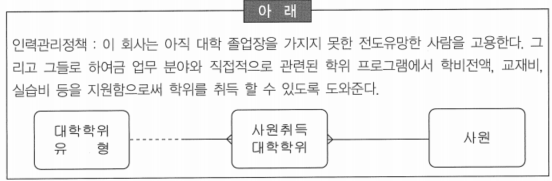
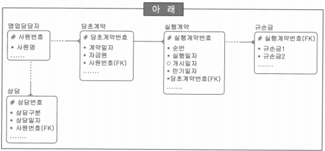
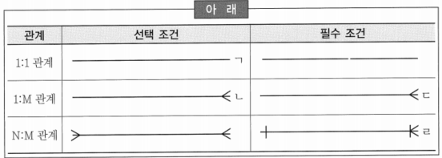

# 136 ~ 155

1. 데이터 무결성은 업무규칙에 따라 데이터 일관성 및 정확성을 유지하기 위한 필수 규칙이다. 관계형 데이터베이스에만 존재하는 참조 무결성 규칙은 크게 입력 규칙과 삭제 규칙이 있는데, 다음 중 입력 규칙에 대한 설명으로 틀린 것은?
    1. Dependent: 대응되는 부모 실체에 인스턴스가 있는 경우에만 자식 실체에 입력을 허용한다.
    2. Nullify: 자식 실체 인스턴스의 입력을 항상 허용하고, 대응되는 부모 건이 없는 경우 자식 실체의 Foreign Key를 Null 값으로 처리한다.
    3. Customized: 특정한 검증조건이 만족되는 경우에만 자식 실체 인스턴스의 입력을 허용한다.
    4. ~~Default: 자식 실체 인스턴스의 입력을 항상 허용하고, 대응되는 부모 건이 없는 경우 자식 실체의 Primary Key를 지정한 기본 값으로 처리한다.~~
    
    → Default: 자식 실체 인스턴스의 입력을 항상 허용하고 대응되는 부모 건이 없을 경우에 Foreign Key를 지정된 기본 값으로 처리한다
    
2. 다양한 경로를 통해 수집된 속성 후보들을 엔터티에 배정시킨 후에 해야 할 일은 이들을 검증하여 속성의 제자리를 찾게 해주는 일이다. 다음 중 속성을 검증하는 작업과 거리가 먼 것은?
    1. 원자단위 검증: 사물의 본질을 이루는 고유한 특성이나 성질이 속성이다. 즉, 속성은 독자적인 성질을 가져야 한다.
    2. 유일값(Single Value) 검증: 속성에서 관리되어야 할 값이 반드시 단 하나만 존재해야 한다는 것이다.
    3. 추출값(Derived Value) 검증: 속성이 원천적인 값인지 다른 속성에 의해 가공되어서 만들어진 값인지를 검증해야 한다.
    4. ~~속성 후보 선정: 구 시스템 문서자료, 현업 장표 및 보고서, 타 시스템, 전문서적 및 자료 등에서 속성 후보를 선출해야 한다.~~ → 속성의 검증에 관련된 것이 아니고 속성 후보를 다양한 경로를 통해서 좋은 속성 후보를 확보하는 방법
    
3. 다음 중 아래에서 데이터 무결성과 관계된 사항으로 적합한 것은?
    
    | 아래 |  |
    | --- | --- |
    | ㄱ. 실체 무결성 | ㄴ. 연쇄 작용(Triggering Operation) |
    | ㄷ. 참조 무결성 | ㄹ. 영역(속성) 무결성 |
    | ㅁ. 정규화(Normalization) | ㅂ. 인덱스(Index) |
    1. ㄱ, ㄷ, ㄹ
    2. ㄱ, ㄷ, ㄹ, ㅁ
    3. *ㄱ, ㄴ, ㄷ, ㄹ, ㅁ*
    4. ㄱ, ㄴ, ㄷ, ㄹ, ㅁ, ㅂ
    
    → 연쇄 작용: 비즈니스 규칙으로 어느 실체에 데이터의 값이 입력, 수정, 삭제 될 때 그 실체 내지는 다른 실체의 데이터 값에 영향도를 분석하는 것으로 데이터의 무결성과 관계가 깊음
    
    → 정규화를 잘 못하면 입력, 수정, 삭제 이상이 발생할 수 있음
    
    → 인덱스는 수행 성능의 향상을 위한 기법
    

4. 다음 중 엔터티 검증과 가장 거리가 먼 것은?
    1. 엔터티의 개념을 확실하게 모델러들이 정립해야 한다.
    2. 새로운 목적 시스템에서 관리하고자 하는 대상 집합이 있는지 확인해야 한다.
    3. 엔터티에 가로(속성)와 세로(개체)를 가진 면적(집합)을 가진 속성이 존재하는지 확인해야 한다.
    4. ~~엔터티 후보를 우선적용 대상별로 분류하여 모델링의 골격에 해당하는 주요 엔터티를 먼저 도출하여 명확히 정의함으로써 모델링의 기초를 단단하게 한다.~~ → 모델링을 순차적으로 접근해 가야할 형태별로 분류하는 이유

5. 다음 중 아래의 인사관리정책을 적용한 ERD에서 틀린 부분을 지적한 것으로 가장 적합한 것은?
    
    
    
    1. 틀린 곳이 없다.
    2. 대학 학위 유형을 아직 가지지 않았으므로 ‘대학학위유형’과 ‘사원취득대학학위’가 양쪽 선택적으로 표현돼야 한다.
    3. *사원이 대학 학위를 미취득 했을 가능성이 있으므로 ‘사원’과 ‘사원취득대학학위’ 사이에 사원 쪽을 점선(선택적)으로 표시해야 한다.*
    4. 대학 학위 유형을 아직 가지지 않았으므로 ‘사원’과 ‘사원취득대학학위’가 양쪽 선택적으로 표현되어야 한다.
    
    → 아직 대학 졸업장을 가지지 못한 전도유망한 사람을 고용한다고 하였으므로 사원과 사원취득대학학위는 한쪽 선택적으로 표현해야 함
    

6. 사용자의 요구 사항으로부터 데이터의 실체를 설계하는 데이터 모델링 단계에 대한 설명으로 잘못된 것은?
    1. ~~개괄 모델 단계: 현행 시스템의 프로세스와 데이터베이스를 분석하여 분류 가능한 업무를 분석하는 단계~~ → 개념 데이터 모델 단계의 일부분
    2. 개념 모델 단계: 핵심 엔터티를 도출하고 그들간의 관계를 정의하는 단계
    3. 논리 모델 단계: 업무에서 필요로 하는 모든 엔터티와 특성을 정의하는 단계
    4. 물리 모델 단계: 논리데이터 모델을 기반으로 특정 DB에 맞도록 스키마를 설계하는 단계

7. 속성은 엔터티에 저장되는 개체 집합의 특성을 설명하는 항목이라고 할 수 있다. 다음 중 속성의 정의를 바르게 설명한 것을 모두 고르시오.
    1. 구별 가능한 사람, 장소, 물건, 행위 또는 개념 등에 대하여 정보가 유지되어야 하는 것 → 실체 정의
    2. 다른 것과 구별되어 식별될 수 있는 사물 → 실체 정의
    3. *더 이상 분리되어지지 않는 단위 값(Atomic Value) → 속성 정의*
    4. *실체를 서술하며 양을 계수화하고 자격을 부여·분류하며 구체적으로 기입하는 정보항목 → 속성 정의*

8. 개체 인스턴스는 인스턴스간 식별을 위해 고유한 식별자를 가진다. 다음 중 식별자에 대한 설명으로 틀린 것은?
    1. 식별자는 하나 또는 그 이상의 개체 속성으로 구성된다.
    2. ~~식별자와 키는 일치성을 가지며 식별자는 테이블을 위한 것이며 키는 개체가 가진다.~~
    3. Barker 표기법은 식별자를 ‘#’로 표현한다.
    4. 직원 인스턴스인 경우 봉급이나 입사일은 식별자가 될 수 없다.
    
    → 식별자는 개체를 위한 것이며, 키는 테이블이 가짐
    

9. 다음 중 아래 ERD에서 엔터티 유형(Entity Type)명으로 부적당한 것을 모두 고르시오.(표기법은 Richard Barker의 CASE Method 방식에서 FK(Foreign Key)를 표현하고 있다.)
    
    
    
    1. ~~영업담당자: 표현 그대로 영업을 담당한 사람을 말한다.~~
    2. 당초계약: 실행 계약이 이루어지기 전에 처음으로 이루어지는 계약을 의미한다.
    3. ~~규손금: 규정에 의하여 결정되는 손해액을 의미한다.~~
    4. 상담: 고객과의 상담내역을 의미한다.
    
    → 실체는 동질성을 갖는 인스턴스들의 집합이므로, ‘영업 담당자’, ‘구매 담당자’ 등의 실체를 만든다면 일반화와 추상화 기법에 위배되며 엄청나게 많은 실체를 정의해야 할 것
    
    → ‘규손금’은 ‘규정 손실금’의 약어로 이런 형태의 실체명을 만드는 것은 논리 데이터 모델링에서 삼가야 하는 사항
    
    → 비즈니스 규칙과 관계된 모든 사람들에게 직관적으로 의미를 파악할 수 있는 명명 규칙이 유용하기 때문
    
10. 앞 문제에서 제시한 ERD의 내용 중 잘못된 사항을 지적한 것으로 올바른 것을 모두 고르시오.
    1. ‘영업담당자’와 ‘상담’은 상담을 영업담당자가 하므로, 둘의 관계에 UID Bar를 사용해야 한다.
    2. *‘실행계약’과 ‘규손금’의 관계는 일대다(1:M)인데 업무를 파악하여 일대다이면 ‘규손금’에 PK(Primary Key) 속성을 추가하고, 일대일(1:1)이면 관계의 기수성(Cardinality, Degree)을 고친다.*
    3. *‘당초계약’과 ‘실행계약’이 양쪽 필수 관계인데 일반적으로 이것은 비즈니스와 맞지 않다. 한쪽을 선택적 관계로 바꾸는 것이 합리적이다.*
    4. ‘실행계약’이 이루어지려면 반드시 ‘당초계약’이 있어야 하므로 양쪽 필수 관계가 맞다.
    
    → 상담 실체의 인스턴스를 인식할 때는 영업담당자가 누구인지를 반드시 알아야 할 필요가 없기 때문에 UID Bar를 사용하지 않아도 됨
    
    → 상식적으로 당초계약이 발생할 때는 실행계약의 인스턴스가 발생하는 것이 아니므로 양쪽 필수 관계일 필요는 없음
    

11. 확장된 개체-관계 모델에는 서브타입에 대한 개념이 포함되어져 있다. 다음 중 이 서브타입에 대한 설명으로 틀린 것은?
    1. 서브타입 개체는 그것의 슈퍼타입이라 불리는 다른 개체의 특별한 경우이다.
    2. ~~서브타입은 배타적이지만 포괄적이지는 않다.~~ → 서브타입은 배터적이며 포괄적
    3. 슈퍼타입은 서브타입에 공통적인 모든 속성을 포함한다.
    4. 모든 슈퍼타입이 구분자를 가지고 있는 것은 아니다.
    
12. 다음 중 객체지향 모델링과 논리 데이터 모델링의 대응 개념이 잘못 짝지어진 것은?
    1. 객체 - 엔터티
    2. 연결 - 관계
    3. ~~객체 클래스 - 엔터티 인스턴스~~ → 객체 클래스 - 엔터티 유형
    4. 메시지 - 대응 개념 없음

13. 아래 표는 바커 표기법의 실체와 실체 간의 상관관계 조건(관계)을 표기한 것이다. 다음 중 틀린 것은?
    
    
    
    1. ㄱ
    2. ㄴ
    3. ㄷ
    4. ~~ㄹ~~ →  IE 표기법의 관계(Relationship) 예

14. 배타 관계는 어떤 엔터티가 2개 이상의 다른 엔터티의 합집합과 릴레이션쉽을 가지는 것으로, 논리 데이터 모델링 과정에서 흔히 발생한다. 다음 중 아래의 배타 관계에 대한 설명으로 틀린 것은?
    
    
    
    1. 논리적으로 엔터티 간의 업무적 연관성을 명확하게 표현하고 있다.
    2. 배타관계에 있는 관계는 보통 동일하다.
    3. 배타관계는 반드시 하나의 엔터티에만 속해야 한다.
    4. ~~배타관계에 의한 논리적인 명확성은 물리 설계에도 그대로 반영되는 것이 효율적이다.~~
    
    → 배타관계는 엔터티간의 업무적 연관성을 논리적인 관점에서 명확하게 표현하고 있지만, 실제 데이터베이스의 저장 구조로 구현되었을 때 애플리케이션의 성능이나 업무 변경에 대한 유연성 확보 등을 고려하여 배타관계에 있는 엔터티들을 하나로 통합하여 물리 데이터 모델로 정의할 수도 있음
    

15. 모델링에서는 관계도 하나의 집합이며 엔터티의 정의에 따라 여러 종류의 관계가 존재할 수 있다. 예를 들어, 관계를 당사자 간의 관계, 제3자가 보는 관계 등으로 구분할 수 있다. 이런 복잡한 관계를 표현하기 위해 표현식이 존재하는데, 다음 중 표현식에 대한 설명으로 틀린 것은?
    1. 식별성(Identification) 표시
    2. 선택성(Optionality) 표시
    3. 기수성(Degree, Cardinality) 표시
    4. ~~전이성(Transferability) 표시~~
    
    → 관계형 데이터 모델링에서 비전이성은 별도로 표시하지만 전이성은 표현하지 않음
    

16. 데이터 모델링 전체 과정 중에서 특히 중요한 핵심 엔터티를 가지고 전체 데이터 모델의 틀을 생성하는 작업이 ‘개념 데이터 모델링’이다. 다음 중 개념 모델링 단계에서 할 일로 적절한 것은?
    1. *주제영역 정의*
    2. 정규화
    3. 속성 정의
    4. 참조무결성 정의
    
    → 정규화, 속성 정의, 참조 무결성 정의 등은 논리 데이터 모델링 과정에서 정의해야 할 사항
    

17. A기업은 과거에 조직의 구조를 아래 표와 같이 관리하고 있었는데 조직의 변경 및 통폐합이 발생하면서 관리의 어려움이 발생했다. 다음 중 이를 해결하는 모델링 기법으로 가장 적합한 것은?
    
    
    
    1. 정규화(Normalization) 기법
    2. 슈퍼/서브타입(Super/Sub Type) 기법
    3. 상호 배타적(Mutually Exclusive) 관계 기법
    4. *순환(Recursive) 관계 기법*
    
    → 부서는 조직의 업무에 따라 수시로 바뀌기 때문에 유연하게 대응하기 위해서는 순환 관계 기법으로 모델링을 해야 함
    

18. A기업은 본격적인 데이터 모델링의 전단계로 전체 비즈니스를 데이터 관점에서 분류하는 작업을 수행하기로 할 때, 다음 중 작업을 수행하는데 있어서 부적절한 것은?
    1. 주제영역은 기업이 사용하는 데이터의 최상위 집합이다.
    2. 데이터를 하향식으로 분석하는데 유용하다.
    3. ~~주제영역 정의 시에 계층적 표현은 복잡성을 증가시킨다.~~
    4. 주제영역을 분해하면 하위 수준의 주제영역이나 엔터티가 나타난다.
    
    → 주제영역을 계층적으로 표현하고 Top-Down 방식으로 데이터 모델을 생성하는 것은 체계적인 분석에 많은 도움을 줌
    

19. 다음 중 주제 영역에 대한 설명으로 가장 부적합한 것은?
    1. 주제 영역은 시스템의 대상이 되는 업무를 명백하게 구분이 가능한 단위 업무로 분리하는 개념이다.
    2. 주제 영역을 결정할 때는 주제 영역 내부에 존재하게 될 개체들이 높은 결합성(High Cohension)을 유지하게 해야 한다.
    3. ~~주제 영역을 정의함으로써 요구 사항 검증 시에 기준으로 활용할 수 있으며, 생산성 향상과 개발 기간 단축이 가능하다.~~ → 주제영역 활용의 장점으로 생산성 향상과는 관계가 적음
    4. 데이터 모델과 프로세스 모델은 별개로 진행될 수 있지만 상호 보완적인 위치에 있고 주제 영역은 프로세스 모델링의 기능(Function)과 매핑되는 것이 보통이다.

20. 다음 중 주제영역 활용의 장점으로 가장 부적절한 것은?
    1. 데이터 및 업무활동 모델의 품질보증이 용이함
    2. ~~생산성이 향상되고 개발기간 단축이 용이함~~
    3. 프로젝트 관리가 용이함
    4. 모델 개발조정이 용이하고 요구사항 검증 시 기준으로 활용 가능함
    
    → 주제영역을 활용하는 장점으로 생산성 향상은 관계가 적고, 주제영역을 활용한다고 프로젝트 전체의 개발 기간이 단축 된다고 볼 수 없음