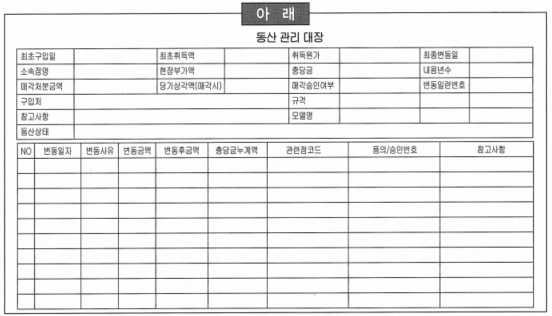
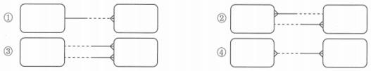
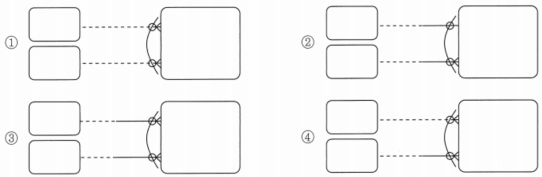
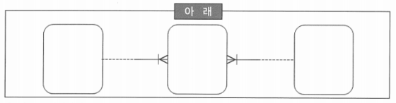
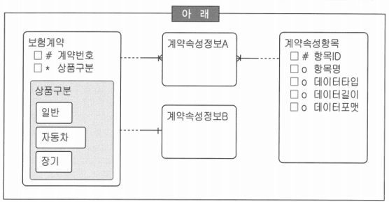
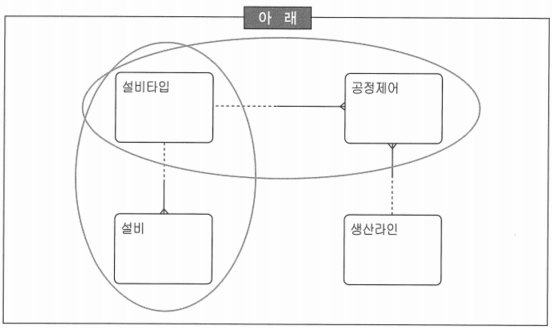

# 156 ~ 175

1. A은행은 새로운 Banking 시스템을 구축하고 있다. 현재 단계는 현행 시스템에서 사용되고 있는 모든 보고서, 화면, 장표 등을 가지고 엔터티 후보를 도출하는 작업을 진행하고 있다. 다음 중 개념 데이터 모델링 단계에서 아래와 같은 장표를 가지고 모델러가 수행할 내용으로 가장 적합한 것은?
    
    
    
    1. ‘구입처’에 어떤 값들이 들어갈 수 있는지 업무 담당자와 인터뷰를 통해서 조사하고, ‘고객’ 데이터와 관계를 생성할 수 있는지를 파악한다. → ‘고객’과의 연관관계는 논리 데이터 모델링 단계에서 검토되어야 함
    2. *‘동산’이라는 용어를 엔터티에 후보로 판단하여 업무 담당자와 인터뷰를 통해 동산의 의미를 조사하고, 동산에 대한 간단한 정의를 모델러 관점에서 정리한다.*
    3. ‘동산상태’에 대해서 이력 관리의 유무를 업무 담당자와 협의한다. → 이력 관리 방안도 집합들이 모두 정의되고 식별자도 정의되어야만 가능한 부분
    4. 현재 장표에서는 ‘소속점명’이 이름으로만 관리되고 있지만, 향후 데이터 모델링이 완성된 후에는 소속점을 관리하는 다른 엔터티와 관계(Relationship)로 표현될 것이기 때문에 여기에서는 엔터티 후보 대상에서 제외하기로 결정한다. → ‘소속점명’을 검토하면서 ‘소속점’을 관리하는 것이 필요하다고 판단하면 ‘소속점’을 엔터티 후보로 도출하는 것이 바람직함
    
2. 다음 중 주제영역 후보 도출의 방법으로 부적절한 것을 모두 고르시오.
    1. 업무에서 사용하는 데이터의 명사형을 도출
    2. 업무기능의 이름으로부터 도출
    3. ~~중요 보고서 제목을 참조하여 도출~~ → 엔터티 후보
    4. ~~시스템 관리자 의견을 참조하여 도출~~ → 업무 관리자의 의견 참조하여 주제영역 생성

3. 다음 중 모델 관계가 잘못 표기된 것은? (표기법은 Richard Barker의 CASE Method 방식)
    
    
    
    → 2: 한쪽에 인스턴스를 입력하려면 다른 쪽에 반드시 값이 있어야 한다는 것이 모순
    
    → 한쪽을 양쪽 선택적 관계로 바꾸어야 함
    

4. 개념 데이터 모델에서는 핵심 데이터 집합을 도출하고 그 엔터티들간의 관계를 규명하는 작업을 수행하게 된다. 이러한 과정의 첫번째 단계로 엔터티 후보 선정 단계를 수행하게 된다. 다음 중 엔터티 후보 선정을 수행할 때 유의사항으로 적절한 것은?
    1. 엔터티 가능성이 있다고 예상되면 예외사항 검토 등을 통해 상세분석을 한다.
    2. *동의어처럼 보이더라도 함부로 버리지 않는다.*
    3. 개념이 모호한 대상은 일단 넘어간다.
    4. 예외처리는 중요하므로 잘 분석하고 정리해 놓는다.
    
    → 개념 데이터 모델링에서는 엔터티의 상세 분석을 수행하는 것은 아님
    
    → 개념 데이터 모델 단계에서 개념에 대해서 확실하게 정립해야 함
    

5. 모델러가 개념 데이터 모델링 단계에서 엔터티 후보들을 도출하고 엔터티 후보들에 대한 자격검증을 위한 엔터티 식별 단계를 수행하고 있다. 다음 중 모델러가 이 단계에서 수행해야 하는 행동으로 가장 부적절한 것은?
    1. ~~‘고객’ 엔터티에서 관리해야할 구체적인 ‘생년월일’ 속성에 대해서 업무 담당자들과 협의한다.~~ → 일반속성(생년월일)을 이 단계에서 언급하는 것은 부적절함
    2. 후보 엔터티가 정확히 어떤 개념인지를 파악하기 위해서 동종의 비즈니스 관련 서적에서 관련 개념을 파악한다.
    3. 인터넷을 통하여 해당 후보 엔터티의 용어적인 의미를 파악하기 위해서 자료를 검색한다.
    4. 특정 업종에서만 사용하는 용어라서 모델러가 판단하기 힘들면 주변에 존재하는 비유를 들어서 업무 담당자와 개념에 대한 동질성을 파악한다.
    
    → 엔터티 후보 식별 단계에서는 해당 엔터티의 개념을 파악하거나 엔터티를 명확히 구분 짓기 위한 속성들에 대해서 업무 담당자와 상의할 수 있음
    

6. 데이터 모델링을 체계적이고 단계적으로 수행하기 위한 목적으로 엔터티 후보를 도출하고 역할에 따라 분류하여 모델링을 진행한다. 다음 중 이러한 목적으로 엔터티를 분류할 때 의미가 다른 것은?
    1. Key Entity
    2. Main Entity
    3. ~~Intersection Entity~~(교차 엔터티): 다대다(M:M) 관계의 해소로 생기는 엔터티
    4. Action Entity
    
    → 교차 엔터티는 개념 데이터 모델에서 생성되기 보다는 논리 데이터 모델링 단계에서 생성되고, 역할에 따른 분류에는 대부분 Action Entity에 속하는 것이 보통
    
7. 다음 중 상호 배타적 관계를 잘못 표기한 것을 모두 고르시오. (표기법은 Richard Barker의 CASE Method 방식)
    
    
    
    → 4: 배타적 관계는 모두 선택적이든지 모두 필수적이어야 함, 한 쪽만 선택적이든지 혹은 한 쪽만 필수적이면 배타적 관계가 형성될 수 없기 때문
    
    → 1: 양쪽 선택적인데 이것은 관계를 하나도 맺지 않는 업무
    
    → 2: 기수성(Cardinality, Degree)은 배타적 관계에 아무 영향을 미치지 않음
    
    → 3: 둘 중에 하나와 관계를 맺는데 반드시 관계가 하나는 있다는 업무 규칙
    

8. K모델러는 개념 데이터 모델링을 진행하면서 엔터티 중에 하나인 부서 엔터티를 정의하고 있다. 다음 중 K모델러의 판단으로 부적절한 것을 모두 고르시오.
    1. 부서는 키 엔터티이다.
    2. 부서 엔터티는 여러 조직간의 상하 관계를 표현하기 위해서 재귀관계를 생성하기로 한다.
    3. ~~부서 엔터티와 연관된 하위 엔터티들을 차례로 정의해 나간다.~~
    4. ~~부서 엔터티의 속성들을 확정하여 부서 엔터티의 모든 부분들을 확정해 나간다.~~
    
    → 개념 데이터 모델링에서는 부서 엔터티 자체의 정의를 명확히 하는 것은 바람직하지만 부서 엔터티와 연관된 하위 엔터티들을 정의하는 것은 수평적 사고를 방해할 위험요소가 있기 때문에 바람직한 모델링의 방향이라 할 수 없음
    
9. 데이터 모델링에서 엔터티를 정의할 때 KEY를 정의하게 된다. KEY의 정의는 후보키를 정의하고 이중에서 실제키와 대체키로 나누어서 정의하는 것이 일반적인 방법이다. 다음 중 후보키에 대한 설명으로 가장 거리가 먼 것은?
    1. 각 인스턴스를 유일하게 식별할 수 있어야 한다.
    2. ~~해당 후보키 이외의 나머지 속성들을 직접 식별할 수 있어야 하는 것은 아니다.~~
    3. 후보키의 데이터들은 가능하면 자주 변경되지 않는 것이 좋다.
    4. 가능하면 키 길이가 작은 속성들을 선택하는 것이 바람직하다.
    
    → 후보키는 후보키 이외의 나머지 속성들을 직접 식별할 수 있어야 이러한 사항을 어기면 향후 정규화(2, 3정규화) 과정에서 정규화 위배로 도출되게 됨
    

10. 데이터 모델링을 체계적으로 수행하기 위해서 엔터티 후보를 분류하는 기준 이외에 엔터티의 데이터의 성격에 따라 분류하는 방법이 있다. 다음 중 성격기준으로 데이터를 분류하는 방법의 장점으로 가장 거리가 먼 것은?
    1. 엔터티 후보들간의 미묘한 차이를 분석하는데 유리하다.
    2. 엔터티 통합여부 판단의 기초가 된다.
    3. 엔터티의 정의를 견고하게 할 수 있다.
    4. ~~주제영역 분류의 기준을 제공한다.~~
    
    → 엔터티 후보를 도출하는 단계에서 주제영역 분류에 대한 언급은 부적절함
    
11. 다음 중 아래 ERD의 직렬 관계의 특성으로 틀린 것을 모두 고르시오.
    
    
    
    1. 새로운 테이블이 추가됨
    2. 인덱스 수가 감소될 가능성이 높음
    3. ~~여러 개의 속성으로 나누어짐~~
    4. 변화에 유리함(로우만 추가됨)
    
    → 직렬 관계는 여러 개의 로우(Row)로 나누어짐
    

12. 다음 중 본질 식별자에 대한 설명으로 부적절한 것은?
    1. ~~카드 회사의 데이터 모델링 과정에서 나올 수 있는 ‘신용카드’의 ‘카드번호’는 본질 식별자에 해당한다.~~ → 카드번호는 실질 직별자 즉, 인조 식별자(Artificial UID)에 해당
    2. 1:M 관계에서 1쪽의 식별자가 M쪽에서 항상 식별자로 되는 것은 아니다.
    3. 인조 식별자(Artificial Unique Identifier)도 때로는 본질식별자가 될 수 있다.
    4. 본질 식별자는 만약 본질 식별자를 이루는 속성이 없을 때 자신이 절대로 태어날 수 없는 경우에만 해당한다.
    
    → 실제 본질 식별자에 해당하는 속성은 고객번호, 카드상품코드, 카드발급일시 등의 속성
    

13. 엔터티 정의 단계에서 엔터티의 통합 및 분할을 위해서 여러 가지 기준들을 적용하게 된다. 아래의 데이터 모델에서와 같이 데이터(계약속성정보)를 관리하더라도 서로 다른 방법으로 적용할 수 있다. 다음 중 아래의 데이터 모델에 대한 설명으로 부적절한 것은?
    
    
    
    1. ‘계약속성정보A’와 같이 관리하는 방법의 가장 큰 장점은 어떠한 속성이 추가 되더라도 데이터 모델에는 변화를 주지 않는다는 것이다. 
    2. ‘계약속성정보A’와 같이 관리하는 방법의 가장 큰 단점은 해당 엔터티에 대한 조건 검색이나 빈번한 액세스가 발생한다면 불리해진다는 것이다.
    3. ‘계약속성정보A’와 같이 관리하는 방법은 ERP와 같은 패키지에서 자주 사용되어지는 데이터 모델링 기법이다.
    4. ~~‘계약속성정보A’와 같이 관리하는 상황에서 속성정보의 이력을 관리하기 위해서는 새로운 엔터티를 추가해야 한다.~~
    
    → 계약속성정보A와 같은 방식의 관리에서 이력을 관리하기 위해서는 추가 UID 속성을 추가하여 관리하는 것이 일반적인 방법
    
14. 다음 중 개념 데이터 모델링 단계에서 코드성 엔터티의 처리에 대해 적절한 것은?
    1. *코드성 엔터티는 키 엔터티로 볼 수 있다.*
    2. 코드 속성을 코드성 엔터티로 도출해 놓으면 데이터 모델이 복잡성의 함정에 빠질 수 있으므로 엔터티로 도출하지 않는 것이 좋다.
    3. 코드 속성이 의미상의 주어가 된다면 반드시 코드성 엔터티로 정의해 주어야 한다.
    4. 코드성 엔터티의 도출은 부모-자식 관계 표현을 통해 개념 데이터 모델을 보다 상세하게 정의할 수 있기 때문에 꼭 필요한 과정이다.
    
    → 대부분 코드성 엔터티는 개념 데이터 모델링 단계에서 굳이 엔터티로 도출하지 않아도 무관함
    
    → 코드성 엔터티가 여러 하위 엔터티를 가지는 경우, 엔터티로 도출해야 함
    
    → 본질 식별자라고 해서 무조건 엔터티로 도출하기보다는 많은 다양한 관계를 가질때 엔터티로 도출하는 것이 바람직함
    
    → 코드성 엔터티의 도출은 개념 데이터 모델에서 꼭 필요한 과정이라고 볼 수 없음
    

15. 다음 중 논리 데이터 모델링을 수행할 때 고려할 사항으로 가장 거리가 먼 것은?
    1. 특정한 응용 프로그램이나 기술에 특화되지 않고 다수에 의해 사용 가능해야 한다.
    2. 현재 상태를 근간으로 최소한의 노력을 통해 새로운 요구 사항을 수용할 수 있어야 한다.
    3. 업무가 데이터를 이용하고 관리하는데 있어서 데이터 값의 일관성이 있어야 한다.
    4. ~~업무가 데이터를 이용하고 수행하는데 있어서 적절한 속도를 보장해야 한다.~~
    
    → 수행 성능은 물리적인 요소(인덱스, 저장 기법 등)
    

16. 다음 중 실제 데이터 모델링 과정에서 엔터티 정의의 판단 기준을 부적절하게 설명한 것은?
    1. ~~보험사에서 ‘피보험자’, ‘납입자’ 등은 업무 중심에 존재하는 매우 중요한 엔터티이다.~~
    2. ‘고객’은 엔터티 후보라고 볼 수 있지만, ‘불량거래자’는 엔터티 후보라고 보기에는 무리이다.
    3. ‘금융기관’은 ‘금융’과 ‘기관’의 합성어 형태이고, 엔터티로 정의할 수도 있다.
    4. ‘배송처’는 순수 본질 집합이 아니지만 경우에 따라서는 엔터티로 정의될 수도 있기 때문에 이 과정에서 엔터티 후보로 도출하는 것은 가능하다.
    
    → 대부분의 보험사에서 피보험자, 납입자 등은 엔터티라기 보다는 고객 엔터티와 업무를 표현하고 있는 ‘계약’ 엔터티와의 관계라고 보는 것이 더 합당함
    
17. 다음 중 아래의 관계형 모델이 위배하고 있는 성격으로 적합한 것은?
    - 계좌번호를 지점코드 + 상품코드 + 년도 + 순번을 합쳐서 하나의 속성으로 구성
    - 구매일자를 구매년도, 구매 월, 구매일의 세 개의 속성으로 구성
    
    1. *속성 원자성*
    2. 속성 무결성
    3. 속성 단순성
    4. 속성 중복성
    
    → 속성의 원자성은 관계형 모델의 이론적 배경
    
    → 원자성: 비즈니스에서 의미 있는 최소한의 속성 단위
    
    → ‘계좌번호’가 문제의 지문과 같이 구성된 것은 속성이 비원자적으로 구성되어 있기 때문에 ‘구매일자’가 지문과 같이 구성된 것은 의미가 없음
    
    → ‘구매일자’와 같은 속성은 연월일이 있어야 의미가 있음
    

18. 다음 중 서브타입 엔터티에 대한 설명으로 부적절한 것을 모두 고르시오.
    1. 서브타입 간에는 교집합이 존재하지 않아야 한다.
    2. 서브타입을 모두 결합하면 반드시 전체 집합이 되어야 한다.
    3. ~~서브타입은 물리 데이터 모델에서 별개의 테이블로 분할 된다.~~
    4. ~~서브타입의 사용은 가독성을 증진시키지만 물리 데이터 모델 전환 시에 복잡성이 증가하는 단점을 갖고 있다.~~
    
    → 서브타입은 물리 데이터 모델링 단계에서 별개의 테이블로 생성될 수 있고, 하나의 테이블로 병합될 수도 있음
    
    → 물리 모델로 전환하기 위한 기준을 마련한다면 복잡성을 증가시키지는 않음
    
19. 개념 데이터 모델링 단계에서 많은 후보 엔터티들을 분류하고 핵심 엔터티를 정의하게 된다. 이러한 일련의 작업에서 많은 코드성 엔터티들이 나타나게 된다. 다음 중 아래의 개념 데이터 모델에서 ‘설비타입’에 대한 모델러의 판단으로 가장 부적절한 것은?
    
    
    
    1. ‘설비타입’이 오로지 설비들을 분류하는 용도로 사용된다고 판단했다면 굳이 지금 단계에서 엔터티로 정의하지 않을 수도 있다.
    2. ~~만약 ‘설비타입’과 ‘생산라인’별로 관리하고자 하는 ‘공정제어’ 값들이 있다면 이 ‘설비타입’은 분명히 부모의 역할을 하게 되므로 지금 엔터티로 도출하여 핵심 엔터티로 정의하고 ‘공정제어’ 집합에 대한 자세한 분석을 실시한다.~~
    3. ‘설비타입’ 엔터티가 멀지 않은 장래(To-be)에 다른 속성을 가질 수 있는지를 확인하기 위해서 업무 담당자와 협의한 후에 가능성이 있다고 판단되면 엔터티로 정의한다.
    4. ‘설비타입’ 엔터티 후보가 다른 엔터티와의 관계, 특히 자식관계가 없다고 판단하여 엔터티 정의에서 제외하기로 하였다.
    
    → 공정제어 집합에 대하여 분석을 실시하는 것은 개념 데이터 모델링 단계에서 언급할 부분은 아님
    
20. 다음 중 서브타입의 적용 기준으로 부적합한 것을 모두 고르시오.
    1. 분류 속성에 따라 엔터티의 정보가 차별화 되는 경우
    2. ~~소수의 선택 속성과 다수의 필수 속성이 존재하는 경우~~ → 소수의 선택속성이 존재한다면 굳이 서브타입으로 구분할 필요는 없음
    3. 서브타입으로 분할함으로써 관계가 필수관계로 변하는 경우
    4. ~~복잡한 엔터티의 단순화가 필요한 경우~~ → 엔터티 단순화와는 거리가 멂