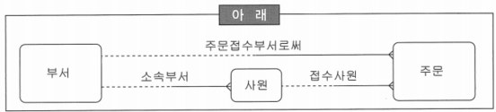
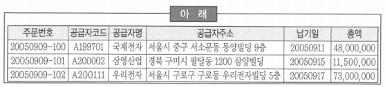
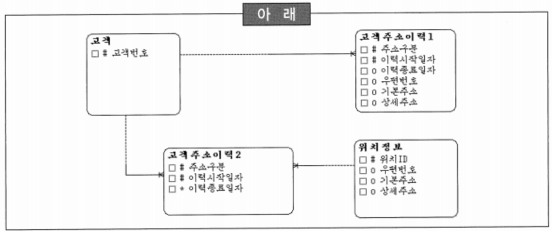

# 176 ~ 195

1. 다음 중 아래의 모델이 궁극적으로 발생할 수 있는 문제점으로 적합한 것은?
    
    
    
    1. *관계의 중복은 중복 데이터를 도입하게 되며 결국 데이터베이스 일관성에 문제를 일으킬 수 있다.*
    2. 주문 실체 유형에 ‘접수부서’와 ‘접수사원’을 관리해야 하므로 아무런 문제가 없다.
    3. ‘사원’의 소속이 바뀌면 주문 당시의 ‘주문접수부서’를 알 수 없으므로 ‘주문’과 ‘부서’사이에 관계를 가지고 가는 것은 논리적으로 문제가 없다.
    4. ‘부서’와 ‘주문’의 JOIN 시에 Access Path를 신속하게 하기 위하여 ‘주문’이 ‘부서’와 관계를 가지는 것은 합당하다.
    
    → ‘사원’은 ‘부서’에 종속되어 있으므로 사원의 부서를 알면 ‘접수부서’를 알 수 있음
    
    → 데이터 논리 모델에서 관계 중복에 해당
    
    → 주문 데이터를 액세스하는데 속도가 느려진다면 조인의 효율을 위하여 부서와 관계를 설정하여 반정규화 할 수 있지만 논리 데이터 모델에서는 데이터의 이상 현상이 발생할 수 있으므로 이러한 모델링은 삼가해야 함
    
2. 개념 데이터 모델링 단계에서의 키 엔터티의 통합과 분할에 대한 전략은 전체 시스템의 데이터 모델에 지대한 영향을 미치게 된다. 다음 중 엔터티의 통합과 분할에 대한 설명으로 적합한 것은?
    1. *엔터티는 통합 할수록 집합의 유연성은 향상되지만 독립성은 저하된다.*
    2. 집합의 일부가 서로 겹칠 때 어느 한 집합을 확장하여 나머지를 포함시키는 것은 부적절한 형태의 통합 방법이다.
    3. 키 엔터티를 최대한 통합을 하는 것은 향후에 생길 자식 엔터티를 위해서 가급적이면 삼가해야 한다.
    4. 집합의 동질성 부여 방법에 따라 집합의 독립성에 영향을 주지는 못한다.
    
    → 엔터티의 통합은 향후에 유연성이 크게 향상되고, 배타적관계의 가능성을 줄여 줄 수 있음
    
    → 무리한 통합은 집합의 독립성을 저해하는 결과를 초래함
    

3. 다음 중 관계(Relationship)에 대한 설명으로 틀린 것은?
    1. 집합 간에는 하나 이상의 많은 관계들이 존재할 수 있다. 하지만 이러한 관계들 중에서 직접 관계만을 표현하는 것이 논리 데이터 모델링이다.
    2. ~~다대다(M:M) 관계는 관계의 복잡성을 증가시키므로 발견 즉시 두개의 일대다(1:M) 관계를 가지는 관계 엔터티(Relationship Entity)로 분해하는 것이 바람직하다.~~
    3. 관계의 내용에 따라서 얼마든지 관계의 형태가 달라질 수 있다.
    4. 관계를 맺는 두 엔터티의 의미상 식별자가 결정되지 않았다면 관계를 생성하는 것은 무의미하다고 볼 수 있다.
    
    → 개념 데이터 모델링 단계에서는 다대다(M:M) 관계를 풀지 않지만, 논리 데이터 모델링 단계에서는 두개의 일대다(1:M) 관계 엔터티로 생성하게 됨
    

4. 다음 중 관계(Relationship)에 대한 설명으로 부적합한 것을 모두 고르시오.
    1. 관계도 집합이다.
    2. 집합 간에 존재하는 무수히 많은 관계 중에 직접종속인 것만을 관계로 모델링한다.
    3. ~~다대다(M:M) 관계는 복잡성을 증가시키므로, 발견 즉시 두 개의 일대다(1:M) 관계를 갖는 관계 엔터티로 분해한다.~~
    4. ~~두 엔터티 간에 하나 이상의 관계를 정의하는 것은 바람직하지 않다.~~
    
    → 직접 종속, 간접 종속 등의 관계 속성들을 모델링 함
    
    → 두 엔터티 간에는 하나 이상의 관계가 얼마든지 존재할 수 있음
    

5. 개념 데이터 모델링에서는 엔터티 후보에 대한 객관적인 판단의 근거를 가지고 엔터티 여부를 판별하는 것이 매우 중요하다. 아래와 같은 엔터티 후보들이 있다고 가정할 때, 다음 중 각 엔터티 후보들에 대한 모델러의 판단으로 가장 부적절한 것은?
    
    
    | 아래 |
    | --- |
    | 금융기관, 피보험자, 법인, 배송처 |
    1. ~~‘금융기관’은 ‘금융’이라는 행위와 기관이라는 개체가 묶여진 관계(Relationship)이다.~~
    2. ‘피보험자’는 ‘피보험’이라는 행위와 ‘자’라는 개체가 묶여서 만들어진 관계이다. 하지만, ‘피보험자’가 다대다(M:M)이라면 엔터티(교차엔터티, 관계엔터티)로 생성될 수 있다.
    3. ‘법인’은 ‘고객’의 서브타입에 해당하므로 독자적인 엔터티가 아니다.
    4. ‘배송처’는 ‘배송’이라는 행위와 ‘처’라는 개체 집합으로 결합된 형태이기 때문에 관계라고 할 수 있지만 경우에 따라서는 ‘배송처’가 될 수 있는 개체들만 모아둔 엔터티로 볼 수도 있다.
    
    → ‘금융’은 ‘기관’이라는 큰 집합의 특정 부분 집합을 나타내기 위해서 사용된 말이기 때문에 ‘금융기관’은 관계라고 보기 어려움
    
    → 전체 집합인 ‘고객’의 일부를 ‘법인고객’으로 표현한 것과 같은 이치
    

6. 다음 중 논리 데이터 모델링에 대한 설명으로 가장 부적합한 것은?
    1. 논리 데이터 모델은 논리적 관점에서 데이터 모델링이 최종적으로 완료된 상태를 말한다.
    2. ~~전산화 대상 시스템의 형태나 목적 등에 의해 영향을 받는다.~~
    3. 비즈니스 데이터에 존재하는 사실을 인식·기록하는 기법이다.
    4. 데이터 모델링 과정에서 가장 핵심이 되는 부분으로 분석 초기 단계에서부터 인간이 결정해야 할 대부분의 사항을 모두 정의함으로써 설계의 전 과정을 지원하는 ‘과정의 도구’라고 할 수 있다.
    
    → 전산화 대상 시스템의 형태, 목적 등에 의해 영향을 받는 것은 물리 데이터 모델
    
    → 물리 데이터 모델은 논리 데이터 모델링 과정에서 정의된 내용을 기반으로 물리적인 요소, 시스템 상황 등을 고려하여 생성함
    
7. 다음 중 아래의 표가 필요한 정규화로 적합한 것은? (주문번호가 식별자이다.)
    
    
    
    1. 제1차 정규화
    2. 제2차 정규화
    3. *제3차 정규화*
    4. 제4차 정규화
    
    → 식별자가 ‘주문번호’이고, ‘공급자명’과 ‘공급자주소’는 식별자가 아닌 ‘공급자코드’에 종속된 속성으로 3차 정규화를 실시해야 함
    
8. 다음 중 논리적 데이터 모델링의 목적 및 효과로서 부적절한 것은?
    1. 해당 비즈니스에 대해 데이터 관점에서 명확한 이해가 가능하다.
    2. ~~데이터베이스를 구성하는 오브젝트(Object)들의 설계 전략이 반영되어 있다.~~
    3. 사용자와 명확한 의사소통을 하기 위한 수단으로 활용된다.
    4. 데이터의 일관성 및 정확성 유지를 위한 규칙을 도출할 수 있다.
    
    → 데이터베이스를 구성하는 오브젝트들의 설계 전략은 물리 데이터 모델링 단계에서 생성됨
    
    → 파티셔닝 전략 등의 내용이 물리 데이터 모델에 포함
    

9. 다음 중 엔터티의 통합과 분할에 대한 설명으로 적합한 것은?
    1. 핵심 엔터티 즉, 상위 엔터티를 최대한 통합하는 것은 향후에 생길 하위 엔터티를 위해서 가급적이면 삼가해야 한다.
    2. *보험회사의 경우에는 ‘대리점’이 ‘내근사원’과 통합하는 것이 좋지만, 통신회사인 경우에는 ‘조직’과 통합하는 것이 바람직하다.*
    3. 집합의 일부가 서로 겹칠 때는 어느 한 집합을 확장하여 나머지를 포함하는 것이 부적절한 형태의 통합 방법일 수 있다.
    4. 향후 변화에 대응하기 위해서는 데이터 모델이 반드시 유연성을 가지고 있어야 한다. 이러한 유연성 확보를 위해서 집합을 최대한 분할하는 것이 바람직하다.
    
    → 하위 엔터티를 위해서는 최대한 통합을 유도하는 것이 바람직함
    
    → 경우에 따라서는 하나의 집합이 완전히 포함되어지는 통합이 일어나는 경우도 발생
    
    → 새로운 유형의 집합이 추가되더라도 새로운 엔터티나 기존에는 관계의 변화가 일어나지 않으면서 부분 집합(서브타입)만 증가하는 형태가 바람직함
    

10. 다음 중 논리 데이터 모델링의 필수 성공 요소들에 대한 설명으로 부적절한 것을 모두 고르시오.
    1. ~~현업 사용자보다 업무시스템 운영 경험이 많은 유지보수 담당자의 참여가 필수적이다.~~
    2. 절차(Procedure) 보다는 데이터에 초점을 두고 모델링을 진행해야 한다.
    3. 데이터의 구조(Structure)와 무결성(Integrity)을 함께 고려해야 한다.
    4. ~~변경이 발생할 가능성은 매우 높으면서 이력관리 대상 속성이 적으면 속성 레벨의 선분이력 관리 방식이 유리하다.~~
    
    → 데이터 모델링 과정에는 현업사용자의 참여가 필수적이며, 데이터 모델링을 지원하는 CASE 툴을 사용하면 많은 도움을 줄 수 있음
    

11. 데이터 모델링을 체계적으로 수행하기 위해서는 여러 경로를 통해서 수집된 엔터티 후보들을 분류해야 한다. 특히, 엔터티의 우선순위를 정하여 먼저 정의해야 할 엔터티와 나중에 정의해야 할 엔터티를 분류해야 한다. 다음 중 엔터티 후보의 분류를 위한 모델러의 수행내용으로 가장 부적합한 것은?
    1. 우선순위가 높은 엔터티들은 대개 전체 데이터 모델링의 골격에 해당하는 주요 엔터티들이기 때문에 먼저 이들을 명확하게 함으로써 모델링의 골격을 갖출 수 있다.
    2. 데이터 모델링의 골격에 해당하는 엔터티는 각 회사마다 가장 중요한 데이터의 집합인데 비즈니스 영역마다 유사한 형태를 가지고 있는 것이 보통이다.
    3. 최상위 우선순위를 가지는 엔터티들은 대개 행위를 발생시키는 주체나 목적에 해당한다.
    4. ~~카드사에서 ‘신용카드’라는 엔터티 후보는 최상위 우선순위를 가지고 있으므로 가장 먼저 정의해야 할 중요한 엔터티이다.~~
    
    → 신용카드는 카드를 발급 받은 사람과 발급해 준 카드사의 상품이 반드시 존재해야만 태어날 수 있는 엔터티이므로, 우선순위가 가장 높은 것이라고 보기는 어려움
    

12. 엔터티 정의를 수행하고 해당 엔터티 내의 관리 항목들을 도출하여 정의하는 과정을 ‘속성 정의’라고 한다. 다음 중 속성 정의에 대한 설명으로 틀린 것은?
    1. 엔터티에 통합되는 구체적인 정보항목으로써 더이상 분리될 수 없는 최소의 데이터 보관 단위이다.
    2. 관계(Relationship)도 속성이다.
    3. 속성들은 서로 독립적이고 식별자에만 종속되어야 한다.
    4. ~~현재 시스템과 다른 시스템의 다큐먼트는 속성 후보 수집처로 적절하지 못하다.~~
    
    → 다른 시스템의 문서를 참조하는 것은 현재 시스템의 개선점을 파악하기 위해서 필요하며, 미처 생각하지 못했던 관리 속성들을 추출하기 위한 중요한 소스로도 사용할 수 있음
    

13. 다음 중 참조 무결성 규칙에 대한 설명으로 틀린 것은? (단, 주문과 주문내역은 1:M의 양쪽 필수 단계)
    1. 주문과 주문내역 실체 유형에서 주문 인스턴스(Row) 삭제 시에는 주문내역 인스턴스(Row)를 삭제한다.
    2. 주문과 주문내역 실체 유형에서 주문 인스턴스(Row) 삭제 시에는 주문내역 인스턴스(Row)가 있으면 삭제하지 않는다.
    3. 주문과 주문내역 실체 유형에서 주문내역 인스턴스(Row) 입력 시에는 주문 인스턴스(Row)가 있는 경우만 입력한다.
    4. ~~주문과 주문내역 실체 유형에서 주문내역의 마지막 인스턴스(Row) 삭제 시에는 주문 인스턴스(Row)도 삭제한다.~~ → 참조 무결성이 해결하지 못하는 연쇄작용에 의한 데이터 무결성

14. 논리 데이터 모델링 과정에서 속성 후보를 수집하기 위한 자료로 다음 중 가장 부적절한 것은?
    1. ~~중장기 마스터플랜~~
    2. 현업장표/보고서
    3. 사용자 인터뷰
    4. 타 시스템 자료
    
    → 속성은 엔터티 내에서 관리해야 할 구체적인 관리항목이므로 중장기 마스터플랜에서 속성 후보를 도출한다고 보기는 어려움
    

15. 데이터 모델에서 일대일(1:1) 관계는 어느 쪽 당사자의 입장에서 보더라도 반드시 일대일 대응 관계를 가진다. 일대일(1:1) 관계는 선택사항의 종류에 따라서 몇 가지로 나눌 수 있는데, 다음 중 일대일 관계의 선택사항에 대한 설명으로 올바른 것은?
    1. *필수-선택형태(–⋯)는 좌측 엔터티가 우측 엔터티에 집합적으로 포함되는 형태를 말한다.*
    2. 필수-필수형태(––)가 데이터 모델에 많이 등장하였다면, 모델링 과정 중에서 과도한 수평분할을 시도하였기 때문이다. → 무리한 수직 분할을 시도했을 경우에 많이 나타나는 관계 형태
    3. 선택-선택형태(⋯⋯)는 실전에서 빈번하게 발생하는 일대일(1:1) 형태의 관계가 바람직하다. → 데이터 모델링 과정에서 드물게 발생하는 형태
    4. 일대일(1:1) 형태의 데이터 모델은 최대한 일대다(1:M) 관계의 데이터 모델로 유도하는 것이 바람직하다. → 일대일 관계도 때로는 필요함
    
16. A기업은 논리 데이터 모델링의 중간 단계에서 속성 후보들을 도출하고 각각의 속성 후보에 대해서 타당성 작업을 수행하고 있는데, 다음 중 속성 검증의 방법으로 가장 부적절한 것은?
    1. 최소 단위 분할 여부를 판단한다.
    2. 해당 속성 후보가 단일값을 갖는지 판단한다.
    3. 추출 속성인지 판단한다.
    4. ~~식별자로 사용되는 것인지 판단한다.~~
    
    → 식별자 검증은 속성 검증이 완료되고 해당 엔터티 내에서 식별자를 지정하게 되므로, 속성 검증과는 거리가 멂
    

17. 다음 중 실체 유형에 대한 정의(설명)를 기술할 때 고려해야 할 사항으로 가장 거리가 먼 것은?
    1. 실체 유형의 정의(설명)는 그 실체 유형이 무엇인지를 설명해야 한다.
    2. 실체 유형의 정의(설명)는 왜 그 실체 유형이 업무에서 중요한가를 설명해야 한다.
    3. ~~실체 유형의 정의(설명)는 누가, 어떻게 실체 유형을 사용하는지를 설명해야 한다.~~
    4. 실체 유형의 정의(설명)는 실체 유형명은 명확하고 간결하게 설명해야 한다.
    
    → 실체 유형을 사용하는지는 변화 가능성이 많으므로 데이터 모델에 정의하면 유지보수에 문제가 발생할 수 있기 때문에 매트릭스 분석 기법을 통한 상호작용 분석으로 수행하는 것이 향후 긍정적 효과가 나타날 수 있음
    

18. 엔터티 내의 속성을 정의하는 단계에서 “’일자’, ‘시간’, ‘성명’, ‘주민등록번호’, ‘우편번호’, 등은 일반적으로 나누지 않는 것이 좋다.” 라는 모델링 유의사항을 모델러로 부터 들었다. 다음 중 유의사항에 속하는 속성 검증의 하위 단계로 적합한 것은?
    1. 상세화 여부 판단
    2. *최소 단위 분할*
    3. 추출 속성 검증
    4. 단일값
    
    → 속성은 최소단위로 분할해서 정의하는 것이 일반적, 경우에 따라서 복합속성 구성도 가능
    

19. 아래의 데이터 모델은 흔히 볼 수 있는 고객 데이터 모델이다. (특히, 고객의 주소를 관리하는 데이터 모델이다.) 아래의 데이터 모델에서와 같이 고객의 주소는 ‘고객주소이력1’, ‘고객주소이력2’ 등과 같은 형태로 관리하는 것이 대표적이다. 다음 중 이에 대한 설명으로 가장 부적절한 것은?
    
    
    
    1. ~~‘법인고객’을 ‘고객’에서 통합해서 관리하고 있다면, ‘고객주소이력2’와 같은 형태의 고객주소관리는 비효율적이다.~~ → ‘법인고객관리’ 형태와는 무관함
    2. ‘고객주소이력1’과 같은 형태의 고객주소관리 형태에서는 동일한 주소 즉, 장소가 여러 번 반복해서 나타나는 경우가 발생할 수 있다.
    3. ‘고객주소이력2’와 같은 형태의 데이터 모델은 ERP와 같은 패키지 형태에서 자주 등장하는 데이터 모델로써 확장성과 재사용성의 극대화에 초점을 두고 있다.
    4. ‘고객주소이력1’과 같은 형태의 고객주소관리에서는 고객이 가진 여러 가지 구분(자택, 직장 등)의 주소이력을 통합하여 관리할 수 있다.
    
20. 속성 검증 원칙 중에서 단일 값 원칙에 의해 “한 개체가 여러 값을 가지거나 반복되는 속성을 가지게 되면 잘못된 속성이다.”가 위배하는 정규화 원칙으로 적합한 것은?
    1. *1차 정규화: 하나의 속성은 반복되는 중복값을 가질 수 없다*
    2. 2차 정규화
    3. 3차 정규화
    4. 4차 정규화
    
    → 하나의 속성이 중복값을 가지기 위해서는 새로운 엔터티를 생성해야 함