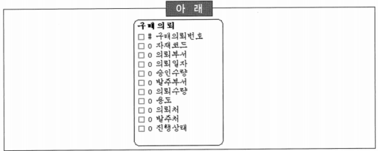
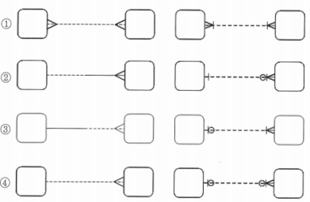

# 196 ~ 215

1. 데이터 모델링에서는 계층적으로 생기는 데이터를 관리하기 위해서 흔히 순환관계 모델을 생성하게 된다. 다음 중 순환관계 데이터 모델에 대한 설명으로 가장 부적절한 것은?
    1. 순환관계 모델은 새로운 계층의 추가·수정에 대해서 유연하게 대처할 수 있다. 즉, 구조의 변화가 필요 없이 변화에 대처할 수 있다.
    2. 순환관계 모델에서 최상위는 의미적으로 NULL이지만 물리적인 요소(수행 성능 등)를 고려해서 특정 값을 갖는 것이 바람직하다.
    3. 다대다(M:M) 순환관계를 처리하기 위해서는 별도의 엔터티를 추가해야 한다.
    4. ~~순환관계 모델에서 구조가 변경되면 식별자가 변해야 하기 때문에 과거의 데이터에 대해서 수정작업을 수행해야 한다.~~ → 구조가 변경되더라도 식별자는 변경되지 않기 때문에 과거 데이터를 변경할 필요가 없음

2. A기업의 논리 데이터 모델링 중에서 ‘고객’ 엔터티의 속성을 정의할 때, 다음 중 추출 속성(Derived Attribute)값으로 가장 거리가 먼 것은?
    1. 현주소
    2. 최초가입일
    3. 고객활동상태
    4. ~~결혼기념일~~ → ‘고객’ 엔터티의 추출 속성이라기 보다는 본래의 속성이라고 보는 것이 적절함

3. 아래의 엔터티는 A회사에서 자재 구매의뢰 정보를 관리하는 엔터티이다. 다음 중 이 엔터티의 인스턴스 레벨 결정에 영향을 미치는(의미상 식별자의 역할을 한 속성 조합) 속성(들)로 적합한 것은?
    
    
    
    1. 구매의뢰번호
    2. 자재코드, 의뢰일자
    3. 구매의뢰번호, 자재코드, 의뢰일자
    4. *자재코드, 의뢰부서, 의뢰일자*
    
    → 의미상으로 식별자 역할을 하는 속성들은 누가, 무엇을, 언제, 어디서 등과 같은 육하원칙에 해당하는 속성들의 그룹
    

4. 다음 중 속성 정의 시에 유의사항으로 부적절한 것을 모두 고르시오.
    1. 의미가 명확한 속성 명칭을 부여한다.
    2. ~~‘전화번호’ 라는 속성은 일반적으로 많이 사용되는 용어로써 속성명으로 적합하다.~~ → 어떤 전화번호인지 명확하게 정의되는 것이 바람직
    3. ‘~~순번’, ‘상태’ 등과 같이 유일한 복합명사를 사용한다.~~ → 순번, 상태 등과 같이 주어 부분이 빠진 형태의 용어는 속성으로 바람직하지 못함
    4. 단수형으로 속성명을 사용한다.

5. 다음 중 엔터티 후보 선정시 유의사항으로 가장 적절한 것은?
    1. 중요한 엔터티인 경우 가능한 깊이 분석하는 것이 좋다. → 너무 깊지 않게 분석
    2. 단어 하나하나에 집중하지 않고 전체 집합을 고려하여 집합을 개념적으로 정의하는 것이 좋다. → 단어 하나하나에 집중
    3. 데이터는 프로세스와 밀접하게 관련있기 때문에 엔터티 후보 선정 시 프로세스 파악을 중요하다. → 프로세스에 연연하지 말아야 함
    4. *이음동의어, 동음이의어 같이 동의어처럼 보이는 집합도 집합을 명확하게 구분하여 파악하는 것이 중요하다.*

6. 다음 중 ‘고객’ 엔터티의 식별자를 결정하기 위한 기준에 대한 설명으로 가장 부적절한 것은?
    1. 각 인스턴스들을 유일하게 식별할 수 있어야 한다.
    2. 나머지 속성들을 직접 식별할 수 있어야 한다.
    3. 후보 식별자로 속성 집합을 선택하는 경우에는 개념적으로 유일해야 한다.
    4. ~~후보 식별자는 단일 속성이어야 한다.~~ → 여러 개의 속성들을 묶어서 식별자로 생성할 수 있음

7. 다음 중 데이터 모델링에서 이력 관리의 대상과 가장 거리가 먼 것은?
    1. 부서와 사원의 관계
    2. ~~주문과 주문품목의 관계~~
    3. 상품 단가에 대한 관리
    4. 금융 상품의 이자율 관리
    
    → 세월이 흐르면 사원의 부서가 바뀌며 상품의 단가, 금융 상품의 이자율도 바뀔 수 있음
    

8. 엔터티에서 실제 인스턴스 탄생의 주체에 해당하는 속성들을 ‘본질 식별자’라고 한다. 본질 식별자는 여러 가지 목적으로 인해 본질 식별자를 대체할 인조 식별자를 지정하게 된다. 다음 중 인조 식별자 지정에 대한 설명으로 부적절한 것은?
    1. 최대한 범용적인 값을 사용한다.
    2. 유일한 값을 만들기 위해 인조 식별자를 사용한다.
    3. 편의성·단순성 확보를 위해 인조 식별자를 사용할 수 있다.
    4. ~~내부적으로 사용되는 인조식별자는 가급적 피한다.~~
    
    → 경우에 따라서는 재부적으로만 사용되는 인조 식별자를 사용할 수도 있음
    → 특히, 시스템에서 사용하는 데이터들에 이러한 유형의 식별자가 많이 존재함
    

9. 다음 중 Richard Barker의 CASE Method 방식과 정보공학 방식이 잘못 짝지어진 것은?
    
    
    
    → 1

    → 정보공학방법에서 동그라미가 없는 것은 필수 관계를 말하고,  CASE Method에서는 실선이 필수 관계를 표현
    

10. 다음 중 식별자 확정 시에 고려사항으로 가장 부적절한 것은?
    1. 상위 엔터티로부터 하위 엔터티로 결정해가는 것이 좋다.
    2. 메인 엔터티는 하위 엔터티들에 대한 영향이 크기 때문에 식별자 속성의 갯수를 적게 하는 것이 좋다.
    3. ~~인조 식별자는 유일성 확보에 유리하므로 적극적인 사용을 고려한다.~~
    4. 인조 식별자의 사용은 꼭 필요한 경우에만 한정적으로 사용하는 것이 바람직하다.
    
    → 하위 엔터티는 다시 자식 엔터티를 가질 가능성이 적으므로 정보의 단절과는 거리가 멂
    

11. 아래의 내용을 위반한 속성이 발견되었을 때, 다음 중 모델러가 제일 먼저 취해야 할 행동으로 가장 적절한 것은?
    
    
    | 아래 |
    | :---: |
    | 한 개체가 여러 값을 가지거나 반복되는 속성을 가지게 되면 잘못된 속성이다. |
    1. 해당 속성은 잘못된 속성으로 간주하여 배제시킨다.
    2. *반복되는 형태에 대해 정확히 파악하기 위해서는 해당 속성의 생성 규칙 내용을 업무 담당자와 협의하여 그 결정에 따라 판단한다.*
    3. 이 부분은 정규화 과정에서 진행된다고 가정하여 우선순위를 뒤로 미룬다.
    4. 해당 엔터티의 UID에 대한 적절성 여부를 판단한다.
    
    → 이런 상황에서 가장 먼저 해야 할 일은 해당 반복 속성의 내용을 업무담당자를 통하여 정확히 파악하는 것
    

12. 다음 중 논리 데이터 모델링의 최종적인 단계에 해당하는 정규화 작업의 내용으로 올바른 것은?
    1. 1차 정규형: 모든 속성은 식별자 전체에 종속되어야 한다.
    2. 2차 정규형: 반복 속성은 존재할 수 없다.
    3. *3차 정규형: 2차 정규형을 만족하고, 비식별자 속성 간에 종속이 없어야 한다.*
    4. 인조 식별자의 사용은 데이터 일관성, 무결성 확보에 유리하므로 정규화를 생략할 수 있다.
    
    → 1차 정규형: 반복 속성은 존재할 수 없음, 반복 속성을 해소하기 위해서는 자식 엔터티를 생성하게 됨

    → 2차 정규형: 모든 속성은 식별자 전체에 종속되어야 함, 그렇지 않은 경우에는 부모 엔터티가 추가됨, 이때 부모 엔터티로부터 관계에 식별자가 포함되어 짐
    
13. 다음 중 선분(기간)이력으로 관리해야 하는 것으로 가장 거리가 먼 것은?
    1. 각 상품별 이자율에 대한 이력 관리
    2. ~~매일 바뀌는 환율에 대한 이력 관리~~ → 매일매일이므로 일자별로 관리하면 굳이 기간으로 관리할 필요가 없음
    3. 어느 부서에 어떤 사원이 근무했다는 이력 관리
    4. 제조 기업의 상품 단가에 대한 이력 관리

14. 다음 중 정규화 작업을 수행함으로써 얻을 수 있는 장점으로 가장 거리가 먼 것은?
    1. 중복값 및 Null 값이 줄어든다.
    2. 데이터 구조의 안정성이 향상된다.
    3. 복잡한 코드로 데이터 모델을 보완할 필요가 없어진다.
    4. ~~새로운 요구 사항의 도출을 차단하여 개발의 안정성을 확보할 수 있다.~~
    
    → 새로운 추가 요구 사항의 반영은 프로젝트 관리 측면에서 다루어져야 할 부분

    → 특히, 이러한 요구 사항의 체계적인 관리는 전체 프로젝트의 성패와도 직결되는 문제이기 때문에 신중을 기해야 함
    

15. 다음 중 선분(기간)이력관리에 대한 설명으로 가장 부적절한 것은?
    1. 선분(기간)이 중첩되지 않도록 해야 한다. → 데이터 무결성을 깨지 않으므로 사용하지 않는 것보다 유리할 수 있음
    2. 시작일자와 종료일자로 관리할 때 종료일자에 “99991231”을 초기(Default)값으로 설정하는 것은 성능상의 이유다.
    3. 데이터의 유효기간을 관리하는 형태로 특정 시점의 데이터를 조회할 때 유리하다.
    4. ~~종료일자는 어떤 면에서 데이터 중복이므로 데이터 무결성을 위하여 가급적 선분이력은 사용하지 않는다.~~
    
16. 다음 중 다대다(M:M) 관계에 대한 설명으로 부적절한 것을 모두 고르시오.
    1. 논리 데이터 모델링 과정 중에서 흔히 나타난다.
    2. 실세계의 업무 중 대부분은 다대다(M:M) 관계라고 할 수 있다.
    3. ~~다대다(M:M) 관계는 발생 즉시 해소되어야 데이터 모델의 품질이 향상된다.~~ → 다대다 관계는 개념 데이터 모델링 단계에서 해소하지 않고 논리 데이터 모델링의 마지막 부분에서 해소하는 것이 바람직
    4. ~~다대다(M:M) 관계가 해소되면 두 개의 일대다(1:M) 관계로 변환되고 새로운 엔터티의 추가는 필요 없다.~~ → 다대다 관계가 해소되면 두 개의 일대다 관계를 가지는 새로운 엔터티가 생성됨

17. 다음 중 속성 정의에 대한 설명으로 부적합한 것은?
    1. 속성은 엔터티에 통합되는 구체적인 정보항복으로써 더 이상 분리될 수 없는 최소의 데이터 보관 단위이다.
    2. 속성에는 결국 데이터 값이 들어가게 되며, 그 값들은 여러 종류를 가지게 된다. 이런 측면에서 본다면 속성 또한 집합이라고 볼 수 있다.
    3. 속성들 간에는 서로 독립적이고, 식별자에만 종속되어야 한다.
    4. ~~현재 시스템의 유지보수를 게을리하여 파생된 시스템 다큐먼트(Document)는 속성후보의 수집처로 적절하지 못하다.~~
    
    → 다른 시스템의 문서를 참조하는 것은 현재 시스템의 개선점을 파악하기 위해서 필요함

    → 미처 생각하지 못했던 관리 속성들을 추출하기 위해서 중요한 소스로서 사용할 수 있음
    

18. 다음 중 참조 무결성 규칙에 대한 설명으로 부적절한 것을 모두 고르시오.
    1. 관계 테이블의 모든 외부 식별자 값은 관련 있는 관계 테이블의 모든 주 식별자 값이 존재해야 한다.
    2. 데이터베이스 설계 관점이 아닌 사용자의 업무 규칙에 따라 적절한 규칙을 선택한다.
    3. 입력 규칙은 자식 실체에 인스턴스를 입력할 때, 참조 무결성 규칙으로 Dependent, Automatic, Nullify, Default 등이 해당된다.
    4. ~~삭제 규칙은 자식 실체의 인스턴스를 삭제할 때 사용되어지는 참조 무결성 규칙으로 Restrict, Cascade, Nullify, Default 등이 해당된다.~~ → 삭제 규칙은 부모 실체의 인스턴스를 삭제할 때 사용되는 참조 무결성 규칙

19. 아래의 내용이 설명하고 있는 정규화의 유형으로 적합한 것은?
    
    
    | 아래 |
    | :---: |
    | 비정규형 릴레이션이 릴레이션으로서의 모습을 갖추기 위해서는 여러 개의 복합적인 의미를 가지고 있는 속성이 분해되어 하나의 의미만을 표현하는 속성들로 분해되어야 한다. 즉, 속성수가 늘어나야 한다. |
    1. *제1 정규형*
    2. 제2 정규형
    3. 제3 정규형
    4. BCNF 정규형

20. 다음 중 이력관리 형태에 대한 설명으로 가장 부적절한 것은?
    1. 이력관리 형태는 시점이력관리와 선분이력관리로 구분할 수 있다.
    2. 시점이력관리는 변경 시점의 스냅샷을 관리하는 형태로 특정 시점의 데이터를 추출할 때 불필요한 작업을 수행하게 되는 단점을 갖고 있다.
    3. 선분이력 관리는 데이터의 유효기간을 관리하는 형태로 특정 시점의 데이터를 추출할 때 유리하다.
    4. ~~변경이 발생할 가능성은 매우 높으면서 이력관리 대상 속성이 적으면 속성 레벨의 선분이력 관리 방식이 유리하다.~~
    
    → 변경이 가끔 발생하고 이력 대상 속성이 많다면 인스턴스 레벨의 이력관리를 고려할 수 있음

    → 이러한 이력 관리 방법은 실제 변경된 속성을 찾는데 다소 불편함이 있다는 것은 감안해야 함