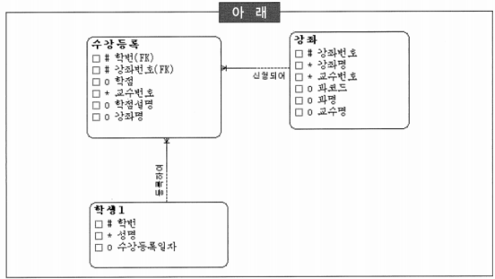
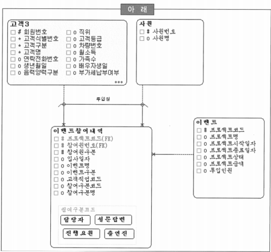
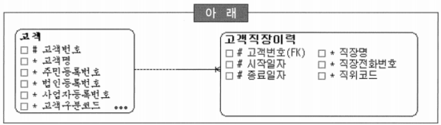
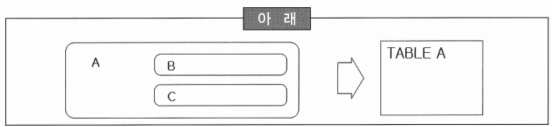
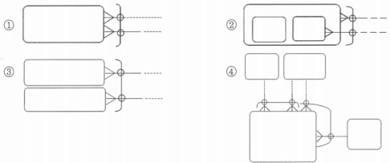

# 216 ~ 240

1. 다음 중 아래의 데이터 모델에서 제3정규형을 위배하고 있지 않은 속성으로 적합한 것은?
    
    
    
    1. 강좌.과명 → 제3 정규형 위배
    2. 수강등록.교수번호 → 제2 정규형 위배
    3. 강좌.강좌명
    4. 학생1.수강등록일자 → 제1 정규형 위배
    
    → 제3 정규형에 위배하지 않으려면 제1, 2 정규형을 만족하고 속성들 간의 종속관계가 없어야 함
    
2. 이력관리의 방법에는 형태적으로 보면 시점이력과 선분이력으로 구분할 수 있고, 두 방법 모두 장·단점이 있다. 특히 선분이력관리는 시작점과 종료점을 관리하는데 종료점 처리를 어떤 방식으로 수행하느냐가 중요하다. 다음 중 종료점 처리의 방법을 결정하는 고려사항으로 가장 적절한 것은?
    1. 종료점에 해당하는 속성은 NULL 허용여부와 상관없이 인덱스 정의가 가능하므로 수행속도를 보장 받을 수 있다.
    2. *계속 진행 중이므로 무한히 계속되는 것으로 간주해 최대치를 부여하면 여러모로 효율적이다.(일자: 99991231)*
    3. 종료점에 대한 최대치 부여는 해당 애플리케이션에서 Validation Check로 처리하면 DBMS에 부담을 덜어 주어 훨씬 효과적이며 유지보수에도 효과적이다.
    4. DBMS 종류나 버전에 따라 NULL 검색도 인덱스를 사용할 수 있어서 Null 허용은 문제되지 않는다.
    
    → 선분이력에서의 종료점 처리 방법은 계속 진행 중인 데이터(최종 데이터)에 대해서는 ‘99991231’과 같은 수렴값을 지정하여 사용하는 것이 여러 측면에서 바람직
    

3. 다음 중 관계 연산자에 대한 내용으로 부적절한 것은?
    1. Select(or Restrict): 열(Column)을 기준으로한 행(Row)의 Subset
    2. Join: 열(Column)을 기준으로한 각 행(Row)을 수평적으로 묶음
    3. ~~Difference(차집합): 다른 관계 테이블의 모든 행에 대응하는 열을 제외한 열~~ → Division에 대한 설명
    4. Union: 중복배제를 기준으로 각 행(Row)을 수직적으로 묶음

4. 다음 중 다대일(M:1) 관계에 대한 설명으로 가장 적절한 것은?
    1. *가장 흔하게 나타나는 관계 형태이다.* → M쪽이 Mandatory인 경우가 현실에서 가장 많이 존재하는 형태의 관계
    2. 양쪽 모두가 선택적(Optional)인 것이 기본형이다.
    3. 다대다(M:M) 관계는 ‘아직 덜 풀려진 형태’로 해석될 수 있으며 현실에서 드물게 발생한다.
    4. 일대다(1:M) 관계 중 양측 필수관계인 경우는 현실 세계에서 가장 흔하게 발생하는 경우이다. → 현실에는 존재하기 힘든 관계
    
5. 아래 데이터 모델은 이벤트 참여를 관리하는 데이터 모델이다. 다음 중 아래의 모델에서 제3정규형을 위배하고 있는 속성으로 적합한 것은?
    
    
    
    1. 연락전화번호
    2. 고객직업코드
    3. *참여구분명* → 제3 정규형 위배
    4. 참여원번호
    
    → UID를 제외한 속성 간의 종속관계를 가져서는 안됨
    

6. 다음 중 논리 데이터 모델을 근간으로 구현될 시스템의 물리적인 요소를 반영하여 실제 시스템에 구축될 오브젝트를 모델링하는 단계인 ‘물리 데이터 모델’에 대한 정의로 가장 부적절한 것은?
    1. 논리 데이터 모델을 특정 데이터베이스로 설계함으로써 생성된 데이터를 저장할 수 있는 물리적인 스키마를 말한다.
    2. ~~논리 데이터 모델의 엔터티는 하나의 테이블로 확정되어 진다.~~
    3. 하나의 논리 데이터 모델은 여러 개의 물리 데이터 모델로 설계되어 질 수 있다.
    4. 논리 데이터 모델의 일부 속성만으로 물리 데이터 모델에서 테이블로 설계하는 경우도 발생할 수 있다.
    
    → 하나의 엔터티는 물리적 요소들을 감안하여 경우에 따라서는 여러 개의 테이블로 생성될 수 있음
    
    → 특히, 성능의 문제를 고려하여 여러 테이블로 생성하는 경우도 종종 발생
    

7. 다음 중 선분이력의 특징으로 틀린 것은?
    1. 향후 활용 관점에서 보면 과거 임의 시점의 이력 데이터를 Access하기 위해서는 
    `select ⋯ 
    from  변경이력 
    where 이력주체id = ‘원하는 이력주체’ 
    and ‘원하는 시점’ between 시작일자컬럼 and 종료일자컬럼;` 
    과 같은 쿼리를 사용하여 원하는 데이터를 추출할 수 있다.
    2. 개체의 상태가 지속된 유효기간을 관리하는 방식이다.
    3. ~~종료 시점이 아직 결정되지 않아서 현재 진행 중인 이력 데이터에 대한 종료값은 Null을 지정하는 것이 효율적이다.~~
    4. 시점별로 환율의 변화를 관리해야 한다면 선분이력으로 관리하는 것이 바람직하다.
    
    → 현재 진행 중인 건은 의미적으로는 종료점을 Null로 표현하는 것이 맞지만 실제적으로는 수렴값(99991231)을 지정하는 것이 효율적
    

8. 다음 중 하나의 논리 데이터 모델을 가지고 여러 개의 물리 데이터 모델을 생성하는 이유로 가장 거리가 먼 것은?
    1. 하나의 논리 데이터 모델을 가지고 분산 데이터베이스 구축 시에 동일한 물리 데이터 모델을 여러 개 생성한다.
    2. 조금씩 상이한 물리 데이터 모델을 생성하여 여러 형태의 물리 데이터 모델을 비교하고자 할 때 생성한다.
    3. 논리 데이터 모델은 변화하지 않았지만 물리적 환경의 변화 발생 시에 여러 개의 물리 데이터 모델을 생성한다.
    4. ~~사용자의 요구가 명확하지 않을 때 여러 개의 물리 데이터 모델을 생성한다.~~
    
    → 사용자의 요구 사항이 명확하지 않았다면 논리 데이터 모델 자체가 확정되지 않은 상황
    
    → 물리 데이터 모델이 여러 개로 생기는 상황과는 거리가 멂
    

9. 다음 중 일반적인 데이터 모델에서 이력을 관리하는 모델로 변환 시에 나타나는 상황에 대한 설명으로 틀린 것은?
    1. 이력 관리는 관계의 형태를 변화시킨다. 즉, 속성이나 관계의 Cardinality를 증가시키게 된다.
    2. 하나의 엔터티에 일반 속성 이력을 관리하면 일대다(1:M) 관계의 하위 엔터티를 생성하게 된다.
    3. 다대다(M:M) 관계인 상태에서 해당 관계에 대한 이력을 관리하면 기존의 관계 엔터티에 추가적인 식별자 속성을 발생시키게 된다.
    4. ~~일대다(1:M) 관계에 대한 이력을 관리하면 M쪽 엔터티에 속성을 추가하여 관리하게 된다.~~
    
    → 일대다 관계의 이력을 관리하게 된다면 다대다 관계로 변하게 되어 새로운 관계 엔터티를 생성해야만 함
    

10. 다음 중 물리 데이터 모델 설계에 영향을 미치는 요소로 가장 부적절한 것은?
    1. CPU, MEMORY, DISK 등 하드웨어 자원의 상황
    2. 운영체제 및 DBMS 버전
    3. DBMS 파라미터 정보
    4. ~~개발자 기술 수준~~

11. 다음 중 논리 데이터 모델의 관계변환에 대한 설명으로 가장 부적절한 것은?
    1. 일대다(1:M) 관계는 논리 데이터 모델에서 가장 흔한 관계의 형태이고, 물리 데이터 모델에서는 M쪽 관계의 형태에 따라서 해당 칼럼의 선택사항이 결정된다.
    2. 일대일(1:1) 관계에 의해서 생긴 모든 외래키는 Unique Constraints를 정의할 수 있다.
    3. 선분이력을 관리하는 상위 엔터티와 관계에서는 상위 엔터티의 식별자 전체를 하위 엔터티에서 상속받지 않아도 데이터적인 연결을 수행할 수 있으므로 식별자 상속을 시키지 않을 수도 있다.
    4. ~~일대일(1:1) 관계에서는 양쪽 집합의 선택사양에 따라서 외래키의 생성 위치가 달라질 수있다. 즉, Optional 관계를 가진 쪽 집합에서 외래키를 생성하는 것이 유리하다.~~
        
        → 일대일 관계에서는 Mandatory 관계를 가진 쪽에 외래키를 생성하는 것이 바람직
        

12. 다음 중 논리 데이터 모델을 물리 데이터 모델로 변환할 때 잘못 짝지어진 것은?
    1. Entity - Table
    2. Attribute - Column
    3. Primary UID - Primary Key
    4. ~~Business Rule - Index~~
    
    → 논리 데이터 모델에서 Business Rule은 물리 데이터 모델에서 Constraint의 형태로 설계되어짐, Check Constraint의 형태가 가장 보편적인 형태
    

13. A기업에서는 새로운 시스템을 생성하기 위해 논리 데이터 모델링 작업이 완료하고 물리 데이터 모델링을 진행하려고 한다. 이 회사에서 관리하는 엔터티 중에 ‘통화내역’ 이라는 테이블에 월별 약 1,000만건의 데이터가 생성될 것으로 예상하고 있다. 이러한 이유로 모델러는 적절한 구분 칼럼을 기준으로 파티셔닝을 고려하고 있을 때, 다음 중 모델러가 A기업의 여러 물리적인 요소 중에서 가장 먼저 파악해야 하는 것은?
    1. CPU, MEMORY, DISK 등의 하드웨어 자원 정보
    2. *운영체제 및 DBMS의 버전 정보*
    3. DBMS의 파라미터 정보
    4. 백업·복구 기법 및 정책, 보안관리 정책 등의 데이터베이스 운영 관리요소 정보
    
    → DBMS 벤더(Vender)와 버전에 따라서 지원하는 파티셔닝의 기법들이 상이하기 때문에, 이 점을 먼저 파악해야 함
    

14. 논리 데이터 모델에서 ‘고객’ 엔터티에는 서브타입으로 ‘개인’, ‘법인’ 을 정의하였다. 논리 데이터 모델에서 정의된 서브타입 엔터티를 변환하는 방법은 여러 가지가 존재하지만 각각의 방법은 상황에 따라서 다른 방법으로 구현되어 진다. 다음 중 논리 데이터 모델의 서브타입 엔터티를 물리적인 객체로 생성하는 방법으로 가장 부적절한 것은?
    1. 하나의 테이블로 통합하여 ‘고객’ 테이블을 생성한다.
    2. 여러 개의 테이블로 분할하여 ‘개인’ 테이블과 ‘법인’ 테이블을 생성한다.
    3. 수퍼타입과 서브타입을 각각의 테이블로 변환하여 세개의 테이블로 생성한다. 즉, ‘고객’ 테이블, ‘개인’ 테이블, ‘법인’ 테이블을 생성한다.
    4. ~~‘법인’ 내의 또 다른 서브타입인 ‘법인사업자’와 ‘개인사업자’를 별개의 테이블로 생성한다.~~
    
    → 상위 테이블을 분할하게 되면 테이블들을 부모로 가지는 하위 테이블들을 활용하는데 많은 불필요한 일들이 발생할 소지가 있음
    

15. 논리 데이터 모델링 단계에서 정의된 선분이력 모델을 물리 데이터 모델로 변환할 때 주의해야 할 사항 중에 하나가 선분 이력을 가진 칼럼의 인덱스 순서를 주의해야 한다. (참고로, 대개의 고객 직장을 참조하는 경우는 고객의 현재 직장을 참조하는 경우가 대부분이다.) 아래의 모델과 같이 고객의 직장에 대한 이력을 선분이력으로 관리한다면 ‘고객직장이력’ 엔터티를 테이블로 변환하고 인덱스를 설계할 때, 다음 중 PK 인덱스의 칼럼 순서로 가장 적합한 것은?
    
    
    
    1. 고객번호 + 시작일자 + 종료일자
    2. 시작일자 + 종료일자 + 고객번호
    3. *고객번호 + 종료일자 + 시작일자*
    4. 종료일자 + 시작일자 + 고객번호

16. 다음 중 논리 데이터 모델의 서브타입 엔터티를 물리적인 테이블로 변환하는 방법에 대한 설명으로 가장 부적절한 것은?
    1. 서브타입을 하나의 테이블로 통합하는 경우에는 주로 서브타입이 적은 양의 속성이나 관계를 가진 경우에 적용한다.
    2. 서브타입을 하나의 테이블로 통합하면 데이터 엑세스가 보다 간편해지고, 복잡한 처리를 하나의 SQL로 통합하기가 용이해져서 수행속도가 향상될 수 있다.
    3. 서브타입을 여러 개의 테이블로 분할하는 경우에는 주로 서브타입이 많은 양의 속성이나 관계를 가진 경우에 적용한다.
    4. ~~서브 타입을 여러 개의 테이블로 분할하면 각 서브타입 속성들의 선택사양을 명확히 할 수 있으나, 처리 할 때 마다 서브타입의 유형구분이 필요하다.~~
        
        → 여러 개의 테이블로 분할하게 되면 서브 타입 유형별로 별개의 테이블로 생성되기 때문에 유형구분이 필요 없어짐
        

17. 반정규화의 한 방법으로 테이블이나 칼럼에 대한 중복을 수행하고자 할 때, 다음 중 고려 및 권고사항으로 부적절한 것을 모두 고르시오.
    1. 넓은 범위를 자주 처리함으로써 수행속도의 저하가 우려되는 경우에는 집계 테이블의 추가를 고려해 볼 수 있다.
    2. ~~자주 사용하는 엑세스 조건이 다른 테이블에 분산되어 있어 상세한 조건 부여에도 불구하고 엑세스 범위를 줄이지 못하는 경우에는 진행 테이블의 추가를 검토하는 것이 바람직하다.~~
    3. 빈번하게 조인을 일으키는 칼럼에 대해서는 중복 칼럼의 생성을 고려한다.
    4. 계산된 값은 속성 정의에도 위배되고 함수적 종속이 존재하므로 정규형이 아니다. 하지만, 계산하는데 비용(노력)이 많이 발생하고 빈번하다면 계산 값을 중복시켜서 가져갈 수 있다.
    
    → 자주 사용되는 액세스 조건이 다른 테이블에 분산되어 있어서 상세한 조건 부여에도 불구하고 엑세스 범위를 줄이지 못하는 경우에 자주 사용되는 조건들을 하나의 테이블로 모아서(칼럼의 중복 즉, 추출 속성으로 하나의 테이블에 모으는 경우를 의미함) 조건의 변별성을 극대화할 수 있음
    

18. 다음 중 논리 데이터 모델에서 관계를 물리 데이터 모델의 객체로 변환하는 방법에 대한 설명으로 가장 부적절한 것은?
    1. 일대다(1:M) 관계는 논리 데이터 모델에 존재하는 가장 흔한 관계의 형태이고, M쪽 관계의 형태에 따라 관계 칼럼의 선택사양을 결정한다.
    2. 일대일(1:1) 관계에 의해서 생긴 모든 외래키 부분은 Unique Key가 필수적이다.
    3. 일대다(1:M) 순환관계는 데이터의 계층구조를 표현하기 위한 수단으로 사용되며 특성상 1쪽, M쪽 양방향 모두 Optional이다.
    4. ~~일대다(1:M) 관계에서 1쪽이 Mandatory이고 M쪽이 Optional 경우는 이론적으로만 가능할 뿐 현실세계에서 거의 발생하지 않기 때문에 무시할 수 있다.~~
    
    → 일대다(1:M) 관계에서 1쪽이 Mandatory이고,  M쪽이 Optional 경우는 업무 규칙상 발생할 수도 있음
    
    → 자식쪽의 레코드가 하나 이상 있어야 부모 테이블에 레코드를 생성할 수 있다는 것
    

19. 논리 데이터 모델에서 배타적 관계를 물리 데이터 모델로 변환하는 방법은 크게 외래키 분리 방법과 외래키 결합 방법으로 나눌 수 있다. 다음 중 두 방법에 대한 설명으로 가장 부적절한 것은?
    1. 외래키 분리 방법에서 가장 큰 단점은 새로운 관계를 추가할 때 구조가 변경되어야 한다는 것이다.
    2. 외래키 분리 방법에서는 논리 데이터 모델의 배타적 관계를 비즈니스 규칙으로 구현하기 위해서 별도의 제약조건을 생성할 필요가 있다.
    3. 외래키 결합 방법은 배타적 관계에 참여하는 관계들을 구분하기 위해서 추가적인 칼럼이 필요하다.
    4. ~~외래키 결합 방법에서는 외래키 제약조건을 통해서 참조 무결성을 유지할 수 있다.~~
    
    → 외부키의 결합에서는 근본적으로 외부키 제약조건을 생성할 수 없기 때문에 User - Defined Trigger 등의 방법을 통하여 해결해야 함
    

20. 물리 데이터 모델링 단계에서도 데이터 표준 적용 과정이 필수적이다. 다음 중 데이터 표준 적용 대상의 우선순위로 가장 낮은 것은?
    1. 뷰(View)
    2. 스토리지 그룹(Storage Group)
    3. 테이블스페이스(Table space)
    4. ~~SQL 코멘트~~ → SQL 코멘트에 대한 데이터 표준 방안을 수립하지 않고, 해당 SQL의 유의사항 또는 처리 방법 등에 대한 내용을 자유롭게 기록하는 것이 일반적

21. 논리 데이터 모델에서 서브타입 모델은 물리 데이터 모델링에서 여러 가지 형태로 변환이 가능하다. 아래와 같이 서브타입을 하나의 테이블로 생성할 때, 다음 중 관련된 설명으로 틀린 것은?
    
    
    
    1. TABLE A의 데이터를 엑세스하고자 할 때 B와 C를 구분해서 액세스 하는 것이 불편하다.
    2. B 서브타입에 정의된 Not Null Constraint를 생성하기가 어렵다.
    3. ~~논리 데이터 모델에서 B와 C 서브타입에 정의된 개별 속성들이 많을 경우에 위와 같은 변환이 대부분이다.~~ → 개별 속성들이 많은 경우에는 하나의 테이블로 변환하는 것이 바람직
    4. 경우에 따라서는 인덱스의 크기가 증가할 수 있다.

22. 논리 데이터 모델에서 정규화된 데이터 모델을 물리 데이터 모델에서 여러가지 물리적인 특성을 고려해 테이블을 분할·통합할 수 있다. 다음 중 논리 데이터 모델의 특정 엔터티를 물리 데이터 모델에서 분할할 때에 대한 설명으로 부적절한 것은?
    1. 하나의 테이블의 데이터가 너무 많고, 레코드들 중에서 특정 범위만 주로 액세스 하는 경우가 많다면 수평분할이 적절하다.
    2. 수평분할 시에 분할된 각 테이블을 서로 다른 디스크에 위치시키면 물리적인 디스크 효용성을 극대화할 수 있다.
    3. 테이블의 칼럼 수가 너무 많고, 조회 위주의 칼럼과 갱신 위주의 칼럼이 구별될 수 있으면 수직분할이 유리하다.
    4. ~~특정 칼럼의 크기가 아주 큰 경우에는 수평분할이 유리하다.~~
    
    → 특정 칼럼의 크기가 아주 큰 경우에는 (특히 이미지와 같은 크기가 큰 데이터) 데이터를 저장하기 위해서는 원래의 테이블의 칼럼들과 분리하여 저장하는 것이 보통
    
    → 이미지를 읽지 않은 경우에 액세스 효율을 증가시킬 수 있음
    

23. 다음 중 배타적 관계 모델의 사용이 적절한 것은?
    
    
    
    → 4
    
    → 1번의 배타적 관계는 항상 Mandatory 이거나 Optional이어야 함
    
    → 2, 3번의 배타적 관계는 반드시 하나의 Entity 에만 속해야 함
    
24. 다음 중 반정규화의 한 방법으로 테이블이나 칼럼에 대한 중복을 고려할 때에 대한 설명으로 부적절한 것을 모두 고르시오.
    1. 다량의 범위를 자주 처리함으로써 수행 속도 저하가 우려되는 경우 집계 테이블 추가를 고려한다.
    2. 자주 사용되는 중복 테이블 유형으로는 집계(통계) 테이블과 진행 테이블이 있다.
    3. 클러스터링, 결합인덱스, 고수준 SQL 등을 적절히 활용하면 집계 테이블 없이도 양호한 수행속도를 얻을 수 있기 때문에 집계테이블 고려 시에 반드시 먼저 고려되어야 한다.
    4. ~~M:M 관계가 포함된 처리의 과정을 추적, 관리하고자 하는 경우에는 다중테이블 클러스터링이나 조인 SQL의 정확한 구사 등으로 해결이 불가능하므로 반드시 진행 테이블 추가가 고려되어야 한다.~~ → 진행 테이블 추가를 고려할 수 있으나, 다중 테이블 클러스터링이나 적확한 조인 SQL 구사 등을 통해 굳이 진행 테이블을 만들지 않아도 양호한 수행속도를 낼수 있는 경우가 많이 있음

25. 파일 시스템(File System)과 데이터베이스 시스템(Database System)의 가장 큰 차이점으로 적합한 것은?
    1. *데이터(정보) 공유*
    2. 데이터(정보) 무결성
    3. 데이터(정보) 중복
    4. 시스템과 관계된 인력 간의 의사소통
    
    → 파일 시스템은 업무나 부서 중심의 관점이지만 데이터베이스 시스템은 데이터 통합을 통한 데이터 공유의 관점이라는 것이 가장 큰 차이점