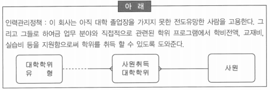

# 요점 정리(121 ~ 145)

# 데이터 모델링의 기본 원칙

- 커뮤니케이션 원칙: 요구 사항은 모든 사람들이 이해할 수 있도록 명확하게 공표됨은 물론 최종 사용자 지향적으로 분명하게 파악되는 수준으로 작성되어야 함
- 모델링의 상세화 원칙: 데이터의 상세화 정도를 제시하고, 조직이 사용하는 정보 구조의 ‘최소 공통 분모’를 제시해야 함
- 논리적 표현 원칙: 모델은 물리적 제약조건 없이 비즈니스를 그대로 반영해야 함. 즉, 논리적 데이터 모델은 특정 아키텍처, 기술 또는 제품 등에 독립적이어야 함

# 관계형 데이터베이스의 제약조건(무결성)

- 무결성(Integrity): 데이터 값과 실제 값이 일치하는 정확성
- 부정확한 자료가 데이터베이스 내에 저장되는 것을 방지하기 위한 제약 조건

1. 참조 무결성(Referential Integrity) 규칙
    - 외래키 값은 Null이거나 참조 릴레이션의 기본키 값과 동일해야 함
    - 외래키와 참조하려는 테이블의 기본키는 도메인과 속성 개수가 같아야 함
    - 관계 실체의 모든 외부 식별자 값은 관련 있는 관계 실체에 주 식별자 값이 존재해야 함
    - 실체 스키마의 제약조건으로 생성되게 되면 관련된 테이블 레코드간의 관계를 유효하게 하고 사용자 실수로 데이터를 삭제하거나 변경하지 않도록 하기 위한 규칙
2. 실체 무결성(Entity Integrity) 규칙 = 개체 무결성
    - 테이블의 기본키를 구성하는 어떤 속성도 Null 값이나 중복 값을 가질 수 없음
3. 영역 무결성(Domain Integrity) 규칙 = 도메인 무결성
    - 주어진 속성 값이 정의된 도메인에 속한 값이어야 함
    - ex. 수강 릴레이션에 국어, 수학, 영어 세 가지만 입력되도록 했을 때 다른 값 입력 불가능
4. 속성 무결성 규칙
    - 주 식별자(특정 행을 유일하게 인식하는 하나 이상의 열)는 Null 값을 포함하지 않음

## 데이터 무결성

- 업무 규칙에 따라 데이터 일관성 및 정확성을 유지하기 위한 필수 규칙
- 참조 무결성 규칙: 입력 규칙과 삭제 규칙이 있음
- 입력 규칙에 대한 설명
    - Dependent: 대응되는 부모 실체에 인스턴스가 있는 경우에만 자식 실체에 입력을 허용
    - Nullify: 자식 실체 인스턴스의 입력을 항상 허용하고, 대응되는 부모 건이 없는 경우 자식 실체의 Foreign Key를 Null 값으로 처리
    - Customized: 특정한 검증 조건이 만족되는 경우에만 자식 실체 인스턴스의 입력 허용
    - Default: 자식 실체 인스턴스의 입력을 항상 허용하고, 대응되는 부모 건이 없는 경우 자식 실체의 Foreign Key를 지정한 기본 값으로 처리

### 데이터 무결성과 관계된 사항

- 실체 무결성
- 참조 무결성
- 영역(속성) 무결성
- 연쇄 작용(Triggering Operation): 비즈니스 규칙으로 어느 실체에 데이터의 값이 입력, 수정, 삭제 될 때 그 실체 내지는 다른 실체의 데이터 값에 영향도를 분석하는 것으로 데이터의 무결성과 관계가 깊음
- 정규화(Normalization): 데이터의 이상 현상을 제거하면서 데이터베이스를 올바르게 설계해 나가는 과정
- ~~인덱스(Index)~~ → 수행 성능의 향상을 위한 기법

# 개체-관계 모델

- 개체(entity)와 개체 간의 관계(relationship)를 이용해 현실 세계를 개념적 구조로 표현하는 방법
- 피터 첸이 1976년에 제안
- 개체-관계 다이어그램, ER 다이어그램: 현실 세계를 개체-관계 모델을 이용해 개념적으로 모델링하여 그림으로 표현한 것
- 개체-관계 모델에 대한 설명
    - 모델의 단순성 때문에 현재 광범위하게 사용되고 있음
    - 확장된 개체-관계 모델은 서브타입을 포함
    - 연관과 상속의 개념을 통해 객체들을 연결
    - ~~서로 다른 뷰들을 하나로 통합할 수 있는 단일화된 설계안을 만들 수 있음~~ → 객체지향 모델링

# 데이터의 특성

- 조직과 기술에 비해 독립적
- 프로세스에 비해 안정적, 즉 변화가 적음
- 여러 프로세스 또는 기능에서 사용됨
- ~~중복적~~

### 객체지향 모델링의 장점

- 재사용 코드와 같은 개념이 실제로 가능한 환경을 제공
- 모든 비즈니스 규칙이 표현될 수 있는 유일한 환경을 제공
- 프로세스와 데이터 모델링을 함께 운영
- ~~데이터는 프로세스에 종속되어 운영~~ → 객체지향 모델링의 접근 방식

# 논리 데이터 모델링

### ‘논리 데이터 모델링’에서 ‘논리’라는 단어가 사용된 이유

- ‘논리적’이라는 용어는 논리 데이터 모델링이 현실 세계를 추상화 하기 때문에 사용
- 개념화 기법을 적용하여 모델을 만드는데도 이유가 될 수 있음
- 현실의 물리적인 장표나 데이터베이스 같은 것이 실질적인 개념이 아니기 때문에 논리적(개념적)이라는 용어를 사용

### 논리 데이터 모델링에 대한 설명

- 논리 데이터 모델의 특징은 초기에 엔터티 사이가 다대다 관계, 순환 관계, 배타적 관계 등의 관계로 연결된 엔터티들이 많이 보임
- 논리 데이터 모델링은 프로세스 중심의 설계보다 데이터 중심 설계를 주로 사용
- 논리 데이터 모델은 하나의 엔터티가 반드시 물리적으로 하나의 테이블이나 세그먼트가 되지 않을 수 있음
- ~~논리 데이터 모델은 업무영역이 바뀌지 않아도 업무방식이 변경되면 반드시 설계변경이 이루어져야 함~~

# 식별자

- 엔터티의 유일성을 보장해주는 것
- 복수개의 값들이 존재할 수 있는 값은 유일성을 보장해주지 못하기 때문에 식별자로 사용할 수 없음
- 사원에 대한 엔터티를 구성하려고 할때, 식별자로 적합한 속성: 사원번호

### 식별자에 대한 설명

- 식별자는 하나 또는 그 이상의 개체 속성으로 구성
- Barker 표기법은 식별자를 ‘#’로 표현
- 직원 인스턴스인 경우 봉급이나 입사일은 식별자가 될 수 없음
- 식별자는 개체를 위한 것이며, 키는 테이블이 가짐

# 관계형 데이터베이스

### ‘관계형 모델 이론’과 ‘비관계형 모델 이론’의 차이점

- 관계형 모델 이론은 데이터 중심의 분석 기법이고, 비관계형 모델 이론은 일반적으로 프로세스 중심의 분석 기법
- 관계형 모델 이론은 데이터의 구조와 조작 및 무결성을 정의하고, 비관계형 모델 이론은 데이터 구조와 조작을 정의
- 관계형 모델 이론은 데이터를 집합적으로 처리를 요구하고, 비관계형 모델 이론은 데이터의 레코드 처리(한 건씩 처리)를 요구
- ~~관계형 모델 이론은 비관계형 모델 이론에 비하여 데이터를 분석하는데 있어 우수한 분석 기법~~

### 관계형 데이터베이스에서만 특별하게 작용하는 집합적 조회

- 집합적 조회: 이론적 배경이 다른 데이터베이스에 없는 관계 연산자
- 처리 연산자: 집합적 조회를 바탕으로 관계 테이블에 영향을 미침
    - Update: 행의 수정
    - Delete: 행의 삭제
    - Insert: 행의 입력
    - ~~Project: 열(Column)의 Subset~~ → 관계 연산자

### 관계 연산자의 설명

- Select(or Restrict): 열(Column)에 의거한 행(Row)의 Subset
- Product: 두 관계 테이블 간의 행(Row) 조합의 묶음
- Division: 다른 관계 테이블의 모든 행에 대응하는 열을 제외한 열
- ~~Insert: 행의 입력~~ → 처리 연산자

# 데이터베이스 설계를 시작하기 위한 필수 사항

- 이름(Name): 모든 속성은 고유하게 식별할 수 있는 이름이 주어져야 함
- 명세(Description): 모든 실체는 명세가 있어야 하며, 명세는 모형을 검토하는 누구든지 그 실체를 정확히 해석할 수 있도록 해주어야 함
- 유형(Type): 속성은 두 가지 유형 즉, 키 속성 또는 비키 속성 중 하나로 구분되지 않으면 안됨. 이 특성은 키 속성으로써의 역할 가능성 보다는 실제 용도와 관련됨
- 도출 공식(Derived Formula): 데이터 모델링 팀은 업무 전문가의 참여 하에 도출 공식을 확립해야 함

# 속성

### 속성 이름을 부여할 때, 주요 규칙에 대한 설명

- 속성 이름은 해당 속성에 의해 구체화된 논리적 개념을 현업에게 즉시 전달해야 함. 그러므로 속성 이름은 명료, 간결, 자명해야 함
- 모델러들은 논리 데이터 모형을 구축하고 있는 것. 물리적 특징들로 개념을 제한 또는 왜곡해서는 안 됨. 즉 물리적 특성이 아닌 논리적 고려에 따라 속성 이름을 부여함
- 속성의 개념을 구체적이고 명확하게 정의하였다면 보편적인 용어를 적절히 결합한 복합명사를 만들어서 구체적인 표현을 할 수 있게 속성이름을 부여해야 함
- ~~‘최종학력’, ‘최종이수학력’ 이라는 단어 보다는 ‘학력’ 이라는 단어가 포괄적이고 여러 뜻을 함축성 있게 사용할 수 있으므로 속성명으로 더욱 적합~~ → 누구나 같은 의미로 정확하게 뜻을 알 수 있는 단어를 사용해야 함

### 속성 후보 검증

- 다양한 경로를 통해 수집된 속성 후보들을 엔터티에 배정시킨 후에 이들을 검증하여 속성의 제자리를 찾게 해주어야 함
- 속성을 검증하는 작업
    - 원자단위 검증: 사물의 본질을 이루는 고유한 특성이나 성질이 속성임. 즉, 속성은 독자적인 성질을 가져야 함
    - 유일값 검증: 속성에서 관리되어야 할 값이 반드시 단 하나만 존재해야 한다는 것
    - 추출값 검증: 속성이 원천적인 값인지 다른 속성에 의해 가공되어서 만들어진 값인지를 검증해야 함
    - ~~속성 후보 선정: 구 시스템 문서자료, 현업 장표 및 보고서, 타 시스템, 전문서적 및 자료 등에서 속성 후보를 선출해야 함~~ → 다양한 경로를 통해서 좋은 속성 후보를 확보하는 방법

### 속성

- 엔터티에 저장되는 개체 집합의 특성을 설명하는 항목
- 속성의 정의 설명
    - 더 이상 분리되어지지 않는 단위 값(Atomic Value)
    - 실체를 서술하며 양을 계수화하고 자격을 부여·분류하며 구체적으로 기입하는 정보항목
- 실체 정의 설명
    - 구별 가능한 사람, 장소, 물건, 행위 또는 개념 등에 대하여 정보가 유지되어야 하는 것
    - 다른 것과 구별되어 식별될 수 있는 사물

# 엔터티

### 엔터티 검증

- 엔터티의 개념을 확실하게 모델러들이 정립해야 함
- 새로운 목적 시스템에서 관리하고자 하는 대상 집합이 있는지 확인해야 함
- 엔터티에 가로(속성)와 세로(개체)를 가진 면적(집합)을 가진 속성이 존재하는지 확인해야 함
- ~~엔터티 후보를 우선적용 대상별로 분류하여 모델링의 골격에 해당하는 주요 엔터티를 먼저 도출하여 명확히 정의함으로써 모델링의 기초를 단단하게 함~~ → 모델링을 순차적으로 접근해 형태별로 분류하는 이유

## 엔터티와 엔터티의 관계 중 특수 관계

### 아크(Arc) 관계/배타적(Exclusive) 관계

- 어떤 엔터티가 두개 이상의 다른 엔터티의 합집합과 관계를 가지는 것
- 아크 관계의 특징
    - 아크 내에 있는 관계는 보통 동일함
    - 아크 내에 있는 관계는 항상 Mandatory 거나 Optional 이어야 함
    - 아크는 반드시 하나의 엔터티에만 속해야 함. 하나의 아크가 여러 엔터티를 가질 수 없음
    - 어떤 엔터티는 다수의 아크를 가질 수 있음. 그러나 지정된 관계는 단 하나의 아크에만 사용되어야 함

# 데이터 모델링 단계에 대한 설명

- 개념 모델 단계: 현행 시스템의 프로세스와 데이터베이스를 분석하여 분류 가능한 업무를 분석하는 단계
- 개념 모델 단계: 핵심 엔터티를 도출하고 그들간의 관계를 정의하는 단계
- 논리 모델 단계: 업무에서 필요로 하는 모든 엔터티와 특성을 정의하는 단계
- 물리 모델 단계: 논리데이터 모델을 기반으로 특정 DB에 맞도록 스키마를 설계하는 단계

# 실체

- 동질성을 갖는 인스턴스들의 집합

- ‘영업담당자’, ‘인사담당자’, ‘구매담당자’ 등의 실체를 만든다면 일반화와 추상화 기법에 위배되며 엄청나게 많은 실체를 정의해야 함
- ‘규손금’은 ‘규정 손실금’의 약어로 이런 형태의 실체명을 만드는 것은 논리 데이터 모델링에서 삼가야 하는 사항
- 비즈니스 규칙과 관계된 모든 사람들에게 직관적으로 의미를 파악할 수 있는 명명 규칙이 유용함
    - 당초계약: 실행계약이 이루어지기 전에 처음으로 이루어지는 계약
    - 상담: 고객과의 상담내역

- 위 ERD의 내용 중 잘못된 사항
    - 상담 실체의 인스턴스를 인식할 때는 영업담당자가 누구인지를 반드시 알아야 할 필요가 없기 때문에, 둘의 관계에 UID(Unique Identifier) Bar를 사용하지 않아도 됨
    - ‘실행계약’과 ‘규손금’의 관계는 일대다(1:M)인데 업무를 파악하여 일대다이면 ‘규손금’에 PK(Primary Key) 속성을 추가하고, 일대일이면 관계의 기수성(Cardinality, Degree)을 고침
    - ‘당초계약’과 ‘실행계약’이 양쪽 필수 관계인데 일반적으로 이것은 비즈니스와 맞지 않음. 한쪽을 선택적 관계로 바꾸는 것이 합리적
    - ‘당초계약’이 발생할 때는 실행계약의 인스턴스가 발생하는 것이 아니므로 양쪽 필수 관계일 필요는 없음
    

### 인사관리정책을 적용한 ERD에서 틀린 부분

- 사원이 대학 학위를 미취득 했을 가능성이 있으므로 ‘사원’과 ‘사원취득대학학위’ 사이에 사원 쪽을 점선(선택적)으로 표시해야 함