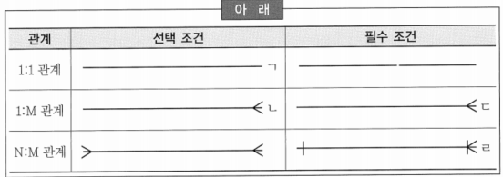
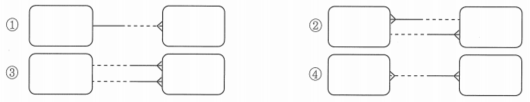
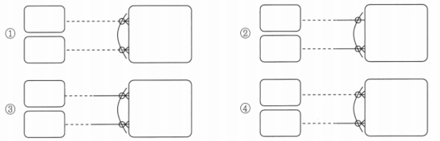
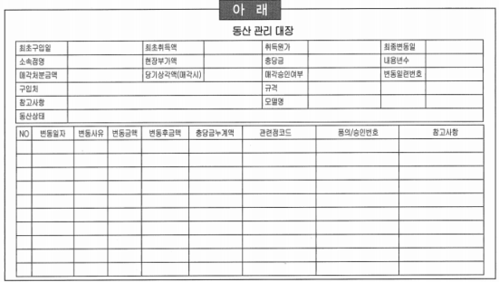

# 요점 정리(146 ~ 165)

# 개체-관계 모델

### 서브타입

- 서브타입 개체는 그것의 슈퍼타입이라 불리는 다른 개체의 특별한 경우
- 서브타입은 배타적이지만 포괄적임
- 슈퍼타입은 서브타입에 공통적인 모든 속성을 포함
- 모든 슈퍼타입이 구분자를 가지고 있는 것은 아님

# 객체지향 모델링과 논리 데이터 모델링의 대응 개념

- 객체 - 엔터티
- 연결 - 관계
- 객체 클래스 - 엔터티 유형
- 메세지 - 대응 개념 없음

# 바커 표기법

### 실체와 실체 간의 상관관계 조건(관계) 표기

- ㄹ → 바커 표기법의 관계가 아니라 I/E 표기법의 관계

### 모델 관계 표기

- 2 → 한쪽에 인스턴스를 입력하려면 다른 쪽에 반드시 값이 있어야 한다는 것이 모순이므로, 한쪽을 양쪽 선택적 관계로 바꾸어야 함

### 상호 배타적 관계 표기

- 1: 양쪽 선택적인데 이것은 관계를 하나도 맺지 않는 업무를 설명
- 2: 기수성은 배타적 관계에 아무 영향을 미치지 않음
- 3: 둘 중에 하나와 관계를 맺는데 반드시 관계가 하나는 있다는 업무 규칙
- 4 → 배타적 관계는 모두 선택적이든지 모두 필수적이어야 함, 한쪽만 선택적이든지 혹은 한 쪽만 필수적이면 배타적 관계가 형성될 수 없음

# 배타 관계

- 어떤 엔터티가 2개 이상의 다른 엔터티의 합집합과 릴레이션쉽을 가지는 것
- 논리 데이터 모델링 과정에서 흔히 발생

- 논리적으로 엔터티 간의 업무적 연관성을 명확하게 표현하고 있음
- 배타 관계에 있는 관계는 보통 동일함
- 배타 관계는 반드시 하나의 엔터티에만 속해야 함
- 실제 데이터 베이스 구조로 구현되었을 때 애플리케이션의 성능이나 업무 변경에 대한 유연성 확보 등을 고려하여 배타관계에 있는 엔터티들을 하나로 통합하여 물리 데이터 모델로 정의할 수도 있음
- ~~배타 관계에 의한 논리적인 명확성은 물리 설계에도 그대로 반영되는 것이 효율적~~

# 표현식

- 모델링에서는 관계도 하나의 집합이며, 엔터티의 정의에 따라 여러 종류의 관계가 존재할 수 있음
- 예를 들어 관계를 당사자 간의 관계, 제3자가 보는 관계 등으로 구분할 수 있음
- 이런 복잡한 관계를 표현하기 위한 표현식 존재
- 표현식에 대한 설명
    - 식별성(Identification) 표시
    - 선택성(Optionality) 표시
    - 기수성(Degree, Cardinality) 표시
    - 비전이성 표시
    - ~~전이성(Transferability) 표시~~
    

# 개념 데이터 모델링

- 데이터 모델링 전체 과정 중에서 특히 중요한 핵심 엔터티를 가지고 전체 데이터 모델의 틀을 생성하는 작업

### 개념 모델링 단계에서 할 일

- 주제영역 정의
- 논리 데이터 모델링 과정에서 정의해야 할 사항: 정규화, 속성 정의, 참조 무결성 정의

### 엔터티 후보 도출

- 현행 시스템에서 사용되고 있는 모든 보고서, 화면, 장표 등을 가지고 엔터티 후보를 도출하는 작업
- 새로운 Banking 시스템 구축시, 개념 데이터 모델링 단계에서 아래와 같은 장표를 가지고 모델러가 수행할 내용
    
    
    
    - *‘동산’이라는 용어를 엔터티 후보로 판단하여 업무 담당자와 인터뷰를 통해 동산의 의미를 조사하고, 동산에 대한 간단한 정의를 모델러 관점에서 정리*
    - ‘구입처’에 어떤 값들이 들어갈 수 있는지 업무 담당자와 인터뷰를 통해서 조사하고, ‘고객’ 데이터와 관계를 생성할 수 있는지를 파악 → 논리 데이터 모델링 단계에서 검토
    - ‘동산상태’에 대해서 이력 관리의 유무를 업무 담당자와 협의 → 집합들이 모두 정의되고 식별자도 정의되어야만 가능
    - 현재 장표에서는 ‘소속점명’이 이름으로만 관리되고 있지만, 향후 데이터 모델링이 완성된 후에는 ‘소속점’을 관리하는 다른 엔터티와 관계로 표현될 것이기 때문에 필요하다고 판단하면 엔터티 후보로 도출하는 것이 바람직

### 엔터티 후보 선정할 때 유의사항

- *동의어처럼 보이더라도 함부로 버리지 않음*
- 개념 데이터 모델링에서는 엔터티의 상세 분석을 수행하는 것은 아님
- 개념 데이터 모델 단계에서 개념에 대해서는 확실하게 정립해야 함
    - ~~엔터티 가능성이 있다고 예상되면 예외사항 검토 등을 통해 상세 분석을 함~~
    - ~~개념이 모호한 대상은 일단 넘어감~~
    - ~~예외처리는 중요하므로 잘 분석하고 정리해 놓음~~

### 엔터티 후보 분류

- 엔터티 데이터의 성격에 따라 분류
    - 엔터티 후보들간의 미묘한 차이를 분석하는데 유리
    - 엔터티 통합여부 판단의 기초가 됨
    - 엔터티 정의를 견고하게 할 수 있음
    - ~~주제영역 분류의 기준 제공~~

### 엔터티 식별 단계에서 수행해야 하는 행동

- 후보 엔터티가 정확히 어떤 개념인지를 파악하기 위해서 동종의 비즈니스 관련 서적에서 관련 개념을 파악
- 인터넷을 통하여 해당 후보 엔터티의 용어적인 의미를 파악하기 위해서 자료를 검색
- 특정 업종에서만 사용하는 용어라서 모델러가 판단하기 힘들면 주변에 존재하는 비유를 들어서 업무 담당자와 개념에 대한 동질성 파악
- 엔터티 후보 식별 단계에서는 해당 엔터티의 개념을 파악하거나 엔터티를 명확히 구분 짓기 위한 속성들에 대해서 업무담당자와 상의할 수 있음
- 일반속성을 이 단계에서 언급하는 것은 부적절함
    - ~~‘고객’ 엔터티에서 관리해야 할 구체적인 ‘생년월일’ 속성에 대해서 업무 담당자들과 협의~~

### 엔터티를 분류할 때 의미

- Key Entity
- Main Entity
- Action Entity: 역할에 따른 분류에는 액션 엔터티에 속함
- Intersection Entity: 다대다(M:M) 관계의 해소로 생기는 엔터티
    - 논리 데이터 모델링 단계에서 생성됨

## 엔터티 정의

### 엔터티 중에 하나인 부서 엔터티를 정의하고 있을 때, K모델러의 판단

- 부서는 키 엔터티
- 부서 엔터티는 여러 조직간의 상하 관계를 표현하기 위해서 재귀관계를 생성하기로 함
- 부서 엔터티 자체의 정의를 명확히 하는 것은 바람직하지만 부서 엔터티와 연관된 하위 엔터티들을 정의하는 것은 수평적 사고를 방해할 위험요소가 있기 때문에 바람직하지 않음
- ~~부서 엔터티의 속성들을 확정하여 부서 엔터티의 모든 부분들을 확정해 나감~~

### KEY 정의

- 후보키를 정의하고 이중에서 실제키와 대체키로 나누어서 정의하는 것이 일반적인 방법
- 후보키에 대한 설명
    - 각 인스턴스를 유일하게 식별할 수 있어야 함
    - 가능하면 키길이가 작은 속성들을 선택하는 것이 바람직함
    - 후보키의 데이터들은 가능하면 자주 변경되지 않는 것이 좋음
    - 후보키는 후보키 이외의 나머지 속성들을 직접 식별할 수 있어야 이러한 사항을 어기면 향후 정규화(2, 3정규화) 과정에서 정규화 위배로 도출됨

# 모델링 기법

- 조직의 변경 및 통폐합이 발생하면서 관리의 어려움이 발생했을 때, 해결하는 모델링 기법
    - 순환(Recursive) 관계 기법: 부서는 조직의 업무에 따라 수시로 바뀌기 때문에 유연하게 대응하기 위해서는 순환 관계 기법으로 모델링 해야 함
    - 정규화(Normalization) 기법
    - 슈퍼/서브타입(Super/Sub Type) 기법
    - 상호 배타적(Mutually Exclusive) 관계 기법

# 주제영역

### 데이터 모델링의 전단계

- 전체 비즈니스를 데이터 관점에서 분류하는 작업
    - 주제영역은 기업이 사용하는 데이터의 최상위 집합
    - 데이터를 하향식으로 분석하는데 유용함
    - 주제영역을  분해하면 하위 수준의 주제영역이나 엔터티가 나타남
    - 주제영역을 계층적으로 표현하고 Top-Down 방식으로 데이터 모델을 생성하는 것은 체계적인 분석에 많은 도움을 줌

### 주제 영역에 대한 설명

- 주제 영역은 시스템의 대상이 되는 업무를 명백하게 구분이 가능한 단위 업무로 분리하는 개념
- 주제 영역을 결정할 때는 주제 영역 내부에 존재하게 될 개체들이 높은 결합성(High Cohension)을 유지하게 해야 함
- 데이터 모델과 프로세스 모델은 별개로 진행될 수 있지만 상호 보완적인 위치에 있고 주제 영역은 프로세스 모델링의 기능과 매핑되는 것이 보통
- 주제 영역을 정의함으로써 요구 사항 검증 시에 기준으로 활용할 수 있으며, 생산성 향상과 개발 기간 단축된다고 보기에는 어려움

### 주제영역 활용의 장점

- 데이터 및 업무활동 모델의 품질보증이 용이함
- 프로젝트 관리가 용이함
- 모델 개발조정이 용이하고 요구사항 검증 시 기준으로 활용 가능함
- 생산성이 향상되고 개발기간 단축은 주제영역 활용과 관계가 적음

### 주제영역 후보 도출 방법

- 중요 보고서 제목을 참조하여 도출
- 시스템 관리자 의견을 참조하여 도출
- ~~업무에서 사용하는 데이터의 명사형을 도출~~
- ~~업무기능의 이름으로부터 도출~~