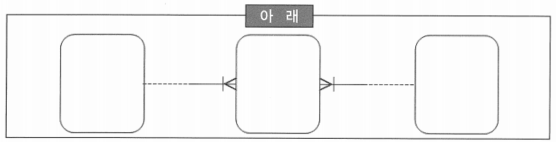
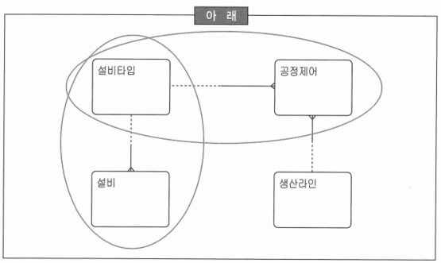
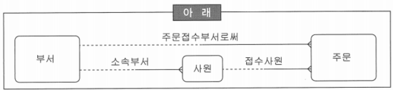
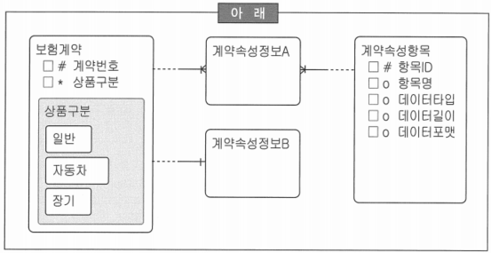
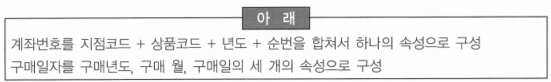
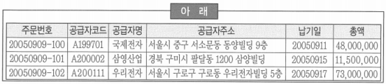

# 요점 정리(166 ~ 185)

# ERD

### 직렬 관계의 특성

- 새로운 테이블이 추가됨
- 인덱스 수가 감소될 가능성이 높음
- 여러 개의 로우(Row)로 나누어짐
- 변화에 유리함(로우만 추가됨)

### ‘설비타입’에 대한 모델러의 판단

- ‘설비타입’이 오로지 설비들을 분류하는 용도로 사용된다고 판단했다면 굳이 지금 단계에서 엔터티로 정의하지 않을 수도 있음
- ~~만약 ‘설비타입’과 ‘생산라인’별로 관리하고자 하는 ‘공정제어’ 값들이 있다면 이 ‘설비타입’은 분명히 부모의 역할을 하게 되므로 지금 엔터티로 도출하여 핵심엔터티로 정의하고 ‘공정제어’ 집합에 대한 자세한 분석을 실시~~ → 공정제어 집합에 대하여 분석을 실시하는 것은 개념 데이터 모델링 단계에서 진행하지 않음
- ‘설비타입’ 엔터티가 멀지 않은 장래(To-be)에 다른 속성을 가질 수 있는지를 확인하기 위해서 업무 담당자와 협의한 후에 가능성이 있다고 판단되면 엔터티로 정의
- ‘설비타입’ 엔터티 후보가 다른 엔터티와의 관계, 특히 자식관계가 없다고 판단하여 엔터티 정의에서 제외하기로 함

### 모델에서 발생할 수 있는 문제점

- *관계의 중복은 중복 데이터를 도입하게 되며 결국 데이터베이스 일관성에 문제를 일으킬 수 있음*
    - ‘사원’은 ‘부서’에 종속되어 있으므로 사원의 부서를 알면 ‘접수부서’를 알 수 있으므로, 데이터 논리 모델에서 관계 중복에 해당
- ~~주문 실체 유형에 ‘접수부서’와 ‘접수사원’을 관리해야 하므로 아무런 문제가 없음~~
- ~~‘사원’의 소속이 바뀌면 주문 당시의 ‘주문접수부서’를 알 수 없으므로 ‘주문’과 ‘부서’ 사이에 관계를 가지고 가는 것은 논리적으로 문제가 없음~~
- ~~‘부서’와 ‘주문’의 JOIN 시에 Access Path를 신속하게 하기 위하여 ‘주문’이 ‘부서’와 관계를 가지는 것은 합당~~

# 식별자

### 본질 식별자

- 신용카드의 카드번호는 실질 식별자 즉, 인조 식별자(Artificial UID)에 해당
- 1:M 관계에서 1쪽의 식별자가 M쪽에서 항상 식별자로 되는 것은 아님
- 인조 식별자(Artificial Unique Identifier)도 때로는 본질식별자가 될 수 있음
- 본질 식별자는 만약 본질 식별자를 이루는 속성이 없을 때 자신이 절대로 태어날 수 없는 경우에만 해당
- ~~카드 회사의 데이터 모델링 과정에서 나올 수 있는 ‘신용카드’의 ‘카드번호’는 본질 식별자에 해당~~
    - 본실 식별자에 해당하는 속성: 고객번호, 카드상품코드, 카드발급일시 등

# 엔터티

### 엔터티 정의

- 엔터티의 통합 및 분할을 위해서 여러 가지 기준들을 적용하게 됨
- 데이터(계약속성정보)를 관리하더라도 서로 다른 방법으로 적용할 수 있음
- 데이터 모델에 대한 설명
    
    
    
    - ‘계약속성정보A’와 같이 관리하는 방법의 가장 큰 장점은 어떠한 속성이 추가되더라도 데이터 모델에는 변화를 주지 않는다는 것
    - ‘계약속성정보A’와 같이 관리하는 방법의 가장 큰 단점은 해당 엔터티에 대한 조건 검색이나 빈번한 액세스가 발생한다면 불리해진다는 것
    - ‘계약속성정보A’와 같이 관리하는 방법은 ERP와 같은 패키지에서 자주 사용되어지는 데이터 모델링 기법
    - ‘계약속성정보A’와 같은 방식의 관리에서 이력을 관리하기 위해서는 추가 UID 속성을 추가하여 관리하는 것이 일반적인 방법
    - ~~‘계약속성정보A’와 같이 관리하는 상황에서 속성정보의 이력을 관리하기 위해서는 새로운 엔터티를 추가해야 함~~

### 엔터티 정의의 판단 기준

- 보험사에서 ‘피보험자’, ‘납입자’ 등은 고객 엔터티와 업무를 표현하고 있는 ‘계약’ 엔터티와의 관계
- ‘고객’은 엔터티 후보라고 볼 수 있지만, ‘불량거래자’는 엔터티 후보라고 보기에는 무리
- ‘금융기관’은 ‘금융’과 ‘기관’의 합성어 형태이고, 엔터티로 정의할 수도 있음
- ‘배송처’는 순수 본질 집합이 아니지만 경우에 따라서는 엔터티로 정의될 수도 있기 때문에 이 과정에서 엔터티 후보로 도출하는 것은 가능

### 엔터티 후보들에 대한 모델러의 판단

| 아래 |
| --- |
| 금융기관, 피보험자, 법인, 배송처 |
- ~~‘금융기관’은 ‘금융’이라는 행위와 기관이라는 개체가 묶여진 관계~~
    - ‘금융’은 ‘기관’이라는 큰 집합의 특정 부분집합을 나타내기 위해서 사용된 말이기 때문에 금융기관이 관계라고 보기는 어려움
- ‘피보험자’는 ‘피보험’이라는 행위와 ‘자’라는 개체가 묶여서 만들어지 관계. 하지만, ‘피보험자’가 다대다이라면 엔터티(교차엔터티, 관계엔터티)로 생성될 수 있음
- ‘법인’은 ‘고객’의 서브타입에 해당하므로 독자적인 엔터티가 아님
- ‘배송처’는 ‘배송’이라는 행위와 ‘처’라는 개체 집합으로 결합된 형태이기 때문에 관계라고 할 수 있지만 경우에 따라서는 ‘배송처’가 될 수 있는 개체들만 모아둔 엔터티로 볼 수도 있음

## 서브타입

### 서브타입 엔터티에 대한 설명

- 서브타입 간에는 교집합이 존재하지 않아야 함
- 서브타입을 모두 결합하면 반드시 전체 집합이 되어야 함
- 서브타입은 물리 데이터 모델에서 별개의 테이블로 생성될 수 있고, 하나의 테이블로 병합될 수도 있음
- 서브타입의 사용은 가독성을 증진시키지만 물리 데이터 모델 전환 시에 기준을 마련한다면 복잡성이 증가하지 않음

### 서브타입의 적용 기준

- 분류 속성에 따라 엔터티의 정보가 차별화 되는 경우
- 소수의 선택 속성이 존재한다면 굳이 서브타입으로 구분할 필요 없음
- 서브타입으로 분할함으로써 관계가 필수관계로 변하는 경우
- 복잡한 엔터티의 단순화와 거리가 멂

## 통합과 분할

### 엔터티의 통합과 분할

- *엔터티는 통합 할수록 집합의 유연성은 향상되지만 독립성은 저하됨*
    - 엔터티의 통합은 유연성 향상, 배타적 관계의 가능성을 줄여줄 수 있지만 무리한 통합은 집합의 독립성을 저해함
- ~~집합의 일부가 서로 겹칠 때 어느 한 집합을 확장하여 나머지를 포함시키는 것은 부적절한 형태의 통합 방법~~
- ~~키 엔터티를 최대한 통합을 하는 것은 향후에 생길 자식 엔터티를 위해서 가급적이면 삼가해야 함~~
- ~~집합의 동질성 부여 방법에 따라 집합의 독립성에 영향을 주지는 못함~~

### 엔터티의 통합과 분할에 대한 설명

- *보험회사의 경우에는 ‘대리점’이 ‘내근사원’과 통합하는 것이 좋지만, 통신회사인 경우에는 ‘조직’과 통합하는 것이 바람직*
    - 하위 엔터티를 위해 최대한 통합을 유도하는 것이 바람직
    - 경우에 따라서는 하나의 집합이 완전히 포함되어지는 통합이 일어나는 경우도 발생
    - 새로운 유형의 집합이 추가되더라도 새로운 엔터티가 기존에는 관계의 변화가 일어나지 않으면서 부분 집합(서브타입)만 증가하는 형태가 바람직
- ~~핵심 엔터티 즉, 상위 엔터티를 최대한 통합하는 것은 향후에 생길 하위 엔터티를 위해서 가급적이면 삼가해야 함~~
- ~~집합의 일부가 서로 겹칠 때는 어느 한 집합을 확장하여 나머지를 포함하는 것이 부적절한 형태의 통합 방법~~
- ~~향후 변화에 대응하기 위해서는 데이터 모델이 반드시 유연성을 가지고 있어야 함. 이러한 유연성 확보를 위해서 집합을 최대한 분할하는 것이 바람직~~

# 개념 데이터 모델링

## 코드성 엔터티

### 코드성 엔터티의 처리

- *코드성 엔터티는 키 엔터티로 볼 수 있음*
- ~~코드 속성을 코드성 엔터티로 도출해 놓으면 데이터 모델이 복잡성의 함정에 빠질 수 있으므로 엔터티로 도출하지 않는 것이 좋음~~
    - 대부분의 코드성 엔터티는 개념 데이터 모델링 단계에서 굳이 엔터티로 도출하지 않아도 무관
    - 코드성 엔터티가 여러 하위 엔터티를 가지는 경우 엔터티로 도출해야 함
- ~~코드 속성이 의미상의 주어가 된다면 반드시 코드성 엔터티로 정의해 주어야 함~~
    - 본질 식별자라고 해서 무조건 엔터티로 도출하기 보다는 다양한 관계를 가질 때 엔터티로 도출하는 것이 바람직
- ~~코드성 엔터티의 도출은 부모-자식 관계 표현을 통해 개념 데이터 모델을 보다 상세하게 정의할 수 있기 때문에 꼭 필요한 과정~~
    - 코드성 엔터티의 도출은 개념 데이터 모델에서 꼭 필요한 과정이라고 볼 수 없음

# 논리 데이터 모델링

### 고려할 사항

- 특정한 응용프로그램이나 기술에 특화되지 않고 다수에 의해 사용 가능해야 함
- 현재 상태를 근간으로 최소한의 노력을 통해 새로운 요구 사항을 수용할 수 있어야 함
- 업무가 데이터를 이용하고 관리하는데 있어서 데이터의 값의 일관성이 있어야 함
- ~~업무가 데이터를 이용하고 수행하는데 있어서 적절한 속도를 보장해야 함~~
    - 수행 성능은 물리적인 요소(인덱스, 저장 기법 등)

### 논리 데이터 모델링의 필수 성공 요소들에 대한 설명

- 현업 사용자의 참여가 필수적
- 절차 보다는 데이터에 초점을 두고 모델링을 진행해야 함
- 데이터의 구조와 무결성을 함께 고려해야 함
- 변경이 발생할 가능성은 매우 높으면서 이력관리 대상 속성이 적으면 CASE 툴을 사용하면 많은 도움을 줄 수 있음

### 논리 데이터 모델링에 대한 설명

- 논리 데이터 모델은 논리적 관점에서 데이터 모델링이 최종적으로 완료된 상태를 말함
- 비즈니스 데이터에 존재하는 사실을 인식·기록하는 기법
- 데이터 모델링 과정에서 가장 핵심이 되는 부분으로 분석 초기 단계에서부터 인간이 결정해야 할 대부분의 사항을 모두 정의함으로써 설계의 전 과정을 지원하는 ‘과정의 도구’라고 할 수 있음
- ~~전산화 대상 시스템의 형태나 목적 등에 의해 영향을 받음~~ → 물리 데이터 모델

### 논리적 데이터 모델링의 목적 및 효과

- 해당 비스니스에 대해 데이터 관점에서 명확한 이해가 가능
- 사용자와 명확한 의사소통을 하기 위한 수단으로 활용됨
- 데이터의 일관성 및 정확성 유지를 위한 규칙을 도출할 수 있음
- ~~데이터베이스를 구성하는 오브젝트(Object)들의 설계 전략이 반영되어 있음~~ → 물리 데이터 모델

# 관계(Relationship)

### 관계에 대한 설명

- 집합 간에는 하나 이상의 많은 관계들이 존재할 수 있음. 하지만 이러한 관계들 중에서 직접 관계만을 표현하는 것이 논리 데이터 모델링
- 관계의 내용에 따라서 얼마든지 관계의 형태가 달라질 수 있음
- 관계를 맺는 두 엔터티의 의미상 식별자가 결정되지 않았다면 관계를 생성하는 것은 무의미하다고 볼 수 있음
- ~~다대다 관계는 관계의 복잡성을 증가시키므로 발견 즉시 두개의 일대다 관계를 가지는 관계 엔터티로 분해하는 것이 바람직함~~
    - 개념 데이터 모델링 단계에서는 다대다 관계를 풀지 않지만, 논리 데이터 모델링 단계에서는 두개의 일대다 관계 엔터티로 생성하게 됨

### 관계에 대한 설명

- 관계도 집합
- 집합 간에 존재하는 무수히 많은 관계 중에 직접 종속, 간접 종속 등의 관계 속성들을 모델링
- 두 엔터티 간에 하나 이상의 관계가 존재할 수 있음
- ~~다대다 관계는 복잡성을 증가시키므로, 발견 즉시 두 개의 일대다 관계를 갖는 관계 엔터티로 분해~~
    - 개념 데이터 모델링 단계에서는 다대다 관계를 풀지 않지만, 논리 데이터 모델링 단계에서는 두개의 일대다 관계 엔터티로 생성하게 됨

# 관계형 모델

### 위배하고 있는 성격

- *속성 원자성*: 비즈니스에서 의미 있는 최소한의 속성 단위
    - ‘계좌번호’가 문제의 지문과 같이 구성된 것은 속성이 비원자적으로 구성되어 있기 때문에 ‘구매일자’가 지문과 같이 구성된 것은 의미가 없음
- 속성 무결성
- 속성 단순성
- 속성 중복성

# 정규화

### 표에서 필요한 정규화

- 제3차 정규화
    - 식별자가 ‘주문번호’이고, ‘공급자명’과 ‘공급자주소’는 식별자가 아닌 ‘공급자코드’에 종속된 속성으로 3차 정규화를 실시해야 함