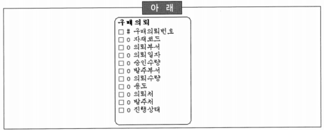
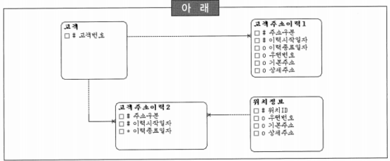

# 요점 정리(186 ~ 200)

# 엔터티

### 엔터티 후보 분류를 위한 모델러의 수행내용

- 우선순위가 높은 엔터티들은 대개 전체 데이터 모델링의 골격에 해당하는 주요 엔터티들이기 때문에 먼저 이들을 명확하게 함으로써 모델링의 골격을 갖출 수 있음
- 데이터 모델링의 골격에 해당하는 엔터티는 각 회사마다 가장 중요한 데이터의 집합인데 비즈니스 영역마다 유사한 형태를 가지고 있는 것이 보통
- 최상위 우선순위를 가지는 엔터티들은 대개 행위를 발생시키는 주체나 목적에 해당
- ‘신용카드’는 카드를 발급받은 사람과 발급해 준 카드사의 상품이 반드시 존재해야만 태어날 수 있는 엔터티이므로, 우선순위가 가장 높은 것이라고 보기는 어려움

### 엔터티 후보 선정시 유의사항

- 중요한 엔터티인 경우 ~~가능한 깊이~~ 너무 깊지 않게 분석하는 것이 좋음
- 단어 하나하나에 집중~~하지 않고~~ 전체 집합을 고려하여 집합을 개념적으로 정의하는 것이 좋음
- 데이터는 프로세스와 밀접하게 관련있기 때문에 엔터티 후보 선정 시 프로세스에 연연하지 말아야 함
- 이음동의어, 동음이의어 등과 같이 동의어처럼 보이는 집합도 집합을 명확하게 구분하여 파악하는 것이 중요

# 무결성

### 참조 무결성 규칙에 대한 설명(주문과 주문 내역은 1:M의 양쪽 필수 관계)

- 주문과 주문내역 실체 유형에서 주문 인스턴스(Row) 삭제 시에는 주문내역 인스턴스(Row)를 삭제
- 주문과 주문내역 실체 유형에서 주문 인스턴스(Row) 삭제 시에는 주문내역 인스턴스(Row)가 있으면 삭제하지 않음
- 주문과 주문내역 실체 유형에서 주문내역 인스턴스(Row) 입력 시에는 주문 인스턴스(Row)가 있는 경우만 입력
- ~~주문과 주문내역 실체 유형에서 주문내역의 마지막 인스턴스(Row) 삭제 시에는 주문 인스턴스(Row)도 삭제~~
    - 참조 무결성이 해결하지 못하는 연쇄작용에 의한 데이터 무결성

# 논리 데이터 모델링

## 속성

- 속성 정의: 엔터티 정의를 수행하고 해당 엔터티 내의 관리항목들을 도출하여 정의하는 과정

### 속성 정의에 대한 설명

- 엔터티에 통합되는 구체적인 정보항목으로써 더이상 분리될 수 없는 최소의 데이터 보관 단위
- 관계(Relationship)도 속성
- 속성들은 서로 독립적이고 식별자에만 종속되어야 함
- ~~현재 시스템과 다른 시스템의 다큐먼트는 속성 후보 수집처로 적절하지 못함~~
    - 다른 시스템의 문서를 참조하는 것은 현재 시스템의 개선점을 파악하기 위해서 필요
    - 미처 생각하지 못했던 관리 속성들을 추출하기 위한 중요한 소스로도 사용할 수 있음

### 속성 정의 시 유의사항

- 의미가 명확한 속성 명칭을 부여
- ‘전화번호’라는 속성은 어떤 전화 번호인지 명확하게 정의하는 것이 바람직
- ‘순번’, ‘상태’ 등과 같이 주어 부분이 빠진 형태의 용어는 속성으로 바람직하지 않음
- 단수형으로 속성명을 사용

### 속성 후보를 수집하기 위한 자료

- 현업장표/보고서
- 사용자 인터뷰
- 타 시스템 자료
- ~~중장기 마스터플랜~~
    - 속성은 엔터티 내에서 관리해야 할 구체적인 관리항목이기 때문에 중장기 마스터플랜에서 속성 후보를 도출하기는 어려움
    

### 속성 검증 방법

- 최소 단위 분할 여부를 판단
- 해당 속성 후보가 단일값을 갖는지 판단
- 추출 속성인지 판단
- ~~식별자로 사용되는 것인지 판단~~
    - 식별자 검증은 속성 검증이 완료되고 해당 엔터티 내에서 식별자 지정하게 되므로 속성 검증과는 거리가 멂

## 엔터티 내 속성 정의 단계

- 유의사항: ‘일자’, ‘시간’, ‘성명’, ‘주민등록번호’, ‘우편번호’ 등은 일반적으로 나누지 않는 것이 좋다

### 위 유의사항 관련 속성 검증의 하위 단계

- 최소 단위 분할
    - 경우에 따라서는 복합속성을 구성하는 것도 가능
- ~~상세화 여부 판단~~
- ~~추출 속성 검증~~
- ~~단일값~~

### ‘고객’ 엔터티의 속성을 정의할 때, 추출 속성 값

- 현주소
- 최초가입일
- 고객활동상태
- ~~결혼기념일~~ → 본래의 속성

### 엔터티의 인스턴스 레벨 결정에 영향을 미치는(의미상 식별자의 역할을 한 속성 조합) 속성

- 자재 구매의뢰 정보를 관리하는 엔터티

- 자재코드, 의뢰부서, 의뢰일자
    - 의미상으로 식별자의 역할을 하는 속성들은 누가, 무엇을, 언제, 어디서 등과 같은 육하원칙에 해당하는 속성들의 그룹

## 속성 검증 원칙

- 한 개체가 여러 값을 가지거나 반복되는 속성을 가지게 되면 잘못된 속성

### 위 내용에 위배하는 정규화 원칙

- 1차 정규화: 하나의 속성은 반복되는 중복값을 가질 수 없음
    - 하나의 속성이 중복값을 가지기 위해서는 새로운 엔터티를 생성해야 함
- ~~2차 정규화~~
- ~~3차 정규화~~
- ~~4차 정규화~~

# 데이터 모델

### 일대일(1:1) 관계

- 필수-선택형태(—⋯)는 좌측 엔터티가 우측 엔터티에 집합적으로 포함되는 형태
- 필수-필수형태(——)가 데이터 모델에 많이 등장하였다면, 모델링 과정 중에서 과도한 수직분할을 시도하였기 때문
- 선택-선택형태(⋯⋯)는 실전에서 드물게 발생하는 일대일(1:1) 형태
- 일대일(1:1) 형태의 데이터 모델도 때로는 필요함
    - 최대한 일대다(1:M) 관계의 데이터 모델로 유도할 필요 없음

### 고객 주소 관리 데이터 모델에 대한 설명

- ‘고객주소이력1’, ‘고객주소이력2’ 등과 같은 형태로 관리하는 것이 대표적

- ~~‘법인고객’을 ‘고객’에서 통합해서 관리하고 있다면, ‘고객주소이력2’와 같은 형태의 고객주소관리는 비효율적~~ → 법인고객관리 형태와 무관
- ‘고객주소이력1’과 같은 형태의 고객주소관리 형태에서는 동일한 주소 즉, 장소가 여러 번 반복해서 나타나는 경우가 발생할 수 있음
- ‘고객주소이력2’와 같은 형태의 데이터 모델은 ERP와 같은 패키지 형태에서 자주 등장하는 데이터 모델로써 확장성과 재사용성의 극대화에 초점을 두고 있음
- ‘고객주소이력1’과 같은 형태의 고객주소관리에서는 고객이 가진 여러 가지 구분(자택, 직장 등)의 주소이력을 통합하여 관리할 수 있음

# 실체

### 실체 유형에 대한 정의(설명)를 기술할 때 고려해야 할 사항

- 실체 유형의 정의(설명)는 그 실체 유형이 무엇인지를 설명해야 함
- 실체 유형의 정의(설명)는 왜 그 실체 유형이 업무에서 중요한가를 설명해야 함
- 실체 유형의 정의(설명)는 실체 유형명은 명확하고 간결하게 설명해야 함
- ~~실체 유형의 정의(설명)는 누가, 어떻게 실체 유형을 사용하는지를 설명해야 함~~
    - 변화 가능성이 많으므로 데이터 모델에 정의하면 유지보수에 문제가 발생할 수 있음
    - 매트릭스 분석 기법을 통한 상호작용 분석으로 수행하는 것이 향후 긍정적 효과를 나타낼 수 있음

# 순환관계 모델

- 순환관계 모델: 데이터 모델링에서 계층적으로 생기는 데이터를 관리하기 위해서 생성

### 순환관계 모델에 대한 설명

- 순환관계 모델은 새로운 계층의 추가·수정에 대해서 유연하게 대처할 수 있음. 즉, 구조의 변화가 필요 없이 변화에 대처할 수 있음
- 순환관계 모델에서 최상위는 의미적으로 NULL이지만 물리적인 요소(수행 성능 등)를 고려해서 특정 값을 갖는 것이 바람직
- 다대다(M:M) 순환관계를 처리하기 위해서는 별도의 엔터티를 추가해야 함
- 순환관계 모델에서 구조가 변경되더라도 식별자는 변경되지 않기 때문에 과거의 데이터를 변경할 필요 없음