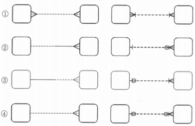
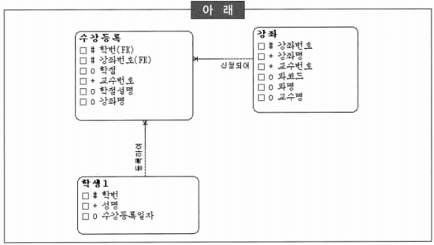
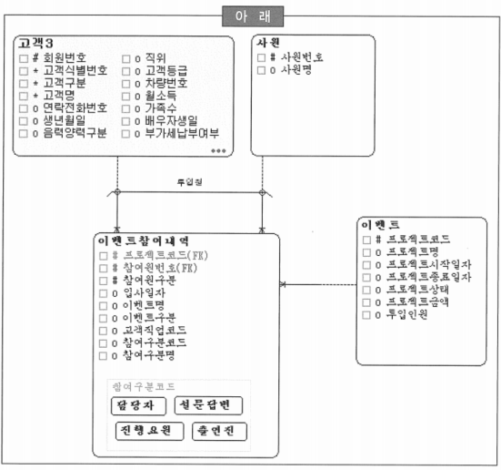

# 요점 정리(201 ~ 220)

# 식별자

### ‘고객’ 엔터티의 식별자를 결정하기 위한 기준

- 각 인스턴스들을 유일하게 식별할 수 있어야 함
- 나머지 속성들을 직접 식별할 수 있어야 함
- 후보 식별자로 속성 집합을 선택하는 경우에는 개념적으로 유일해야 함
- 후보 식별자는 여러 개의 속성들을 묶어서 생성할 수 있음

### 인조 식별자 지정에 대한 설명

- 본질 식별자: 엔터티에서 실제 인스턴스 탄생의 주체에 해당하는 속성들
- 인조 식별자: 여러 가지 목적으로 인해 본질 식별자를 대체할 식별자
    - 최대한 범용적인 값을 사용
    - 유일한 값을 만들기 위해 인조 식별자 사용
    - 편의성·단순성 확보를 위해 인조 식별자를 사용
    - 경우에 따라서는 내부적으로만 사용되는 인조 식별자를 사용할 수도 있음
        - 시스템에서 사용하는 데이터들에 이러한 유형의 식별자가 많이 존재함

### 식별자 확정 시에 고려사항

- 상위 엔터티로부터 하위 엔터티로 결정해가는 것이 좋음
- 메인 엔터티는 하위 엔터티들에 대한 영향이 크기 때문에 식별자 속성의 갯수를 적게 하는 것이 좋음
- 인조 식별자의 사용은 꼭 필요한 경우에만 한정적으로 사용하는 것이 바람직
- ~~인조 식별자는 유일성 확보에 유리하므로 적극적인 사용을 고려~~

# 이력관리

### 이력 관리의 대상

- 부서와 사원의 관계
- 상품 단가에 대한 관리
- 금융 상품의 이자율 관리
- ~~주문과 주문품목의 관계~~

### 선분(기간)이력으로 관리해야 하는 것

- 각 상품별 이자율에 대한 이력 관리
- 어느 부서에서 어떤 사원이 근무했다는 이력 관리
- 제조 기업의 상품 단가에 대한 이력 관리
- ~~매일 바뀌는 환율에 대한 이력 관리~~

### 선분(기간)이력관리에 대한 설명

- 선분(기간)이 중첩되지 않도록 해야 함
    - 데이터 무결성을 깨지 않으므로 사용하지 않는 것보다 유리할 수 있음
- 시작일자와 종료일자로 관리할 때 종료일자에 “99991231”을 초기값으로 설정하는 것은 성능상의 이유
- 데이터의 유효기간을 관리하는 형태로 특정 시점의 데이터를 조회할 때 유리
- ~~종료일자는 어떤 면에서 데이터 중복이므로 데이터 무결성을 위하여 가급적 선분이력은 사용하지 않음~~

### 이력관리 형태에 대한 설명

- 이력관리 형태는 시점이력관리와 선분이력관리로 구분할 수 있음
- 시점이력관리는 변경 시점의 스냅샷을 관리하는 형태로 특정 시점의 데이터를 추출할 때 불필요한 작업을 수행하게 되는 단점을 갖고 있음
- 선분이력관리는 데이터의 유효기간을 관리하는 형태로 특정 시점의 데이터를 추출할 때 유리함
- ~~변경이 발생할 가능성은 매우 높으면서 이력관리 대상 속성이 적으면 속성 레벨의 선분이력관리 방식이 유리함~~
    - 변경이 가끔 발생하고 이력 대상 속성이 많다면 인스턴스 레벨의 이력 관리를 고려할 수 있음
    - 이러한 이력관리의 방법을 사용하면 실제 변경된 속성을 찾는데 다소 불편함이 있음

### 선분이력관리 종료점 처리의 방법을 결정하는 고려사항

- 계속 진행 중이므로 무한히 계속되는 것으로 간주해 최대치를 부여하면 여러모로 효율적(일자: 99991231)
- ~~종료점에 해당하는 속성은 NULL 허용여부와 상관없이 인덱스 정의가 가능하므로 수행속도를 보장 받을 수 있음~~
- ~~종료점에 대한 최대치 부여는 해당 애플리케이션에서 Validation Check로 처리하면 DBMS에 부담을 덜어 주어 훨씬 효과적이며 유지보수헤도 효과적~~
- ~~DBMS 종류나 버전에 따라 NULL 검색도 인덱스를 사용할 수 있어서 NULL 허용은 문제되지 않음~~

# 데이터 모델

### Richard Barker의 CASE*Method 방식과 정보공학 방식

→ 1번 잘못됨

- 정보공학 방식에서 동그라미가 없는 것은 필수 관계, CASE*Method에서는 실선이 필수 관계

# 속성

### 위반시 모델러가 취해야 할 행동

| 아래 |
| :---: |
| 한 개체가 여러 값을 가지거나 반복되는 속성을 가지게 되면 잘못된 속성이다. |
- *반복되는 형태에 대해 정확히 파악하기 위해서는 해당 속성의 생성 규칙 내용을 업무 담당자와 협의하여 그 결정에 따라 판단*
- ~~해당 속성은 잘못된 속성으로 간주하여 배제시킴~~
- ~~이 부분은 정규화 과정에서 진행된다고 가정하여 우선순위를 뒤로 미룸~~
- ~~해당 엔터티의 UID에 대한 적절성 여부를 판단~~

### 속성 정의에 대한 설명

- 속성은 엔터티에 통합되는 구체적인 정보항목으로써 더 이상 분리될 수 없는 최소의 데이터 보관 단위
- 속성에는 결국 데이터 값이 들어가게 되며, 그 값들은 여러 종류를 가지게 됨. 이런 측면에서 본다면 속성 또한 집합이라고 볼 수 있음
- 속성들 간에는 서로 독립적이고, 식별자에만 종속되어야 함
- ~~현재 시스템의 유지보수를 게을리하여 파생된 시스템 다큐먼트(Document)는 속성 후보의 수집처로 적절하지 못함~~
    - 다른 시스템의 문서를 참조하는 것은 현재 시스템의 개선점을 파악하기 위해서 필요
    - 미처 생각하지 못했던 관리 속성들을 추출하기 위해서 중요한 소스로 사용할 수 있음

# 정규화

### 정규화 작업의 내용

- 1차 정규형: 반복 속성은 존재할 수 없음
    - 반복 속성을 해소하기 위해서는 자식 엔터티를 생성하게 됨
- 2차 정규형: 모든 속성은 식별자 전체에 종속되어야 함
    - 그렇지 않은 경우에는 부모 엔터티가 추가됨
    - 부모 엔터티로부터 관계에 식별자가 포함
- 3차 정규형: 2차 정규형을 만족하고, 비식별자 속성 간에 종속이 없어야 함
- ~~인조 식별자의 사용은 데이터 일관성, 무결성 확보에 유리하므로 정규화를 생략할 수 있음~~

### 정규화 작업의 장점

- 중복값 및 Null  값이 줄어듦
- 데이터 구조의 안정성이 향상
- 복잡한 코드로 데이터 모델을 보완할 필요가 없어짐
- ~~새로운 요구 사항의 도출을 차단하여 개발의 안정성을 확보할 수 있음~~
    - 새로운 추가 요구 사항의 반영은 프로젝트 관리 측면에서 다루어져야 할 부분
    - 이러한 요구 사항의 체계적인 관리는 전체 프로젝트의 성패와도 직결되는 문제이기 때문에 신중을 기해야 함

### 정규화의 유형

| 아래 |
| :---: |
| 비정규형 릴레이션이 릴레이션으로서의 모습을 갖추기 위해서는 여러 개의 복합적인 의미를 가지고 있는 속성이 분해되어 하나의 의미만을 표현하는 속성들로 분해되어야 함. 즉, 속성수가 늘어나야 함 |
- *제1정규형*
- ~~제2정규형~~
- ~~제3정규형~~
- ~~BCNF 정규형~~

### 제3정규형을 위배하고 있지 않은 속성

- 제3정규형을 위배하지 않으려면 제1, 2정규형을 만족하고 속성들 간의 종속관계가 없어야 함

- 강좌.강좌명
- 강좌.과명 → 제3정규형 위배
- 수강등록.교수번호 → 제2정규형 위배
- 학생1.수강등록일자 → 제1정규형 위배

### 제3정규형을 위배하고 있는 속성

- 참여구분명
    - UID를 제외한 속성 간의 종속 관계를 가져서는 안되는데, ‘참여구분코드’, ‘참여구분명’ 등이 제3정규형 위배

# 관계

### 다대다(M:M) 관계에 대한 설명

- 논리 데이터 모델링 과정 중에서 흔히 나타남
- 실세계의 업무 중 대부분은 다대다 관계라고 할 수 있음
- 다대다 관계는 발생 즉시(개념 데이터 모델링 단계에서) 해소하지 않고 논리 데이터 모델링의 마지막 부분에 해소하는 것이 바람직
- 다대다 관계가 해소되면 두 개의 일대다 관계를 가지는 새로운 엔터티가 생성됨

### 관계 연산자

- Select(or Restrict):  열(Column)을 기준으로한 행(Row)의 Subset
- Join: 열을 기준으로 한 행을 수평적으로 묶음
- Division: 다른 관계 테이블의 모든 행에 대응하는 열을 제외한 열
- Union: 중복배제를 기준으로 각 행을 수직적으로 묶음

### 다대일(M:1) 관계에 대한 설명

- 가장 흔하게 나타나는 관계 형태
- M쪽이 필수인 경우가 가장 많은 경우
- 다대다 관계는 ‘아직 덜 풀려진 형태’로 해석될 수 있으며 현실에서 가장 많이 존재
- 일대다 관계 중 양측 필수관계인 경우는 현실에는 존재하기 힘든 관계

# 무결성

### 참조 무결성 규칙에 대한 설명

- 관계 테이블의 모든 외부 식별자 값은 관련 있는 관계 테이블의 모든 주 식별자 값이 존재해야 함
- 데이터베이스 설계 관점이 아닌 사용자의 업무 규칙에 따라 적절한 규칙을 선택
- 입력 규칙은 자식 실체에 인스턴스를 입력할 때, 참조 무결성 규칙으로 Dependent, Automatic, Nullify, Default 등이 해당
- 삭제 규칙은 부모 실체의 인스턴스를 삭제할 때 사용되어지는 참조 무결성 규칙으로 Restrict, Cascade, Nullify, Default 등이 해당