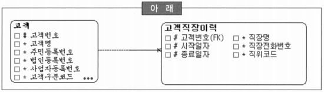
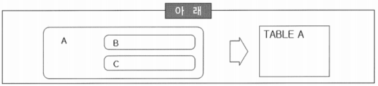
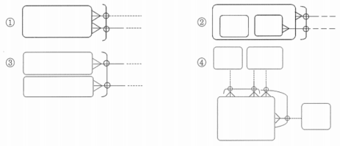

# 요점 정리(221 ~ 242)

# 물리 데이터 모델

- 논리 데이터 모델을 근간으로 구현될 시스템의 물리적인 요소를 반영하여 실제 시스템에 구축될 오브젝트를 모델링하는 단계

### 정의

- 논리 데이터 모델을 특정 데이터베이스로 설계함으로써 생성된 데이터를 저장할 수 있는 물리적인 스키마를 말함
- 하나의 엔터티는 물리적 요소들을 감안하여 경우에 따라서는 여러 개의 테이블로 생성될 수 있음
    - 성능의 문제를 고려하여 여러 테이블로 생성하는 경우도 종종 발생
- 하나의 논리 데이터 모델은 여러 개의 물리 데이터 모델로 설계되어 질 수 있음
- 논리 데이터 모델의 일부 속성만으로 물리 데이터 모델에서 테이블로 설계하는 경우도 발생할 수 있음

### 물리 데이터 모델 설계에 영향을 미치는 요소

- CPU, MEMORY, DISK 등 하드웨어 자원의 상황
- 운영체제 및 DBMS 버전
- DBMS 파라미터 정보
- ~~개발자 기술 수준~~

### 하나의 논리 데이터 모델로 여러 개의 물리 데이터 모델을 생성하는 이유

- 하나의 논리 데이터 모델을 가지고 분산 데이터베이스 구축 시에 동일한 물리 데이터 모델을 여러 개 생성
- 조금씩 상이한 물리 데이터 모델을 생성하여 여러 형태의 물리 데이터 모델을 비교하고자 할 때 생성
- 논리 데이터 모델은 변화하지 않았지만 물리적 환경의 변화 발생 시에 여러 개의 물리 데이터 모델을 생성
- 사용자의 요구가 명확하지 않다면 논리 데이터 모델 자체가 확정되지 않은 상황이므로, 물리 데이터 모델이 여러 개로 생기는 상황과는 거리가 멂

### 논리 데이터 모델에서 관계를 물리 데이터 모델의 객체로 변화하는 방법

- 일대다 관계는 논리 데이터 모델에 존재하는 가장 흔한 관계의 형태이고, M쪽 관계의 형태에 따라 관계 칼럼의 선택사양을 결정
- 일대일 관계에 의해서 생긴 모든 외래키 부분은 Unique Key가 필수적
- 일대다 순환 관계는 데이터의 계층구조를 표현하기 위한 수단으로 사용되며 특성상 1쪽, M쪽 양방향 모두 Optional
- 일대다 관계에서 1쪽이 Mandatory이고 M쪽이 Optional 인 경우는 업무 규칙상 발생할 수 있음
    - 자식쪽의 레코드가 하나 이상 있어야 부모 테이블에 레코드를 생성할 수 있다는 것

### 논리 데이터 모델의 특정 엔터티를 물리 데이터 모델에서 분할할 때

- 하나의 테이블의 데이터가 너무 많고, 레코드들 중에서 특정 범위만 주로 액세스 하는 경우가 많다면 수평분할이 적절
- 수평분할 시에 분할된 각 테이블들을 서로 다른 디스크에 위치시키면 물리적인 디스크 효용성을 극대화할 수 있음
- 테이블의 칼럼 수가 너무 많고, 조회 위주의 칼럼과 갱신 위주의 칼럼이 구별될 수 있으면 수직분할이 유리
- 특정 칼럼의 크기가 아주 큰 경우(특히 이미지와 같은 크기가 큰 데이터)에는 데이터를 저장하기 위해서는 원래의 테이블의 칼럼들과 분리하여 저장하는 것이 보통
    - 이미지를 읽지 않은 경우에 액세스 효율을 증가시킬 수 있음

## 물리 데이터 모델링

- 관리하는 엔터티 중에 ‘통화내역’이라는 테이블에 월별 약 1,000만 건의 데이터가 생성될 것으로 예상
- 모델러는 적절한 구분 칼럼을 기준으로 파티셔닝을 고려하고 있음

### 모델러가 가장 먼저 파악해야 할 물리적인 요소

- 운영체제 및 DBMS의 버전 정보
    - DBMS 벤더와 버전에 따라서 지원하는 파티셔닝의 기법들이 상이하기 때문에, 상이한 점들을 파악하는 것이 우선
- ~~CPU, MEMORY, DISK 등의 하드웨어 자원 정보~~
- ~~DBMS의 파라미터 정보~~
- ~~백업·복구 기법 및 정책, 보안관리 정책 등의 데이터베이스 운영 관리요소 정보~~

### 데이터 표준 적용 대상의 우선순위

- 뷰(View)
- 스토리지 그룹(Storage Group)
- 테이블스페이스(Table space)
- ~~SQL 코멘트~~
    - 일반적으로는 SQL 코멘트에 대한 데이터 표준 방안을 수립하지 않고, 해당 SQL의 유의사항 또는 처리 방법 등에 대한 내용을 자유롭게 기록하는 것이 일반적

# 이력 관리

### 선분 이력의 특징

- 향후 활용 관점에서 보면 과거 임의 시점의 이력 데이터를 Access하기 위해서는 아래와 같은 쿼리를 사용하여 원하는 데이터를 추출할 수 있음
    
    ```
    SELECT ⋯
    	FROM 변경이력
    WHERE 이력주체id = '원하는 이력주체'
    	AND '원하는 시점' BETWEEN 시작일자컬럼 AND 종료일자칼럼;
    ```
    
- 개체의 상태가 지속된 유효기간을 관리하는 방식
- 종료 시점이 아직 결정되지 않아서 현재 진행 중인 이력 데이터에 대한 종료점을 NULL로 표현하는 것이 맞지만 실제적으로는 수렴값(99991231)을 지정하는 것이 보다 효율적
- 시점별로 환율의 변화를 관리해야 한다면 선분이력으로 관리하는 것이 바람직

### 일반적인 데이터 모델에서 이력을 관리하는 모델로 변환 시에 나타나는 상황

- 이력 관리는 관계의 형태를 변화시킴. 즉, 속성이나 관계의 Cardinality를 증가시키게 됨
- 하나의 엔터티에 일반 속성 이력을 관리하면 일대다 관계의 하위 엔터티를 생성하게 됨
- 다대다 관계인 상태에서 해당 관계에 대한 이력을 관리하면 기존의 관계 엔터티에 추가적인 식별자 속성을 발생시키게 됨
- 일대다 관계에 대한 이력을 관리하면 다대다 관계로 변하게 되어 새로운 관계 엔터티를 생성해야 함

## 선분 이력을 가진 칼럼의 인덱스 순서

- 논리 데이터 모델링 단계에서 정의된 선분이력 모델을 물리 데이터 모델로 변환할 때 주의해야 할 사항 중에 하나가 선분이력을 가진 칼럼의 인덱스 순서

### PK인덱스의 칼럼 순서

- 대개의 고객 직장을 참조하는 경우는 고객의 현재 직장을 참조하는 경우가 대부분
- 고객의 직장에 대한 이력을 선분이력으로 관리한다면 ‘고객직장이력’ 엔터티를 테이블로 변환하고 인덱스를 설계



- 현재를 읽는다면 ‘고객번호 + 종료일자 + 시작일자’가 가장 효율적

# 논리 데이터 모델

### 관계변환에 대한 설명

- 일대다 관계는 논리 데이터 모델에서 가장 흔한 관계의 형태이고, 물리 데이터 모델에서는 M쪽 관계의 형태에 따라서 해당 칼럼의 선택사항이 결정됨
- 일대일 관계에 의해서 생긴 모든 외래키는 Unique Constraints를 정의할 수 있음
- 선분이력을 관리하는 상위 엔터티와 관계에서는 상위 엔터티의 식별자 전체를 하위 엔터티에서 상속받지 않아도 데이터적인 연결을 수행할 수 있으므로 식별자 상속을 시키지 않을 수도 있음
- 일대일 관계에서는 양쪽 집합의 선택사양에 따라서 외래키의 생성 위치가 달라질 수 있음. 즉, Mandatory 관계를 가진 쪽 집합에서 외래키를 생성하는 것이 유리

### 논리 데이터 모델을 물리 데이터 모델로 변환할 때

- Entity - Table
- Attribute - Column
- Primary UID - Primary Key
- ~~Business Rule - Constraint~~
    - Check Constraint의 형태가 가장 보편적인 형태

## 서브타입

- 논리 데이터 모델에서 ‘고객’ 엔터티에는 서브타입으로 ‘개인’, ‘법인’을 정의
- 논리 데이터 모델에서 정의된 서브타입 엔터티를 변환하는 방법은 여러 가지가 존재하지만 각각의 방법은 상황에 따라서 다른 방법으로 구현됨

### 논리 데이터 모델의 서브타입 엔터티를 물리적인 객체로 생성하는 방법

- 하나의 테이블로 통합하여 ‘고객’ 테이블을 생성
- 여러 개의 테이블로 분할하여 ‘개인’ 테이블과 ‘법인’ 테이블을 생성
- 수퍼타입과 서브타입을 각각의 테이블로 변환하여 세개의 테이블로 생성. 즉, ‘고객’ 테이블, ‘개인’ 테이블, ‘법인’ 테이블을 생성
- ‘법인’ 내의 또 다른 서브타입인 ‘법인사업자’와 ‘개인사업자’를 별개의 테이블로 생성하는 것은 바람직하지 않음
    - 상위 테이블을 분할하게 되면 테이블들을 부모로 가지는 하위 테이블들을 활용하는데 많은 불필요한 일들이 발생할 소지가 있음

### 서브타입 엔터티를 물리적인 테이블로 변환하는 방법

- 서브타입을 하나의 테이블로 통합하는 경우에는 주로 서브타입이 적은 양의 속성이나 관계를 가진 경우에 적용
- 서브타입을 하나의 테이블로 통합하면 데이터 액세스가 보다 간편해지고, 복잡한 처리를 하나의 SQL로 통합하기가 용이해져서 수행속도가 향상될 수 있음
- 서브타입을 여러 개의 테이블로 분할하는 경우에는 주로 서브타입이 많은 양의 속성이나 관계를 가진 경우에 적용
- 서브타입을 여러 개의 테이블로 분할하면 각 서브타입 속성들의 선택사양을 명확히 할 수 있으나, 서브타입 유형구분별로 별개의 테이블로 생성되기 때문에 유형구분이 필요없음

### 서브타입을 하나의 테이블로 생성



- TABLE A의 데이터를 액세스하고자 할 때 B와 C를 구분해서 액세스하는 것이 불편함
- B 서브타입에 정의된 Not Null Constraint를 생성하기가 어려움
- 논리 데이터 모델에서 B와 C 서브타입에 정의된 개별 속성들이 많을 경우에는 하나의 테이블로 변환하는 것이 바람직
- 경우에 따라서는 인덱스의 크기가 증가할 수 있음

# 반정규화

### 테이블이나 칼럼에 대한 중복을 수행할 때, 고려 및 권고사항

- 넓은 범위를 자주 처리함으로써 수행속도의 저하가 우려되는 경우에는 집계 테이블의 추가를 고려해 볼 수 있음
- 자주 사용하는 액세스 조건이 다른 테이블에 분산되어 있어 상세한 조건 부여에도 불구하고 액세스 범위를 줄이지 못하는 경우에는 자주 사용되는 조건들을 하나의 테이블로 모아서(칼럼의 중복 즉, 추출 속성으로 하나의 테이블에 모으는 경우) 조건의 변별성을 극대화할 수 있음
- 빈번하게 조인을 일으키는 칼럼에 대해서는 중복칼럼의 생성을 고려
- 계산된 값은 속성 정의에도 위배되고 함수적 종속이 존재하므로 정규형이 아님. 하지만, 계산하는데 비용(노력)이 많이 발생하고 빈번하다면 계산된 값을 중복시켜서 가져갈 수 있음

## 외래키 분리 방법과 외래키 결합 방법

- 논리 데이터 모델에서 배타적 관계를 물리 데이터 모델로 변환하는 방법은 크게 외래키 분리 방법과 외래키 결합 방법으로 나눌 수 있음

### 두 방법에 대한 설명

- 외래키 분리 방법에서 가장 큰 단점은 새로운 관계를 추가 할 때 구조가 변경되어야 한다는 것
- 외래키 분리 방법에서는 논리 데이터 모델의 배타적 관계를 비즈니스 규칙으로 구현하기 위해서 별도의 제약조건을 생성할 필요가 있음
- 외래키 결합 방법은 배타적 관계에 참여하는 관계들을 구분하기 위해서 추가적인 칼럼이 필요
- 외래키 결합 방법에서는 근본적으로 외래키 제약조건을 생성할 수 없기 때문에 User-Defined Trigger 등의 방법을 통하여 해결해야 함

# 특수 관계

### 배타적 관계 모델의 사용



→ 4번만 올바르게 사용함

- 1번의 배타적 관계는 항상 Mandatory이거나 Optional이어야 함
- 2, 3번의 배타적 관계는 반드시 하나의 Entity에만 속해야 함

# 반정규화

### 테이블이나 칼럼에 대한 중복을 고려할 때

- 다량의 범위를 자주 처리함으로써 수행속도 저하가 우려되는 경우 집계 테이블 추가를 고려
- 자주 사용되는 중복 테이블 유형으로는 집계(통계) 테이블과 진행 테이블이 있음
- 클러스터링, 결합 인덱스, 고수준 SQL 등을 적절히 활용하면 집계테이블 없이도 양호한 수행속도를 얻을 수 있기 때문에 집계테이블 고려 시에 반드시 먼저 고려되어야 함
- M:M 관계가 포함된 처리의 과정을 추적, 관리하고자 하는 경우에는 다중테이블 클러스터링이나 조인 SQL의 정확한 구사 등을 통해 굳이 진행 테이블을 만들지 않아도 양호한 수행속도를 낼 수 있는 경우가 많음

# 파일 시스템과 데이터베이스 시스템의 차이점

- 데이터(정보) 공유
    - 파일 시스템은 업무나 부서 중심의 관점이지만 데이터베이스 시스템은 데이터 통합을 통한 데이터 공유의 관점이라는 것이 가장 큰 차이점
- ~~데이터(정보) 무결성~~
- ~~데이터(정보) 중복~~
- ~~시스템과 관계된 인력 간의 의사소통~~

# 좋은 데이터 모델의 요소

- 완전성(Completeness)
- 데이터 재사용(Data Reusability)
- 간결성(Elegance)
- 중복 배제(Non-Redundancy)
    - 저장 공간의 낭비를 최소화하고, 데이터 일관성을 유지하도록 하고 있음
- ~~반정규화(Denormalization)~~
    - 데이터 모델 설계가 완료된 수 성능을 고려하여 불가피하게 부분적인 중복을 허용한 것

# 모델링 기본 원칙

```
요구사항은 모든 사람이 이해할 수 있도록 명확하게 공표됨은 물론 최종 사용자 지향적으로 분명하게 파악되는 수준으로 작성되어야 한다
```

- 커뮤니케이션 원칙
    - 논리 데이터 모델링의 주목적이 최종 사용자 데이터에 대한 뷰를 개념화하고 추상화하여 시스템 설계자들에게 전달하는 것
- 모델링 상세화 원칙: 데이터의 상세화된 구조를 제시
    - 데이터는 데이터의 본질과 잠재적 사용을 이해할 수 있을 만큼 상세화되어야 함
- 논리적 표현 원칙: 물리적 제약 없이 비즈니스를 그대로 표현
- 설계 형식화 원칙