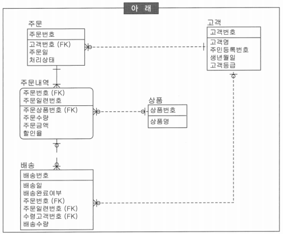
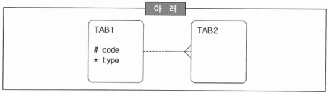

# 261 ~ 272

1. 다음 중 아래의 상황을 고려할 때 수행 내용으로 부적합한 것은?
    
    
    | 아래 |
    | :---: |
    | 상품, 고객, 주문, 주문내역, 배송 테이블을 설계하는 중이다. 상품은 2만 개의 상품을 관리 중이며, 100만 고객을 확보했다. 1일 주문은 만 건 정도이다. |
    1. 고객번호는 고객 테이블 식별자로 Primary Key를 생성한다.
    2. 고객 실명 확인을 위해서 주민등록번호를 후보키로 정의되었다. 이에 따라 주민등록번호에 Unique Index를 생성한다.
    3. ~~배송 테이블의 수령고객번호는 참조 무결성을 위해 NOT NULL Constraints를 생성한다.~~
    4. 주문 테이블에는 성능을 고려하여 고객 번호에 인덱스를 생성하고 참조 무결성 조건은 프로그램으로 구현한다.
    
    → 참조 관계가 NULL을 허용함
    

2. 위에서 예시한 모델을 이용하여 도메인을 추출하였다. 숫자, 일자, 코드 등의 도메인을 도출하여 영역 무결성을 설계할 때, 다음 중 내용이 부적절한 것은?
    1. ‘수량’, ‘배송수량’ 등은 숫자 타입으로 초기값(Default)을 ‘0’으로 지정한다.
    2. ~~조회 조건으로 많이 사용되는 ‘주문일’, ‘배송일’ 등은 날짜 도메인이므로 반드시 Date 타입으로 설계한다.~~
    3. 할인율은 소수점 이하 2자리로 제한한다.
    4. ‘처리상태’, ‘배송완료여부’ 등은 상태에 따른 코드를 반드시 정의하여야 하므로 NOT NULL Constraints를 생성한다.
    
    → 날짜 데이터는 비교 연산이나 조회 조건으로 빈번히 이용되므로 문자 타입을 이용하는 것이 편리
    

3. 주문은 1일 1만건 정도 데이터 발생되고 익일 배송을 원칙으로 업무가 진행될 때, 다음 중 ‘주문’과 ‘주문내역’에 대한 참조 무결성을 구현하기 위한 방안에 대한 설명으로 부적절한 것은?
    1. ~~‘주문’이 없는 ‘주문내역’이 존재할 수 있으므로 응용 프로그램에서 사용자에게 경고 다이얼로그로 등록여부를 확인하고 주문 내역을 등록한다.~~ → 참조 관계에서 반드시 주문은 주문내역을 갖고 있어야 함
    2. 삭제 참조 무결성은 ‘주문’이 삭제되면 ‘주문내역’도 연쇄적으로 삭제하도록 데이터베이스 기능을 적용한다.
    3. ‘주문내역’의 ‘주문상품번호’는 NULL 값을 허용한다.
    4. ‘주문’에는 반드시 ‘고객번호’가 있어야 하므로 주문 등록 시에 ‘고객’을 생성한다.

4. 앞서 예시된 모델을 기반으로 인덱스를 디자인하면서 인덱스 생성후보를 도출할 때, 다음 중 올바르지 않은 것은?
    1. 상품명, 고객명은 빈번히 조회 조건으로 사용되므로 인덱스를 생성한다.
    2. 참조 칼럼은 FK(Foreign Key) 제약조건을 생성하지 않더라도 조인 대상이 되므로 인덱스를 생성한다.
    3. 주문일 + 처리상태는 주문 기간에 따른 상태를 조회하는 경우가 많으므로 후보로 적당하다.
    4. ~~주문.처리상태, 배송.배송완료여부, 고객.고객등급 등은 카디널리티를 고려했을 때 비트맵 인덱스를 사용하여 조회 속도를 향상시킨다.~~ → OLTP 업무를 위한 데이터 모델이므로 비트맵 인덱스를 사용하는 것은 바람직하지 않음
        - OLTP(on-line transaction processing): 데이터 베이스의 데이터를 수시로 갱신하는 프로세싱
            - 여러 단말에서 보내온 메시지에 따라 호스트 컴퓨터가 데이터 베이스를 액세스하고, 바로 처리 결과를 돌려보내는 형태
            - 현재 시점의 데이터만을 DB가 관리한다는 개념이며, 이미 발생된 트랜잭션에 대해서는 데이터 값이 과거의 데이터로 다른 디스크나 테이프 등에 보관될 수 있음
        - 비트맵 인덱스: 인덱스 컬럼의 데이터를 Bit 값인 0 또는 1로 변환하여 인덱스 키로 사용하는 방법
            - 카디널리티 값이 낮은 경우(특정 데이터 집합의 유니크한 값의 개수가 높은 경우: 중복도가 높은 경우)에 사용하기 좋음
            - OLAP(Online Analytical Processing: 온라인 분석 처리)에 사용되며, 대량의 데이터를 한꺼번에 입력한 뒤 분석 or 통계 정보를 출력할 때 많이 사용
            - 데이터 값의 종류가 적고 동일한 데이터가 많을 때 주로 사용

5. 상용 DBMS에서 제공되는 테이블들은 제품마다 명칭 또는 기능에 따라 다소 차이가 있지만 데이터의 접근 방법이나 저장 형태에 따라 몇 가지로 분류할 수 있다. 다음 중 테이블에 대한 설명으로 틀린 것은?
    1. 데이터 값의 순서에 관계없이 데이터를 저장하는 테이블을 Heap-Organized Table이라 한다.
    2. ~~Clustered Index는 일반 테이블의 Clustering Factor를 향상시키기 위해서 B-Tree와는 다른 Tree 구조로 데이터 페이지를 저장한다.~~
    3. Partitioned Table은 큰 테이블을 논리적인 작은 단위로 나눈 것으로, 운용적인 측면에서 대용량 I/O성능, 가용성, 확장성 등을 도모할 수 있는 장점을 가진다.
    4. External Table은 파일 데이터를 일반 테이블 형태로 이용할 수 있으며, 데이터웨어하우스(DW)의 ETL 작업 등에서 유용하게 사용할 수 있다.
    
    → Clustered Index는 키 값의 순서로 데이터가 저장되며, B-Tree 구조의 Leaf Node에 데이터 페이지가 존재
    
    → 인덱스를 통한 액세스보다 접근 경로가 단축되므로 소량 데이터의 랜덤 액세스에 유리
    

6. 칼럼이 서로 참조 관계일 경우에 데이터 타입이나 길이가 다르면 DBMS 내부적으로 변형을 실시한 후에 비교 연산을 수행하기 때문에 의도와 다른 결과를 초래할 수 있다. 다음 중 데이터의 비교 연산에 대한 설명으로 틀린 것은?
    1. 양쪽 모두 CHAR 타입인 경우 두 칼럼의 길이를 비교하여 길이가 짧은 쪽 칼럼에 공백을 추가하여 길이를 동일하게 한 후 비교 연산을 수행한다.
    2. 문자열 비교에서 어느 한쪽이 VARCHAR 타입이 있는 경우에는 각각의 문자를 비교하여 서로 다른 값이 나타나면 문자 값이 큰 칼럼이 크다고 판단하고 비교를 종료한다.
    3. ~~NUMBER 타입과 CHAR 타입을 비교할 경우에는 CHAR 타입을 NUMBER 타입으로 변환한 후 비교연산을 수행한다~~. → NUMBER 타입과 CHAR 타입을 동등(=) 비교할 경우 CHAR 타입을 NUMBER 타입으로 변환하여 비교 연산 수행
    4. 각 문자타입이 상수값과 비교될 때는 결정되어 있는 칼럼의 데이터 타입과 같도록 변환된 후에 비교 연산을 수행한다.
    
    → 만약 CHAR 타입을 NUMBER 타입으로 변환이 불가능할 경우 NUMBER 타입을 CHAR 타입으로 변환
    

7. 현재 사용하고 있는 일부  테이블이 I/O가 빈번하게 발생을 하고 있어서 I/O 병목을 최소화하기 위한 스토리지 전략을 수립하고자 할 때, 다음 중 논리적 데이터베이스 설계 시에 고려할 사항으로 틀린 것은?
    1. ~~테이블과 인덱스는 연속적으로 액세스가 발생하기 때문에 동일한 공간에 배치해야 한다.~~
    2. 대용량 테이블은 관리적인 용이성을 위해서 독립적인 테이블스페이스를 지정해야 한다.
    3. NUMBER 타입과 CHAR 타입을 비교할 경우 NUMBER 타입을 CHAR 타입으로 변환 후 비교를 수행한다.
    4. 임시 세그먼트는 분류 작업이 진행되는 동안 데이터베이스 내부에서 객체가 만들어지는 동적 특성을 가지고 있기 때문에 독립적인 공간을 사용하는 것이 좋다.
    
    → 테이블과 인덱스는 분리하여 저장하는 것이 I/O의 병목을 최소화 할 수 있는 길
    
    → 동시간대에 I/O가 발생하는 것은 분리하고 다른 시간대에 I/O가 발생하는 것은 같은 공간에 배치하도록 함
    
    → 인덱스와 테이블은 액세스하는 개별 주체에서 보면 순차적으로 액세스하지만 타 시스템의 입장에서는 항상 동일 시간대에 액세스가 발생할 수 밖에 없음
    
    → 가능하다면 둘을 분리하여 저장하는 것이 좋음
    

8. 프로그램이 완성되고 데이터가 축적된 후 데이터 클린징을 수행하면 많은 시간과 비용을 지불해야 한다. 이러한 문제점을 미연에 방지하기 위해서 데이터베이스 구축 시에 무결성 방안을 확보하고자 한다. 다음 중 무결성 확보 방안으로 틀린 것은?
    1. ~~데이터의 정확성, 일관성, 유효성, 신뢰성 등을 위한 무효 갱신으로부터 데이터를 보호하기 위해 데이터베이스에서 모든 무결성 제약이 정의되어야 한다.~~
    2. 무결성 종류에 따라 장·단점이 존재하므로 선택적인 적용이 필요하다.
    3. 트리거는 이벤트가 발생할 때 저장된 비즈니스 로직을 통해 복잡한 무결성 조건을 처리하는데 유리하지만 트랜잭션이 실패할 확률이 높아지는 단점이 있다.
    4. 데이터베이스 제약조건 기능을 사용하면 대부분의 기본적인 DB 요건은 쉽게 무결성을 유지할 수 있다.
    
    →  데이터베이스에서 모든 무결성 제약을 정의할 수는 없으므로 복잡한 규칙에 의해 데이터 상호 간에 유지해야 할 정합성은 응용 프로그램 내에서 처리해야 함
    

9. 다음 중 클러스터 인덱스에 대한 설명으로 틀린 것은?
    1. DB2, SQL Server, Sybase ASE 등에서 지원하고 있는 구조로 테이블 행의 물리적인 순서가 인덱스 키 값과 동일하다.
    2. ~~데이터 페이지의 Split  발생 가능성이 매우 낮다.~~ → 행의 길이가 페이지 사이즈보다 큰 경우에는 Split 현상 발생
    3. 클러스터 인덱스가 만들어질 때 구조적으로 데이터 페이지의 개편이 일어나야 하므로 많은 오버헤드가 발생한다.
    4. 일반 테이블보다 데이터를 더 빠르게 액세스 할 수 있다.
    - 클러스터 인덱스: 같은 무리를 이루고 있는 인덱스(가나다라 순으로 정렬된 사전)
        - 실제 데이터 자체를 정렬
        - 테이블당 1개만 가질 수 있음(보통 primary key)
        - 데이터가 인덱스 순서대로 정렬되어 있어, 정렬된 결과를 필요로 하는 쿼리 성능에 좋음
        - 데이터의 물리적 순서와 인덱스 순서가 일치하기 때문에, 데이터 삽입이나 삭제 시 재정렬이 필요하여 성능에 영향이 큼

10. 다음 중 OLTP 환경에서 주로 사용되는 B-Tree 인덱스의 특징에 대한 설명으로 틀린 것은?
    1. 인덱스를 생성한 칼럼 순서로 정렬되어 있다.
    2. 인덱스를 생성한 칼럼을 가공하면 인덱스를 사용할 수 없다.
    3. ~~대용량 데이터의 입력, 수정, 삭제 등에 적합하지 못한 저장 구조이다~~. → 인덱스 자료 구조 중 대용량 데이터의 입력, 수정, 삭제에 가장 적합한 구조
    4. 분포도가 나빠지면 수행속도가 저하된다.
    - B-Tree 인덱스: 가장 일반적으로 사용되는 인덱스 구조로 균형 이진 트리 형태로 데이터가 정렬되어 있어 검색, 삽입, 삭제 연산이 효율적
        - 데이터가 정렬된 상태로 저장되어 있어 범위 검색에 유리
        - 균형 트리 구조를 유지하여 검색 성능이 일정함
        - 대부분의 관계형 데이터베이스에서 기본 인덱스 유형으로 사용됨
        - 범위 검색이 빠르고, 삽입과 삭제시 트리의 균형을 유지하여 성능 저하가 적음
        - 고정된 키 값 크기에서만 작동하며, 변동이 심한 키 값에서는 성능이 저하될 수 있음

11. 다음 중 테이블스페이스에 대한 설명으로 부적절한 것은?
    1. ~~테이블스페이스는 물리적인 데이터 저장공간이다~~. → 테이블스페이스는 논리적인 단위이며, 데이터 파일은 물리적인 저장 공간
    2. 데이터와 인덱스를 별도의 테이블스페이스로 정의하고, 정의된 테이블스페이스는 각각의 데이터파일을 지정하여 I/O 분산을 유도한다.
    3. 테이블스페이스는 백업단위나 공간확장단위의 물리적인 파일크기를 적정하게 유지하기 위해서 필요하다.
    4. LOB 타입 데이터에는 독립적인 테이블 스페이스를 할당한다.
    - 테이블스페이스
        - 한 개 이상의 컨테이너 묶음에 대한 논리적인 이름
        - 컨테이너는 디렉토리, 파일, 논리적 파티션 중의 한 가지
    - LOB(Large Object)
        - CLOB: 문자 대형객체(Character), Oracle은 CLOB와 VARCHAR2 사이에 암시적 변환을 수행함
        - BLOB: 이진 대형객체(Binary), 이미지, 동영상, MP3 등
        - NCLOB: 내셔널 문자 대형객체(National, Oracle에서 정의되는 National Character set을 따르는 문자
        - BFILE: OS에 저장되는 이진 파일의 이름과 위치를 저장, 읽기 전용모드로만 액세스 가능

12. SQL문은 동일한 결과를 얻기 위해서 여러 가지 형태로 작성될 수 있다. 다음 중 아래 그림과 같은 모델을 위해 작성된 동일한 결과 집합의 SQL문으로 가장 효과적인 것은? (단, TAB1과 TAB2는 각 20건, 50만 건이고, 참조 무결성을 위해 FK Constraints가 생성되어 있으며, TAB2의 Code 칼럼에 대하여 인덱스 전략이 수립되어 있다.)
    
    
    
    1. select x.code, x.type from tab1 x, tab2 y
    where x.code = y.code group by x.code, x.type
    2. select distinct x.code, x.type from tab1 x, tab2 y
    where x.code = y.code
    3. *select code, type from tab1 x
    where exists (select 1 from tab2 y where y.code = x.code)* → 일대다 관계에서 M쪽에 존재하는 1쪽 집합을 구한 결과
    4. select code, type from tab1 x where x.code in (select code from tab2)
    
    → 결과는 동일하지만 1, 2, 4번은 1쪽의 집합으로 만들기 위해서 내부적으로 SORT 연산을 수행하게 되어 비효율적