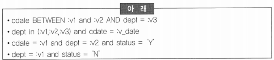
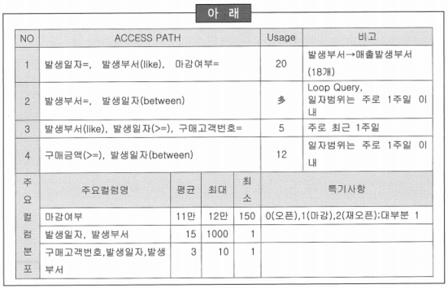
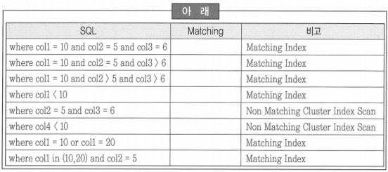

# 273 ~ 289

1. 아래의 SQL 조회 조건을 조사한 결과, 다음 중 인덱스 후보로 가장 적합한 것은?
    
    
    
    1. *dept + cdate 인덱스 생성*
    2. cdate + dept 인덱스 생성
    3. cdate, dept, status 각각의 칼럼에 인덱스 생성
    4. cdate + dept, dept + cdate 인덱스 생성
    
    → 등치(=) 조건으로 사용되는 칼럼을 선행조건으로 해야함
    
    → 인덱스 선행 칼럼이 범위 조건이면 Range Scan 을 해서 읽는 데이터의 양이 증가함
    

2. 다음 중 인덱스 전략 수립 시에 고려할 사항으로 틀린 것은?
    1. 단일 칼럼의 분포도가 양호하다면 인덱스 간의 변별력이 생길 수 있도록 단일 칼럼 인덱스를 생성하는 것이 좋다.
    2. ~~결합 인덱스는 선행 칼럼이 등호(=)로 비교되지 않으면 인덱스를 사용하지 못하므로 선두 칼럼들은 항상 등호(=) 조건으로만 사용해야 한다.~~
    3. 동일한 조건인 경우에는 분포도가 좋은(변별력이 있는) 칼럼을 선행 칼럼으로 정의한다.
    4. 액세스 경로를 단축하기 위해 정렬 등에 사용되는 칼럼을 적절하게 후보 칼럼으로 활용할 수 있다.
    
    → 결합 인덱스는 선행 칼럼이 등호로 비교되지 않으면 인덱스를 사용하지 못함
    
    → 선두 칼럼들을 항상 등호 조건으로만 사용하게 되면 인덱스의 수가 많아지므로 등호 조건이 아니더라도 항상 사용되는 칼럼인 경우에는 선두 칼럼으로 사용할 수 있음
    
    → 논리합 연산자나 SUB-QUERY를 사용하여 선두 칼럼을 등호 조건으로 변경하게 되면 등호를 사용한 것과 동일한 효과를 얻을 수 있음
    

3. 테이블에 대한 액세스 경로 조사의 결과가 아래와 같을 때, 다음 중 접근경로를 만족할 수 있는 최적화된 인덱스로 적합한 것은?
    
    
    
    1. *발생일자 + 발생부서 + 구매고객번호*
    2. 발생부서 + 발생일자 + 구매고객번호
    3. 구매고객번호 + 발생일자
    4. 구매고객번호 + 발생부서
    
    → 결합 인덱스에서 칼럼의 순서는 항상 사용되는 칼럼 > 등치조건 > 분포도 > 정렬 순으로 정의
    

4. 인덱스 매칭도란 인덱스에서 처리범위를 결정하는데 참여한 술어의 수를 의미한다. 다음 중 아래 표에서 제시한 SQL의 전체 매칭도 합으로 올바른 것은? (단 IDX = COL1 + COL2 + COL3)
    
    
    
    1. 10
    2. *12*
    3. 13
    4. 15
    
    → 술어는 선행 칼럼이 등호(=)로 비교되어야만 처리 범위를 결정하는데 참여할 수 있음
    

5. 지역별로 데이터베이스를 구축하고자 한다. 각 지역에서 취급하는 상품은 중복되지 않고 동일한 속성을 가질 때, 다음 중 분산 설계에 대한 설명으로 부적합한 것은?
    1. 상품 테이블의 모든 데이터를 대상으로 분할하여야 한다.
    2. 분할된 상품은 전체 집합으로 재구성될 수 있어야 한다.
    3. 수평 분할하여 분산된 테이블을 통합하여도 식별자가 중복되지 않아야 한다.
    4. ~~수직 분할하여 위치 투명성을 제공하여야 한다.~~
    
    → 동일한 속성을 가진 상품을 지역적으로 분산하여 관리하는 수평분할 설계가 요구됨
    
    → 수직분할은 칼럼을 기준으로 분할되므로 상이한 속성을 가질 경우에 적용됨
    
    - 데이터베이스 분할(Partitioning)
        - 수평 분할: 데이터베이스의 테이블을 행(Row) 단위로 나누는 것
            - 샤딩
                - 샤드: 수평 파티셔닝을 했을 때 분할된 파티셔닝을 가리킴
                - 샤드 단위의 결정은 분할, 샤딩을 어떤 기준으로, 어떤 것을 key로 분할 하느냐에 달려있음
            - 장점: 성능 향상, 확장성, 보안, 유지보수 쉬움
            - 단점: 데이터 중복, 쿼리 복잡성 증가, 파티션 간에 부하 균등하게 분산시키기 어려움, 데이터 무결성 관리(일관성 유지) 어려움
        - 수직 분할: 테이블을 열(Column)을 기준으로 분할하는 형태
            - 스키마를 나누고 데이터가 따라 옮겨가는 것, 하나의 엔터티를 두 개 이상으로 분리하는 작업
            - 장점: 성능 개선, 보안 강화, 쉬운 유지보수
            - 단점: 쿼리 복잡성, 중복 데이터, 확장성 제한

6. 단위 부서에서 사용하기 위한 소규모 데이터베이스를 구축하고 있다. H/W는 Unix 기종이며 SCSI ∥ 내장 Disk 로 구성되어 있는데 현재 시스템이 확산 중에 있으므로 Disk 구성변경이 예상되어 저장 공간 설계 내용을 검토할 때, 다음 중 바르게 설명하고 있는 것은?
    1. *소규모 시스템이지만 데이터 특성과 업무활용 특성을 고려하여 복수 개의 테이블스페이스로 설계하였다.*
    2. DISK I/O 분산을 위해서 동일한 업무의 테이블과 인덱스를 하나의 테이블스페이스로 설계하였다. → 테이블과 인덱스는 테이블스페이스를 분리하고 물리적인 DISK를 분리하는 것이 바람직
    3. 저장용량 설계는 용량분석, 디스크 용량 산정, 테이블스페이스 용량 산정, 오브젝트별 용량 산정 순으로 진행하였다. → 용량분석, 오브젝트별 용량산정, 테이블스페이스 용량산정, 디즈크 용량산정 순으로 진행
    4. 소규모 시스템인 점을 고려하여 백업 및 복수 작업의 편의성을 위해서 단일 Raw Device로 구성하였다. → Raw Device는 백업 및 디스크 구성 변경에 어려움이 존재하므로 소규모 시스템인 점을 감안하여 Cooked Device를 사용하는 것이 바람직
    - Raw Device: 블록 장치로 구성되는 것이 아닌 문자 장치로 구성되는 방식으로 포맷을 지정하지 않고 디스크를 구성하는 방식(File System을 구성하기 이전의 디스크 상태)
        - Raw Device의 경우 운영체제가 필요 없으므로 File System에서 사용하는 운영체제를 거치지 않고 바로 데이터 I/O가 일어나기 때문에 뛰어난 I/O 성능을 자랑함
        - Disk I/O 성능이 우수하고, 불필요한 Overhead가 발생하지 않음
        - 데이터 파일에서 사용할 용량을 초기에 예상하고 미리 볼륨을 잡아야 하기 때문에 단편화가 발생할 수 있음
        - 데이터 파일 백업 시 볼륨 전체를 백업해야하기 때문에 백업하는데 시간도 오래 걸리고 불필요한 용량을 차지함

7. 지역적으로 분산된 업무와 논리적으로 분리가 필요한 업무에 대해서 데이터베이스 구성과 시스템을 설계 중일 때, 다음 중 분산 설계 방식으로 부적합한 것은?
    1. 테이블 위치 분산은 전역적으로 테이블이 유일하게 존재한다.
    2. 테이블 분할은 수직분할, 수평분할 방법이 있다.
    3. ~~분산 설계는 복제에 의한 데이터 중복을 허용하지 않는다.~~
    4. 데이터 분산은 기술적인 요소를 반영하여 설계 되어야 한다.
    
    → 복제 분산은 동일한 테이블을 복수 서버에 생성하는 것으로 부분 복제, 광역 복제 등의 방법이 있음
    

8. 24시간 운영되는 인터넷 쇼핑몰의 데이터베이스 저장 객체들을 설계 중이다. 인터넷 쇼핑몰의 특성을 고려할 때, 다음 중 테이블 설계가 틀린 것은?
    1. 90% 이상의 테이블을 Heap-organized Table로 설계했다.
    2. ~~게시판은 동시에 많은 사람들이 조회하므로 식별자 칼럼과 CLOB 타입의 게시글 칼럼 이외에 4개의 칼럼으로 구성되었다. 해당 테이블의 빠른 응답속도를 보장하기 위해서 Index-organized Table로 설계했다.~~
    3. 주문이 하루 10만건 이상 발생했을 때, 데이터 보관주기를 1년으로 정했다. 1년이 경과하면 데이터가 삭제되는 특성이 있어서 Partition Table로 설계했다.
    4. 주기적으로 신용 및 결제정보를 카드사, 금융기관 등에서 SAM파일을 통해 제공받고 있다. 이를 데이터베이스에 로드(Load)하기 위해 External Table로 설계했다.
    
    → Index-organized Table은 키 값 또는 인덱스 값의 순서대로 데이터가 저장되는 구조로서 인덱스를 이용한 테이블 액세스보다 접근경로가 단축되므로 소량 데이터에 대한 랜덤 액세스에서 성능이 탁월
    
    → 게시글 칼럼은 대량 데이터 타입인 CLOB 타입이나 VLOB 타입 등을 사용하여 데이터 체인이 발생할 수 있으므로 Index-organized Table로 설계하는 것은 바람직하지 않음
    

9. 사용자의 다양한 보안 정책을 적용하기 위해서 보안 요구 사항을 수집하였다. 수집된 요구 사항을 근거로 보안 설계가 진행 중일 때, 다음 중 보안 설계에 관련된 내용으로 부적절한 것은?
    1. 패스워드는 데이터 및 프로그램 접근 권한을 확인하기 위해 요구한다.
    2. 접근 통제는 신분, 역할, 위치, 시간, 서비스 제한 등의 요건을 이용하여 설계한다.
    3. 데이터 접근 통제 모델은 주제, 객체, 규칙 간의 상관관계를 정의하는 것이 기본 모델이다.
    4. ~~데이터베이스 보안은 인가된 사용자를 대상으로 불법적인 노출, 변조, 파괴를 방지하는 것이다.~~
    
    → 데이터베이스 보안은 비인가된 자를 대상으로 원하는 작업을 하기 위해서 필요한 자원에 대한 허가를 설정하는 것
    

10. 다음 중 아래의 상황을 고려한 분산 설계 방식의 설명으로 틀린 것은?
    
    
    | 아래 |
    | --- |
    | 자신의 데이터를 지역적으로 제어하여 원격 데이터에 대한 의존도를 감소시키며, 단일 서버에서 불가능한 처리를 기존 시스템에 서버를 추가하여 점진적으로 증가시킬 수 있는 구조로 분산 데이터베이스 환경을 구축하고자 한다. |
    1. ~~수직 분할은 식별자가 중복되지 않아야 한다~~. → 식별자가 중복되지 않아야 하는 것은 수평 분할
    2. 각 서버에서 필요한 데이터나 구조가 다를 경우에는 완전성, 재구성, 상호중첩내재 등의 분할 규칙을 적용하여 분할해야 한다.
    3. 분할된 것은 관계 연산자를 사용하여 원래의 전역 실체로 재구성이 가능해야 한다.
    4. 테이블이 전역적으로 중복되지 않을 경우에는 테이블 구조의 변경 없이 서버별로 분산시킨다.
    
    → 수직 분할은 칼럼을 기준으로 분할을 하기 때문에 식별자를 제외한 칼럼의 중복이 발생되지 않아야 함
    

11. 다음 중 보안을 강화하기 위한 접근 통제 방법이나 기법에 대한 설명으로 틀린 것은?
    1. 터미널 혹은 네트워크 주소 등 확인이 가능한 접근 위치나 경로만 접근을 허용한다.
    2. 뷰를 사용하여 데이터 접근을 이중화 한다.
    3. 일과 시간, 마감시간 등 특정 시간에 대하여 접근을 허용한다.
    4. ~~강제 통제 접근 제어 기법을 사용하여 수정 및 등록 시에 사용자 등급이 기록하고자 하는 데이터 객체의 등급보다 높은 경우에만 접근을 허용한다.~~
    
    → 강제 통제는 높은 등급의 데이터가 사용자에 의해 의도적으로 낮은 등급 데이터로 쓰여지거나 복사되는 것을 방지하기 위해서 사용자 등급과 객체 등급이 같은 경우에만 허용
    

12. 다음 중 데이터베이스 서버의 시작과 종료에 관한 설명으로 틀린 것은?
    1. 데이터베이스를 사용하기 위해서는 권한을 가진 데이터베이스 관리자가 DBMS 인스턴스를 시작해야 한다.
    2. ~~인스턴스 시작은 매개변수 파일을 읽어 초기화 매개변수 값을 결정하고, 데이터베이스 정보를 위해서 사용되는 메모리 공유 영역을 할당한 뒤 자동 복구 작업, 미확정 분산 트랜잭션 해결 작업을 수행한다.~~ → 자동 복구 작업, 미확정 분산 트랜잭션 해결, 읽기 전용 모드의 보수작업 등은 데이터베이스 열기 단계에서 수행되는 작업
    3. 데이터베이스가 마운트(Mount)되더라도 데이터베이스는 여전히 닫힌 상태이며 데이터베이스 관리자만이 액세스 할 수 있다.
    4. 데이터베이스 서버 종료는 데이터베이스 닫기, 마운트 해제, 인스턴스 종료 순으로 진행된다.

13. 다음 중 데이터베이스 버퍼 액세스에 관련된 설명으로 부적합한 것은?
    1. 가장 먼저 사용자 프로세스에서 요구한 데이터가 데이터베이스 버퍼에 있는지 검색힌다.
    2. 요청한 데이터가 데이터베이스 버퍼에 없다면 데이터 파일에서 해당 데이터를 읽어 메모리에 보관한다.
    3. ~~사용자 프로세스가 전체 테이블을 스캔한 경우에는 테이블 블록을 버퍼로 읽어 들여 LRU 목록의 MRU 끝에 놓고 장시간 보관한다.~~
    4. 데이터베이스 버퍼 크기는 데이터 요구에 대한 적중률에 영향을 준다.
    
    → 사용자 프로세스가 전체 테이블을 스캔할 경우에는 테이블 블록을 버퍼로 읽어 들여 LRU 목록의 끝에 놓음
    
    → 전체를 스캔하는 테이블은 더 자주 사용되는 블록이 남아 있도록 신속하게 제거
    

14. 회계 시스템을 재구축 중에 데이터 품질 향상과 데이터 무결성을 강화하기 위해서 실시된 표준화 산출물을 근거로 데이터베이스 설계가 진행되고 있다. 다음 중 설계에 적용하기 부적적한 것은?
    1. 모든 원화(\)를 나타내는 칼럼은 NUMBER 타입으로 정의하고, 소액과 거액을 구분하여 각 13자리, 18자리로 정의한다.
    2. 원화는 수치 계산의 오류를 방지하기 위해서 Default 값을 ‘0’으로 한다.
    3. 명칭 도메인은 상품명, 코드명, 고객명, 조직명, 한/영문 등에 관계없이 가변길이문자 타입을 정의하고 데이터의 최대길이보다 큰 50자로 단일화했다.
    4. ~~날짜 칼럼은 날짜 데이터 타입을 사용한다.~~ → 칼럼의 데이터 타입을 DBMS에서 제공하는 날짜 혹은 시간 데이터 타입으로 정의할 경우 검색 및 조인 등의 연산에서 비효율이 발생할 소지가 있음
    
    → 일반적으로 ‘주문일’, ‘입사일’, ‘청구일’ 등의 일자데이터는 Char 또는 Varchar로 정의하여 사용하고 로그성의 칼럼은 시간타입을 사용
    

15. 다음 중 데이터 확장 영역(Extents)에 대한 설명으로 부적절한 것은?
    1. 특정 유형의 정보를 저장하기 위해 할당된 몇 개의 연속적인 데이터 블록이다.
    2. ~~행수가 ‘0’인 테이블은 저장 공간 절약을 위해서 Extents가 없다.~~
    3. 단편화된 Extents는 연속된 데이터 블록을 확보할 수 없는 원인이다.
    4. 저장공간의 단편화 방지를 위해서 초기·증가 Extents 사이즈를 설계한다.
    
    → 초기 Extents 사이즈는 테이블이 생성될 때 설정되는 것이므로 데이터가 없더라도 확장영역이 확보
    

16. 업무 시스템을 운영하면서 성능 및 저장공간의 효율성을 위해서 인덱스 재생성 작업을 고려 중에 관련된 대상을 목록화하고 검토하고자 한다. 다음 중 우선순위가 높은 작업 대상은?
    1. PK 생성으로 작성된 Unique Key
    2. 고객 이력 테이블의 ‘고객번호 + 발생일 + 고객상태코드’로 구성된 인덱스
    3. 빈번한 문자 검색을 위해서 ‘대리점명’, ‘고객명’, ‘조직명’ 등에 생성한 인덱스
    4. *빈번한 수정이 발생하는 ‘미납금액’ 칼럼을 포함한 ‘고객번호 + 청구일자 + 미납금액’ 으로 구성된 인덱스*
    
    → 1, 2, 3번은 데이터의 생성 후에 수정변경 사항이 거의 없지만 4번은 인덱스 칼럼값이 수정되므로 Rebuild 작업이 필요
    
    → 일반적으로 변경이 빈번한 칼럼 인덱스를 생성하지 않으나 비용대비 효과를 고려하여 생성할 수도 있음
    

17. 다음 중 테이블 설계과정에서 Nullable 칼럼에 대한 고려사항으로 부적합한 것은?
    1. ~~NULL에 어떤 정수를 더하면 결과는 그 정수가 된다.~~
    2. 미확정 값을 표현할 때 NULL 값을 이용한다.
    3. 입력 조건 값으로 자주 이용되는 칼럼은 테이블 정의 시에 NOT NULL Constraints를 적용한다.
    4. NULL이 허용되는 칼럼은 테이블에서 칼럼 순서를 뒤편으로 지정한다.
    
    → NULL + 숫자 = NULL
    
    → NULL - 숫자 = NULL
    
    → NULL * NULL = NULL
    
    → NULL / NULL = NULL