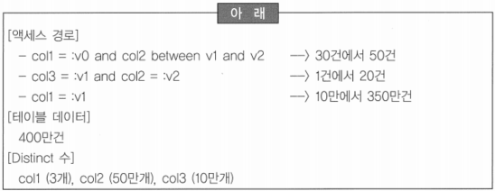

# 290 ~ 305

1. 인덱스 설계를 위한 액세스 경로가 아래와 같이 수집되었다. 수집된 사항을 바탕으로 인덱스 후보를 도출하고 최종적으로 인덱스를 생성하고자 한다. 다음 중 가장 타당성이 높은 인덱스 후보는?
    
    
    
    1. col1 + col2, col3  2개 인덱스
    2. *col2 + col3 + col1  1개 인덱스*
    3. col3 + col2  1개 인덱스
    4. col1, col2 + col3  2개 인덱스
    
    → 복합 인덱스의 구성은 항상 사용되는 칼럼을 선두 칼럼(col2)으로 이용
    
    → ‘col1’은 변별이 낮기에 ‘col1 = :v1’의 조건을 Table Full Scan으로 유도하는 것이 유리
    
    → 4가지 후보 중에서 ‘col2 + col3 + col1’을 선택하면 2가지의 액세스 경로에서 가장 효율적
    

2. 인덱스 디자인이 완료된 후, 일괄적으로 인덱스가 생성되었다. 오픈 테스트 과정 중에 일부 테이블과 관련된 프로그램, 특정 개발자 그룹 등이 작성한 프로그램이 속도저하 현상이 발생했다. 원인은 인덱스가 SQL의 정상적인 액세스 경로를 제공하지 못하고 있었다. 다음 인덱스를 사용할 수 있는 경우로 적합한 것은?
    
    ```sql
    인덱스: DNAME + JOB + MGR
    ```
    
    1. SELECT*FROM dept WHERE SUBSTR(dname, 1, 3) = ‘ABD’ → 칼럼 가공
    2. SELECT*FROM dept WHERE dname IS NOT NULL → NULL 비교 연산
    3. SELECT*FROM dept WHERE dname ◊ ‘abd’ → 부정 비교
    4. *SELECT*FROM dept WHERE dname like ‘abd%’*

3. 다음 중 실체 무결성과 식별자에 대한 내용으로 부적절한 것은?
    1. 실체 무결성을 보장하기 위해서 Primary Key Constraints와 Unique Key Constraints를 구현한다.
    2. 일부 DBMS에서 PK Constraints를 정의하면 해당 테이블은 Clustered Index Table로 변경되어 데이터가 키 값 순으로 재배열된다.
    3. ~~Primary Key Constraints와 Unique Key Constraints는 동일한 제약 조건으로 만족하는 요건도 동일하지만 데이터 모델상의 식별자이거나 후보식별자에 따라서 결정된다~~. → PK와 UK는 요건이 동일하지 않음
    4. 실체 무결성은 일대다(1:M) 관계에서 1쪽의 유일성을 보장하여 데이터 식별을 가능하게 한다.
    
    → Primary Key Constraints는 NOT NULL, Unique, Minimal Set(최소 칼럼 구성)의 3가지 조건이 요구되나 Unique Constraints는 Unique와 Minimal Set이 요구됨
    

4. 다음 중 비트맵 인덱스에 대한 설명으로 틀린 것은?
    1. 분포도가 나쁜 칼럼에 유효하다.
    2. B-tree 인덱스에 비해 저장공간과 I/O를 획기적으로 줄였다.
    3. ~~인덱스를 유지하는데 비교적 적은 비용이 소요되기 때문에 OLTP 환경에서 주로 사용한다.~~
    4. NULL, NOT NULL 등에 대한 연산을 수행할 수 있다.
    
    → 입력, 수정, 삭제 등이 발생할 때, 전체 인덱스 조정 부하로 OLTP 환경에서 사용은 적합하지 않음
    

5. DBMS마다 데이터 사전(Data Dictionary)의 정보 양은 다소 차이가 있지만 데이터베이스의 형상을 관리하는데 중요한 정보를 제공한다는 공통점을 가지고 있다. 다음 중 데이터 사전에서 제공되는 것이 아닌 것은?
    1. 데이터베이스의 모든 스키마 객체 정보
    2. 무결성 제약 조건에 대한 정보
    3. 열에 대한 기본 값
    4. ~~데이터베이스 이름~~ → 제어 파일에서 제공
    
    → 제어 파일에는 아래와 같은 정보들이 관리되고 있으며 시작된 인스턴스가 데이터베이스를 마운트하고 제어 파일에서 데이터 파일과 로그 파일의 이름 등을 읽어 들임
    
    - Control file contents
        1. the database name
        2. names and locations of associated database and online redo log
        3. the timestamp of the database creation
        4. the current log sequence number
        5. checkpoint information

6. 절차적 프로그램으로 SQL을 통해서 구현하기 위해 DUMMY 테이블 이용해서 카테시언 곱이 되는 아래의 SQL문을 작성했다. 아래 SQL문의 결과로 출력되는 행의 개수로 적합한 것은? (참고: 테이블 DUMMY - 1개 행이 등록된 테이블임)
    
    
    
    1. 2개
    2. 3개
    3. *6개*
    4. 12개
    
    → 카디시안 프로덕트(Cartesian Product)에 의해서 6개의 행이 출력됨
    

7. 관계형 데이터베이스시스템에서는 데이터 접근 제어를 위해 임의 접근 제어방식과 강제 접근 제어방식, 역할-기반 접근 제어방식 등을 사용하고 있다. 다음 중 데이터 접근 제어 방식에 대한 설명으로 틀린 것은?
    1. 임의적 접근 통제는 사용자의 신원에 근거를 두고 권한을 부여하고 취소하는 매커니즘을 기반으로 하고 있다.
    2. 임의적 접근 통제에서 사용자는 개인적인 판단에 따라 권한을 이전한다.
    3. 임의적 접근 통제에서 권한의 전파에 대한 제한을 명시할 수 있다.
    4. ~~임의적 접근 통제에서 읽기는 사용자의 등급이 접근하는 데이터 객체의 등급과 같거나 높은 경우에만 허용된다.~~ → 강제적 접근 통제에 대한 설명

8. 다음 중 트리거 사용 목적으로 부적당한 것은?
    1. 합계, 잔액, 재고량 등의 유도 칼럼 값 생성
    2. 복잡한 보안 권한의 강제 수행
    3. 이벤트 로깅 작업이나 감사 작업
    4. ~~실체 무결성을 위한 검증 수단~~
    
    → 실체 무결성은 데이터베이스 제약조건인 Primary Key, Unique Key를 정의하는 것이 바람직
    

9. 데이터베이스의 기본 목적은 관련 정보를 저장하고 탐색하는데 있다. 이러한 데이터베이스의 목적을 효율적으로 지원하기 위해서 대부분의 데이터베이스 관리시스템에서는 데이터의 저장구조를 논리적인 구조와 물리적인 구조로 나누어서 관리하고 있다. 다음 중 논리적 데이터베이스 영역 할당에 대한 설명으로 틀린 것은?
    1. 테이블스페이스는 데이터베이스를 논리적으로 분할한 것으로, 물리적 저장 구조인 여러 개의 데이터 파일을 가진다.
    2. 세그먼트는 특정 논리적 저장영역 구조를 위하여 할당된 데이터 확장 영역의 집합으로써 테이블을 위한 테이블 세그먼트와 인덱스를 위한 인덱스 세그먼트 등이 있다.
    3. ~~확장 영역은 특정 유형의 정보를 저장하기 위하여 할당된 연속된 데이터 블록으로, 예약된 데이터 블록을 모두 사용하면 자동으로 할당되며 데이터가 삭제되면 자동으로 반환한다.~~
    4. 데이터 블록은 데이터베이스에서 데이터를 저장하는 가장 작은 단위로써 하나의 데이터 블록은 디스크에 위치하는 물리적 데이터베이스 영역의 특정 바이트 수에 해당한다.
    
    → 세그먼트에서 예약된 데이터 확장영역이 모두 사용되면 데이터 확장 영역이 자동으로 할당되지만, 한번 할당된 확장 영역은 데이터를 삭제해도 반환되지 않음
    
    → 강제로 반환하고자 한다면, 생성된 오브젝트(Object)를 Drop하거나 Truncate해야 함
    

10. 다음 중 트랜잭션에 대한 설명으로 틀린 것은?
    1. 트랜잭션은 하나의 논리적 작업 단위를 구성하는 하나 이상의 SQL 문으로 구성된다.
    2. 병행제어의 목적은 갱신분실 문제, 모순적인 판독 문제들을 방지하기 위함이다.
    3. 트랜잭션은 원자성, 일관성, 고립성, 영속성 등의 특징을 가지고 있다.
    4. ~~비관적 병행 제어 알고리즘은 다수 사용자가 동시에 같은 데이터에 접근할 경우가 적다고 보고 구현한 알고리즘이다.~~
    
    → 비관적 병행 제어 알고리즘은 다수 사용자가 동시에 같은 데이터에 접근할 경우가 많다고 보고 구현한 알고리즘
    

11. 현재 대부분의 상용 DBMS 구현에서 사용되는 일반적인 아키텍처는 1978년에 제안된 ANSI/SPARC 아키텍처이다. 다음 중 ANSI/SPARC 아키텍처의 3 Schema와 관련한 설명으로 틀린 것은?
    1. 외부단계(External Level): 각각의 데이터베이스 사용자 관점 또는 사용자 뷰를 표현하는 단계
    2. 개념단계(Conceptual Level): 데이터베이스에 저장되는 데이터와 그들간의 관계를 표현하는 단계
    3. ~~논리단계(Logical Level): 데이터베이스에 저장된 데이터를 모델화하여 논리적으로 관계를 표현하는 단계~~
    4. 내부단계(Internal Level): 물리적인 저장장치에서 데이터가 실제적으로 저장되는 방법을 표현하는 단계
    
    → ANSI/SPARC 아키텍처의 3 Schema 구조는 외부단계, 개념단계, 내부단계의 3단계
    

12. 인터넷 쇼핑몰 시스템을 개발하고 부하 시스템까지 성공적으로 완료되었다. 하지만 쇼핑몰 오픈일에 프로모션을 실시하여 많은 접속자가 방문을 했으나 주문 처리 프로그램의 지연으로 문제가 발생하여 주문 식별자를 일련번호로 재설계하고자 한다. 다음 중 채번에 관련된 설계 내용으로 부적절한 것은?
    1. 오브젝트나 데이터 타입을 이용하여 자동으로 발생하는 데이터베이스 기능을 이용하면 잠김 현상에 의한 지연을 최소화 할 수 있다.
    2. ~~데이터의 일관성을 위해서 채번 테이블을 사용하고 채번 시에 테이블 잠김(Locking)을 이용한다.~~
    3. 잠김 지속 시간을 단축하는 방법으로 장기 트랜잭션(Long Transaction)을 최소화 한다.
    4. 채번 테이블은 최적화된 액세스를 위해서 인덱스전략이 필요하다.
    
    → 테이블 잠김을 사용하면 관련된 모든 트랜잭션의 병목현상을 유발하므로 데이터베이스가 제공하는 최소 단위 잠김을 적용해야 함
    

13. 데이터베이스에서 사용하는 명령어는 DBMS마다 다소 차이는 있지만 DDL, DML, CONTROL 문 등으로 분류할수 있다. 다음 중 이들 명령어에 대한 설명으로 틀린 것은?
    1. DDL은 스키마 오브젝트의 생성, 구조변경, 삭제, 명칭변경 등을 위해서 사용하는 명령어로 CREATE, ALTER, DROP, RENAME 등이 있다.
    2. ~~DML은 데이터베이스에 있는 데이터를 조작할 수 있게 해주는 명령어로 SELECT, UPDATE, INSERT, DELETE, TRUNCATE 등이 있다.~~ → TRUNCATE는 DDL 명령어
    3. DML 문장은 커서 생성 → 명령어 구문 분석 → 질의 결과 설명 → 질의 결과 출력 정의 → 변수 바인드 → 명령문 병렬화 → 명령문 실행 → 로우 인출 → 커서 닫기 등의 단계로 수행된다.
    4. 트랜잭션 제어문은 1개 이상의 SQL 문장을 논리적으로 하나의 처리 단위로 적용하기 위해서 사용하는 명령어다.

14. 다음 중 데이터베이스 백업 방법에 대한 설명으로 부적절한 것은?
    1. 정기적인 Full Back-up을 실시한다.
    2. ~~백업은 중요하므로 비정기적으로 가용한 시간이 생길 때 마다 실시한다.~~
    3. 로그 파일 백업이 없는 경우는 완전 복구가 불가능하다.
    4. 읽기 전용 데이터는 온라인 백업할 필요가 없다.
    
    → 백업 작업은 일, 주, 월, 년 주기로 정기적으로 수행하는 것을 원칙으로 해야 함
    

15. 데이터베이스의 보안을 강화하기 위해서 보안 설계를 진행 중이다. 프로그램 사용제한, 접근통제, 데이터베이스 권한 제한 등 다양한 경로로 보안을 강화하였을 때, 다음 중 보안 강화에 대한 설명으로 틀린 것은?
    1. 뷰를 통해 등급별로 조회할 수 있는 정보를 분리하여 제공하였다.
    2. 강제통제를 위해서 데이터에서 분류 등급을 지정하고, 사용자에게 인가 등급을 부여하여 이를 시스템으로 구현하였다.
    3. 사용자 활동에 대한 일련의 기록을 확보하기 위해서 모든 처리에 대해 로그 정보를 저장하였다.
    4. ~~강제통제를 구현하기 위해서 SQL2 표준을 이용하였다~~. → SQL2는 임의 통제만 지원
    - 임의 통제(DAC, Discretionary Access Control): 사용자가 각 데이터 객체에 대해 서로 다른 권리(Privilege)들을 갖고 각 사용자의 개인적인 판단에 따라 권리를 이전할 수 있음
    - 강제 통제(MAC, Mandatory Access Control): 보안 등급 라벨(Security Label)을 각 데이터 객체에 보안 분류 등급(classification level)에 부여하고 각 사용자마다 인가 등급을 부여하여 객체의 보안 분류 등급과 사용자 인가 등급에 의하여 접근 통제를 수행

16. 다음 중 데이터베이스 복구 메커니즘에 대한 설명으로 적절한 것은?
    1. *트랜잭션 실행 내용이 데이터베이스 버퍼에 비동기적으로 기록될 때 복구 작업에 NO-UNDO·REDO 작업을 실시한다.*
    2. 논리 백업에 의한 복구는 UNDO·REDO의 논리적 수행이다. → 논리 백업에 의한 복구는 백업 시점 상태로 데이터를 생성하는 것이므로 UNDO/REDO 작업이 없음
    3. 복구 작업은 데이터베이스 오픈 상태에서 가능하다. → 데이터베이스가 오픈 되기 전인 마운트 상태에서 진행
    4. 로그 파일 내용에는 트랜잭션 식별자를 포함한 데이터베이스 스키마 정보가 있다. → 로그 파일에는 데이터베이스 스키마 정보가 존재하지 않음