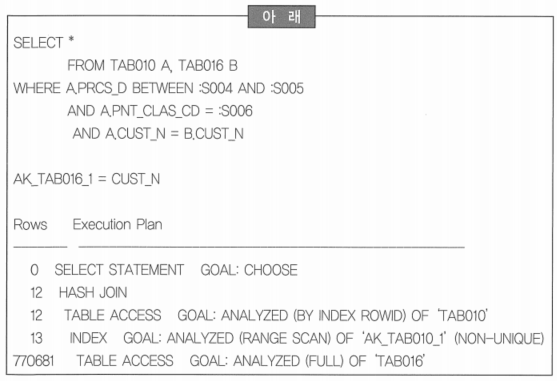
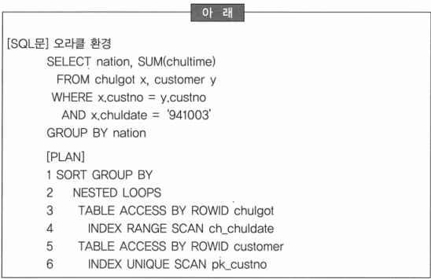
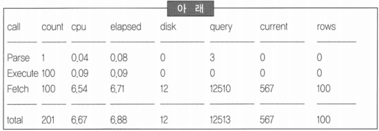
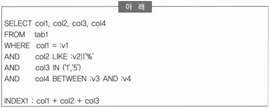
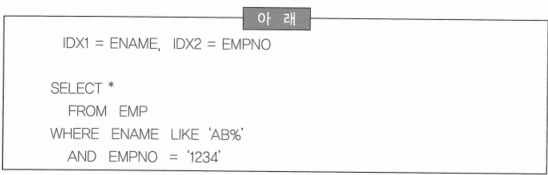
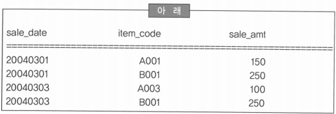

# 306 ~ 317

1. 읽기 일관성을 유지하기 위해서 Locking을 사용하지만 지나치게 Locking을 강화하면 작업의 동시성은 떨어지게 된다. 다음 중 Locking을 통해 읽기 일관성이 보장되지 않을 경우에 발생할 수 있는 문제점에 대한 설명으로 틀린 것은?
    1. 문장 수준의 읽기 일관성이 보장되지 않을 경우, 트랜잭션 A(잔액=잔액+1,000원)와 트랜잭션 B(잔액=잔액+2,000원)가 동시에 잔액을 읽어 들인 후 수행하게 되면 잔액이 11,000원 혹은 12,000원이 되는데 이를 Lost Update라고 한다.
    2. 아직 커밋되지 않고 수정 중인 데이터에 대해 ‘읽기’를 허용할 경우, 어떤 원인에 의해 수정 사항이 롤백된다면 ‘데이터 읽기’ 트랜잭션은 잘못된 수행 결과를 초래하게 되는데, 이러한 현상을 Dirty Read라 한다.
    3. DBMS가 단일문장에 대한 읽기 일관성은 보장하지만, 트랜잭션 내에서 한 개 이상의 문장이 반복 수행될 때 읽기 일관성을 보장하지 않는다면, 한 트랜잭션 내에서 같은 행을 두 번 이상 읽는 사이에 다른 트랜잭션이 그 행을 변경할 경우에는 일관성이 깨어지게 되는데 이러한 현상을 Non-Repeatable Read라고 한다.
    4. ~~한 트랜잭션 안에서 일정 범위의 레코드들을 두 번 이상 읽을 때, 이전 쿼리에 없던 레코드가 튀어나오는 경우가 있는데 이러한 현상을 Phantom Read라고 한다. 이것은 SELECT 작업을 할 때 설정한 공유 잠김을 트랜잭션 종료시까지 유지하면 해결할 수 있다.~~
    
    → Phantom Read: 한 트랜잭션 안에서 일정 범위의 레코드들을 두 번 이상 읽을 때 이전 쿼리에 없던 유령 레코드가 튀어 나오는 경우
    
    - SELECT 작업을 할 때 설정한 공유잠금이 트랜잭션 종료시까지 유지되더라도 트랜잭션 수행 도중에 다른 사용자가 해당 범위에 새로운 레코드를 삽입하는 것을 허용한다면 Phantom Read 현상이 발생할 수 있음
    - 해결 방법: 트랜잭션 수행 도중 해당 커넥션에서 읽어 들인 모든 레코드에 공유 잠금을 걸 뿐만 아니라, 그 사이에 있는 모든 키 값에 대해서도 잠금을 걸어서(Range Lock) 해당 영역사이에 다른 커넥션에서 수정, 삭제는 물론 새로운 레코드를 추가하지 못하게 함

2. 다음 중 조인에 대한 설명으로 바른 것은?
    1. Nested-loop 조인에서 드라이빙 테이블의 처리 범위는 수행 속도에 영향을 미치지 않는다. → 드라이빙 조건에 따라서 조인 행 수가 결정됨
    2. Sort-merge 조인은 조인 조건을 가공하면 수행 속도가 저하된다. → 조인 칼럼 가공은 직접적인 수행 속도에 영향이 없음
    3. *Nested-loop 조인은 Inner Table의 조인 조건에 인덱스가 존재하여야 비효율이 발생하지 않는다.*
    4. Nested-loop 조인에서 조인의 순서는 수행속도와 무관하다. → Nested-loop와 Hash 조인은 조인 순서에 따라 수행 속도의 차이가 큼

3. 다음 중 아래의 플랜(Plan)을 보고 분석한 내용으로 부적절한 것은?
    
    
    
    1. 인덱스를 액세스 한 후에 한건이 줄어든 것은 AK_TAB010_1 인덱스의 구성이 PRCS_D + PNT_CLAS_CD 순으로 되어있다는 것을 의미한다. → 인덱스의 구성은 ‘PNT_CLAS_CD_+PRCS_D’이어야 함
    2. Hash 조인으로 수행되었기 때문에 B 테이블에 CUST_N으로 생성된 인덱스가 있음에도 불구하고 사용하지 못하였다.
    3. 조인의 결과가 A 테이블의 추출 건수와 동일한 것으로 보아 B 테이블은 상위 집합일 가능성이 매우 높다.
    4. 개선 방안은 Nested-loop 조인으로 수행될 수 있도록 힌트를 이용하여 액세스 패스를 고정해야 한다.
    
    → 인덱스 엑세스는 조건을 만족하지 않는 첫 번째 로우까지 검색을 하기 때문에 실제로 조건을 만족하는 로우수보다 +1이 항상 많게 됨
    
    → 인덱스를 검색하여 12건이 추출되었고 테이블을 액세스한 것도 12건 일 때, 테이블을 액세스 한 후에 12건이 나왔다는 것은 인덱스에서 전혀 비효율이 없었다는 것을 의미함
    

4. 다음 중 Nested-loop 조인에 대한 설명으로 부적합한 것은?
    1. Outer 테이블 처리 범위에 따라서 Inner 테이블 처리 범위가 결정된다.
    2. 처리하는 데이터 양이 많을 경우에는 과도한 Random IO 액세스가 발생한다.
    3. 조인 칼럼의 인덱스 유무가 조인의 순서와 성능에 영향을 미친다.
    4. ~~결과를 하나씩 받아서 순차적으로 조인하는 형태이므로 부분 범위 처리가 불가능하다.~~
    
    → 결과를 하나씩 받아서 순차적으로 조인하는 형태이므로 부분범위 처리에 가능함
    

5. 시스템 오픈을 앞두고 온라인 프로그램의 튜닝 계획을 작성했다. 4단계에 걸쳐 작업을 진행하는 계획은 아래와 같을 때, 다음 중 온라인 튜닝에 대한 설명으로 틀린 것은?
    
    
    | 아래 |
    | --- |
    | 1단계: Access Path를 조사하여 인덱스 디자인 실시 |
    | 2단계: 실행계획을 이용한 SQL 튜닝 |
    | 3단계: Trace를 이용한 SQL 튜닝 |
    | 4단계: 통합테스트를 통한 성능검증 및 튜닝 |
    1. 온라인 프로그램은 응답속도 단축을 목표로 하는 것이 일반적이다.
    2. 온라인 프로그램은 효과적인 인덱스 디자인 없이 성능향상은 불가능하다.
    3. 잠재된 문제 SQL을 튜닝하기 위해서 Trace 분석에 의한 접근방법이 효과적이다.
    4. ~~실행 횟수가 많은 프로그램보다는 절대 응답시간이 긴 프로그램을 중심으로 접근하는 것이 효과적이다.~~
    
    → 온라인 프로그램은 동시 사용자가 많은 것을 전제로 하기 때문에 실행횟수가 많은 프로그램부터 튜닝을 진행하는 것이 전체 시스템의 성능을 향상시킴
    
    → 하루 100번 실행되는 프로그램을 3초에서 0.3초로 단축하는 효과(270초 개선)보다는 하루 만번 실행되는 프로그램을 0.3초에서 0.1초로 단축했을 때 효과(2000초 개선)가 큼
    

6. 오라클 데이터베이스 사용하는 환경에서 특수한 목적을 위해서 항상 결과 행이 존재하거나 항상 결과 값이 없는 SQL문을 작성 중이다. 다음 중 SQL 수행 결과를 바르게 설명한 것은? (NVL은 Column 값이 NULL인 경우 다른 값을 치환하는 함수)
    1. SELECT col1, col2 FROM tab1 WHERE 1 = 2;
    논리적인 오류로 실행 시에 SQL-ERROR가 발생한다.
    2. SELECT NVL(col1, ‘X) FROM tab1 WHERE 1 = 2;
    정상적으로 ‘X’를 RETURN 한다.
    3. *SELECT NVL(MIN(col1),’ X”) FROM tab1 WHERE 1 = 2;
    Col1이 NULL인 경우는 ‘X’가 RETURN 된다.*
    4. SELECT col1, col2 FROM tab1 WHERE 1 = 2;
    NULL 값으로 1개 행이 RERUTN 된다.
    
    → SQL문의 결과가 False이면 리턴되는 값이 없으므로 NVL 함수가 수행되지 않음
    
    → 그룹 함수를 사용하면 리턴되는 결과가 없더라도 항상 수행되기 때문에 결과가 False이면 null을 리턴
    
    → 1, 2, 4의 경우는 출력되는 행이 없지만, 3번의 경우는 그룹함수를 사용하였으므로 그룹함수가 null을 리턴하기 때문에 NVL 함수가 수행되고 결과는 ‘X’가 됨
    

7. 조인은 두 집합 간의 곱으로 데이터를 연결하는 가장 대표적인 데이터 연결 방법이다. 다음 중 조인에 대한 설명으로 틀린 것은?
    1. Nested-loop 조인의 비효율은 랜덤 액세스로 비교적 적은 규모의 데이터 조인에 유리하기 때문에 OLTP 환경에서 비교적 많이 사용된다.
    2. ~~Sort-merge 조인의 성능은 조인 속성의 인덱스 유무와 무관하며, 정렬 작업이 메모리에서만 수행되기 때문에 대용량 데이터의 조인에 적합하다.~~
    3. Hash 조인은 아주 큰 테이블과 아주 작은 테이블의 조인에 적합하며 Hash Area Size에 따라 성능의 편차가 심하다.
    4. Star 조인은 DW 환경에서 큰 팩터 테이블과 아주 작은 디멘션 테이블이 조인할 때 유리하다.
    
    → Sort-merge 조인의 비효율은 정렬작업 시에 Sort Area Size 가 부족하면 디스크에서 정렬 작업을 수행하기 때문에 많은 오버헤드가 발생하게 되어 Sort Area Size를 훨씬 초과하게 되는 대용량 데이터의 조인은 정렬 작업의 부하로 인해 성능이 많이 저하되게 됨
    
    → Hash 조인은 랜덤 액세스도 발생하지 않고 정렬 작업도 발생하지 않기 때문에 대용량 데이터의 조인 시에 좋은 성능을 발휘하게 됨
    

8. 다음 중 아래의 SQL문과 실행 계획을 보고 실행 순서를 바르게 나열한 것은?
    
    
    
    1. 1-2-3-4-5-6
    2. 3-4-5-6-2-1
    3. *4-3-6-5-2-1*
    4. 6-5-4-3-2-1
    
    → 실행 계획의 실행 순서는 동일 레벨인 경우에는 위에서 아래와 레벨이 다른 경우에는 안에서 바깥으로 처리가 됨
    
    → 3라인과 5라인은 동일 레벨이므로 3라인이 실행된 후 5라인이 실행됨
    
    → 3라인과 5라인은 각각 하위 레벨을 가지고 있기 때문에 3라인이 실행되기 위해서는 4라인이 먼저 수행하여야 하고 5라인이 수행되기 위해서는 6라인이 먼저 수행되어야 함
    
    → 4-3-6-5 가 처리되면 상위 레벨인 2라인과 1라인이 차례로 처리됨
    

9. 아래는 성능 개선 작업을 진행 중에 문제가 된 SQL의 통계 정보이다. 다음 중 분석한 내용으로 부적절한 것은?
    
    
    
    1. Fetch Count와 Rows의 수가 동일한 것을 보아 다중 처리(ARRAY PROCESSING)로 SQL을 수행하지 않았다.
    2. Execute Count가 Parse Count의 배수인 것으로 보아 Loop 내에서 반복 수행되었다.
    3. SQL이 한번 수행할 때 마다 0.07초 정도 소요되었다.
    4. ~~애플리케이션이 여러 번 수행되었지만 실제로 SQL을 파싱하지 않고 Shared SQL Area에서 찾아 왔다.~~
    
    → 애플리케이션은 한번만 수행되고 Loop 내에서 반복 수행하는 경우에 나타나는 패턴
    

10. 아래의 SQL 문에 대한 설명으로 틀린 것은?
    
    
    
    1. col4 조건은 테이블 액세스 후 만족 여부가 결정된다.
    2. ~~col1, col2, col3 조건들이 드라이빙 조건으로 사용된다.~~ → col1, col2 조건만 드라이빙 조건으로 사용될 수 있음
    3. 인덱스 구성을 col1 + col2 + col3 + col4 형태로 변경하면 index only scan이 가능하다.
    4. IN 조건 때문에 실행계획이 분리되면 오히려 액세스 범위가 증가한다.

11. 아래는 SQL을 규칙기반 옵티마이져 환경에서 수행할 때와 비용기반 옵티마이져 환경에서 수행할 때를 예측하여 분석해 본 것이다. 다음 중 아래의 내용에 대한 분석이 부적절한 것은?
    
    
    
    1. 규칙기반 옵티마이저 환경에서 수행된다면 랭킹의 차이 때문에 IDX2 인덱스만을 사용한다.
    2. 비용기반 옵티마이저 환경이고 분포도가 좋다면 IDX1 인덱스를 사용할 수도 있다.
    3. ~~비용기반 옵티마이저 환경이고 두 인덱스의 분포도가 모두 좋다면 Index Merge를 수행될 수도 있다.~~
    4. 비용기반 옵티마이저 환경에서 두 술어 조건의 분포도가 모두 나쁘다면 인덱스를 사용하지 않을 수도 있다.
    
    → 주어진 술어가 모두 독립적으로 인덱스로 생성되어 있고 분포도가 좋다면 인덱스 머지가 발생할 수도 있지만 술어 조건이 전부 등호(=)로 비교되어야 함
    

12. 다수의 개발자가 개발한 시스템은 동일한 결과 일지라도 개발자에 따라 작성된 SQL문이 다양하다. 테이블의 데이터가 아래와 같을 때, 다음 중 다른 결과가 나오는 SQL문은?
    
    
    
    1. SELECT DISTINCT item_code FROM tab1
    2. SELECT item_code FROM tab1 GROUP BY item_code
    3. ~~SELECT item_code FROM tab1 WHERE item_code IN (SELECT item_code FROM tab1)~~
    4. SELECT item_code FROM (SELECT distinct item_code, sale_amt FROM tab1)
    
    → 1, 2, 4의 결과: A001, A003, B001
    
    → 3의 결과: A001, A003, B001, B001