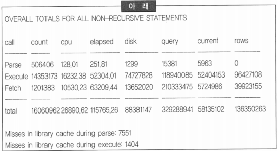
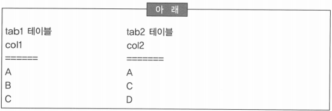
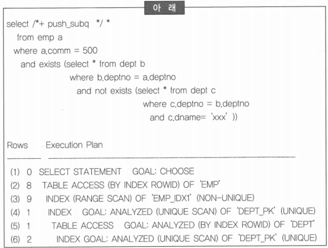
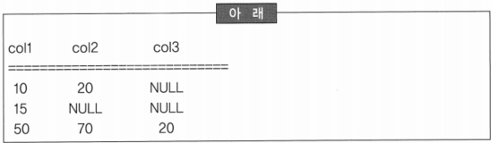
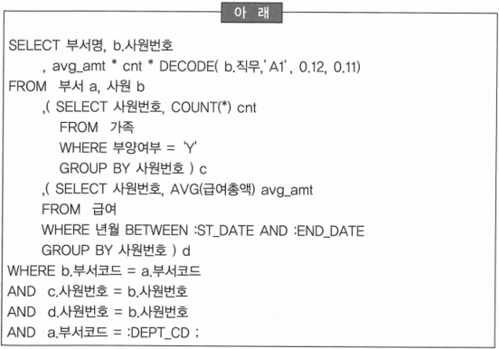
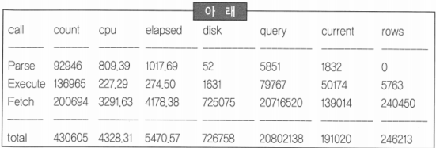
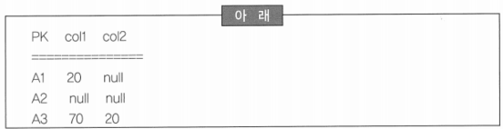
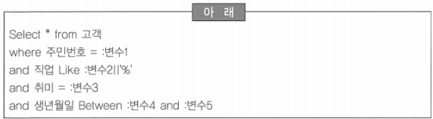
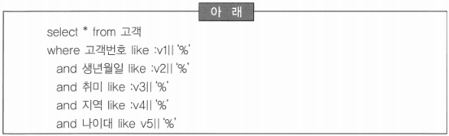

# 318 ~ 340

1. 배치 프로그램의 처리 시간을 단축하기 위해서는 H/W 자원을 최대한 이용하는 것뿐만 아니라 대용량 데이터 처리에 적절한 데이터베이스 기능을 활용해야 한다. 그 외애도 동시 수행되는 타 프로그램의 상황을 고려해야 한다. 다음 중 배치 프로그램의 처리 시간을 단축하기 위한 고려사항으로 부적절한 것은?
    1. 배치 프로그램은 대용량의 데이터를 처리하므로 절대 DISK I/O 시간을 고려해야 한다. 이를 해결하기 위해서는 병렬처리, 테이블 파티셔닝, 멀티 블락 I/O 등을 고려해야 한다.
    2. 대용량 데이터의 집계나 정렬 작업은 최소화하고 필요하다면 가용한 메모리를 확보하여 Disk Swapping이 발생하지 않도록 한다.
    3. ~~랜덤 I/O를 최소화하기 위해서는 Nested-loop 조인보다는 Hash 조인이 효과적이며 Hash 조인은 Build in Table이 사이즈가 큰 테이블이 되도록 한다.~~
    4. 자원의 병목이 없고 처리시간을 단축할 수 있게 작업계획을 작성하고 시스템이 안정화 될때까지는 모니터하여 이상 현상을 방지한다.
    
    → 대용량 처리를 위해서 Hash 조인이 유리하며 Build-in Table의 사이즈가 작고 Probe-in Table 사이즈가 크도록 조인의 순서를 확인
    
    → Build-in Table이 가용한 Hash Area Size 보다 클 경우에는 많은 시간이 소요됨
    

2. 아래의 DDL 문장으로 인덱스 생성하였다. 다음 중 인덱스 디자인을 위해서 조사한 SQL문에서 인덱스 사용이 가능한 것은?
    
    ```sql
    CREATE TABLE tab1 (
    	col1 VARCHAR2(10),
    	col2 NUMBER,
    	col3 VARCHAR2(10));
    ALTER TABLE tab1 ADD CONSTRAINT pk_tab1 PRIMARY KEY (col1);
    CREATE INDEX tab1_idx1 ON tab1 (col3, col2);
    ```
    
    1. SELECT*FROM tab1 WHERE col1 NOT IN (’ABC’, ‘XYZ’)
    2. SELECT*FROM tab1 WHERE col2 = 30
    3. *SELECT*FROM tab1 WHERE col3 LIKE ‘A%’ AND col2 = 50*
    4. SELECT*FROM tab1 WHERE col3 ◊ ‘10’ AND col2 = 100
    
    → NOT IN, ◊, NOT LIKE 등의 부정 연산은 인덱스를 사용할 수 없음
    
    → 결합 인덱스에서 선두 칼럼이 조건으로 제공되지 않으면 해당 인덱스를 사용할 수 없음
    

3. SQL 트레이스는 데이터베이스 인스턴스 또는 세션 단계의 모든 수행 SQL에 대한 통계치 및 대기 이벤트 정보를 수집하는 기능을 제공한다. 다음 중 TKPROF를 수행하여 집계된 OVERALL TOTALS를 분석한 내용으로 틀린 것은?
    
    
    
    1. Parse count(506406) * 0.01보다 Parse CPU time(128.01)이 작게 나타나고 있으나 parse disk 수치가 비교적 높고 Misses In library cache 수치도 높은 것으로 미루어 Dynamic SQL이 많이 사용되고 있거나 라이브러리 캐시가 작게 Setting  된 것으로 판단된다.
    2. ~~Parse count(546406)와 Execute Count(14353173)의 비율로 보아 많은 SQL들이 Hold Cursor로 선언되어 있거나 Loop Query로 수행되고 있는 것으로 보이지만 Array Processing은 전혀 이루어지지 않은 것으로 판단된다.~~
    3. 1회 실행 시에 평균 Disk I/O는 6 Block,  평균 Logical I/O는 26.9 Block이며, 1 Row 당 평균 Disk I/O는 1.5 Block, 평균 Logical I/O는 4.3 Block이 발생하고 있는 것으로 보아 대체적으로 옵티마이징 전략(인덱스, 클러스터)에 문제가 많은 것으로 판단된다.
    4. CPU Fetch Time(10530)과 Elapsed Fetch Time(63209)이 5배 정도의 차이를 보이며, 1회 SQL 실행 시에 평균  CPU Time이 0.002초, 평균 Elapsed Time는 0.008초가 소요되는 것에서 보듯이 개선 여지가 많이 나타나고 있으므로 인덱스 전략 부재에 따른 I/O 비효율이 성능 저하의 주된 원인으로 판단된다.
    
    → Execute Rows(96427108)와 Fetch Rows(39923155)의 비율로 볼 때, DML과 배치처리 비율이 높은 시스템인 것으로 보이며 Fetch Count와 Fetch Rows의 비율을 볼 때 어느 정도 Array Processing 이 이루어지고 있는 것으로 판단됨
    

4. 테이블 tab1과 tab2에 아래와 같이 데이터가 존재할 때, 데이터베이스 집합 연산을 이해하기 위해서 결과 집합을 설명하고자 한다. 다음 중 SQL 실행 결과가 올바른 것은? (단, col1과 col2 칼럼 타입 및 길이는 모두 동일하다.)
    
    
    
    1. SELECT col1 FROM tab1 MINUS SELECT col2 FROM tab2의 결과 집합은 { A, B, D } 이다. → { B }
    2. SELECT col1 FROM tab1 UNION ALL SELECT col2 FROM tab2의 결과 집합은 { A, B, C, D } 이다. → { A, B, C, A, C, D }
    3. SELECT col1 FROM tab1 UNION SELECT col2 FROM tab2의 결과 집합은 { A, B, C, A, C, D } 이다. → { A, B, C, D }
    4. *SELECT col1 FROM tab1 UNION ALL SELECT col2 FROM tab2의 결과 집합은 {  A, B, C, A, C, D } 이다.*

5. 아래의 내용은 SQL을 수행하고 트레이스 파일을 통해 플랜(Plan)을 확인한 결과이다. 다음 중 실행 계획이 수행된 순서를 바르게 연결된 것은?
    
    
    
    1. 3 - 2 - 4 - 6 - 5 - 1
    2. *3 - 4 - 6 - 5 - 2 - 1* 
    3. 3 - 2 - 6 - 5 - 4 - 1
    4. 6 - 5 - 4 - 3 - 2 - 1
    
    → Unnesting Subquery에 대한 설명으로 서브 쿼리는 메인 쿼리 항목을 가지고 있기 때문에 먼저 수행될 수 없음
    
    → 메인 쿼리에서 인덱스를 액세스하고 테이블을 액세스한 후에 서브쿼리를 탐색할 수도 있지만 이런 경우에는 4라인과 3라인이 동일한 위치에서 시작되어야 하고, 그 외에는 안쪽부터 수행
    

6. 합계 연산이 빈번히 발생하는 테이블 tab1에 아래와 같이 데이터가 존재한다. 다음 중 연산 결과가 올바른 것은?(각 칼럼 타입은 Number이다.)
    
    
    
    1. SELECT sum(col2) FROM tab1 의 결과는 NULL이다. → 90
    2. SELECT sum(col3) FROM tab1 의 결과는 NULL이다. → 20
    3. SELECT sum(col1 + col2 + col3) FROM tab1 의 결과는 NULL이다. → 140
    4. *SELECT sum(col2 + col3) FROM tab1 의 결과는 90이다.*
    
    → NULL 값은 SUM, AVG, COUNT 등의 함수 연산에 참여하지 않음
    

7. 조인은 조인을 수행하기 위한 내부적인 매커니즘으로 구분하기도 하지만 조인 조건을 기술한 연산자의 형태에 따라 나누기도 한다. 다음 중 조인의 종류에 대한 설명으로 틀린 것은?
    1. Inner 조인은 Inner 테이블에 조인 조건을 만족하는 집합이 존재하는 경우에만 결과 집합에 참여시키고자 하는 조인 방법이다.
    2. Outer 조인은 Outer 테이블이 존재하는 집합 중에서 Inner 테이블이 조인 조건을 만족하는 집합이 존재하지 않더라도 결과 집합에 참여시키는 조인 방법이다.
    3. 조인 조건은 연산자로 표시하기도 하는데 조인 조건이 등호(=)로 정의되었다면  Natural 조인을 의미한다.
    4. ~~조인 조건을 연산자로 표시할 경우에는 반드시 등호(=)만을 사용하여야 한다~~. → ≥, ≤, between 등의 연산자를 모두 사용할 수 있음

8. 다음 중 배치 프로그램의 처리 시간(Through-put Time)을 단축하기 위한 처리 방법으로 거리가 먼 것은?
    1. ~~부분 범위 처리~~
    2. 전체 범위 처리
    3. 병렬 처리
    4. Nested-loop 조인을 Hash 조인으로 변경
    
    → 배치 프로그램의 개선은 전체 처리 시간을 개선하기 위해서 전체 범위 처리, 병렬 처리, 조인 방식 등의 개선이 필요하며, 자원의 경합 감소를 위해서 작업 계획 실시
    

9. 아래의 SQL문은 부양 가족수에 대한 가족수당을 차등 지급하는 금액을 계산하는 것이다. 다음 중 SQL문의 설명으로 틀린 것은?
    
    
    
    1. 인라인 뷰를 이용하여 모든 집합을 사원 기준으로 1:1이 되도록 조인하였다.
    2. ~~인라인 뷰를 사용함으로써 가족은 사원 집합의 처리 결과를 제공 받아서 처리할 수 있게 되었다~~. → 전체 사원을 대상으로 사원별 가족수가 계산된 후에 해당 부서 사원이 조인 됨
    3. 급여 테이블이 부서와 릴레이션이 있다면 부서 조건을 두 번째 인라인 뷰에 추가하므로 부분적인 개선이 가능하다.
    4. 전 사원의 가족과 급여에 대하여 처리한 후에 조인이 수행된다.

10. 운영 중인 OLTP 시스템에서 심각한 성능 저하 현상이 나타나고 있어 시스템 진단 작업을 위해 트레이스 정보를 아래와 같이 수집하였다. 다음 중 아래의 통계 정보를 보고 분석한 내용으로 부적절한 것은?
    
    
    
    1. Parsing Overhead의 징후가 나타난 것으로 보아 SQL문을 작성할 때 조건절에 바인딩 변수를 사용하지 않았을 가능성이 매우 높다.
    2. SQL문을 저장한 문자열에 사용자로부터 입력받은 상수 값을 결합시켜 동적으로 실행시키는 경우에 많이 나타나는 현상이다.
    3. ~~Execute Elapse/Parse Elapse의 비율이 0.26 정도이므로 Parsing Overhead가 발생하고 있다는 것을 알 수 있다~~. 
    4. 동적으로 작성된 SQL은 사용자 수가 적을 경우에는 문제가 되지 않지만 동시 접속자수가 증가하면 심각한 성능 저하 현상이 발생한다.
    
    → Parse elapse/Execute elapse의 비율이 0.1 정도 이상이면 Parsing Overhead가 있는 것으로 판단하는데, 여기에서는 3.74 정도의 수치가 나왔으므로 parsing Overhead가 매우 심각한 수준임을 알 수 있음
    

11. 운영중인 시스템은 오픈하고 1년 정도 시간이 경과 하였고 데이터가 축적되고 운영과정에서 약 10% 정도의 프로그램이 신규 개발되고 5% 정도 프로그램이 변경되었을 때, 다음 중 성능 개선 작업을 위한 목표 설정 기준으로 가장 부적절한 것은?
    1. ~~DML 문장 1회 실행의 처리 건수~~ → 성능 개선이 목표가 아니고 DML 검증 요소
    2. SQL 처리 시간
    3. 응용 프로그램에서 측정된 데이터베이스 응답 시간
    4. 데이터 이행을 위한 로드 시간

12. 테이블 설계과정에서 Not Null Constraints를 정의하여 데이터 무결성을 강화하고자 한다. 다음 중 아래의 테이블 스키마에 대한 설명으로 부적절한 것은?
    
    
    
    1. Null 값에 대한 비교는 Is Null 또는 Is Not Null로 가능하다.
    2. ‘select sum(col1) from tab’의 결과는 90이다.
    3. ‘select sum(nvl(col2,0)) from tab’와 ‘select nvl(sum(col2)) from tab’은 동일한 결과이나 NVL 함수 수행 횟수는 두 개 문장이 서로 다르다.
    4. ~~‘select nvl(sum(col1 + col2)) from tab’의 결과와 ‘sum(nvl(col1,0) + nvl(col2,0)) from tab’의 결과는 동일하다.~~
    
    →  select nvl(sum(col1 + col2)) from tab = 90, select sum(nvl(col1, 0) + nvl(col2, 0)) from tab = 110
    

13. 운영 중인 시스템을 정기적으로 평가하고 평가 결과에 따라 성능 개선 작업을 실시할 때, 다음 중 성능 개선 방법으로 부적절한 방법은?
    1. ~~효율적인 성능 향상을 위해서 모든 SQL을 대상으로 개선 작업을 실시한다~~. → 성능 개선 목표에 따라서 개선 대상과 범위를 설정
    2. 성능 개선의 효과적인 측면을 고려할 때 가장 많이 실행되는 SQL문을 개선한다.
    3. 트랜잭션 처리에 의한 지연현상도 개선 대상이다.
    4. SQL 성능 개선은 처리 프로그램의 특성에 따라 다른 개선안에 제시된다.
    
    → 개선 대상은 트레이스 기능이나 모니터링 도구를 이용하여 실행 시간, 실행 횟수, 대기 시간, 발생 I/O 등을 고려하여 시스템 자원을 많이 사용하는 순으로 선정
    

14. 병행 제어란 다수의 사용자가 데이터베이스에 동시 접근하여 같은 데이터를 조회 또는 갱신을 할 때 데이터 일관성을 유지하기 위한 일련의 조치를 의미한다. 다음 중 병행제어 시 트랜잭션에 대한 설명으로 부적절한 것은?
    1. ~~상용 데이터베이스는 낙관적 알고리즘을 적용하여 Locking 이나 Timestamp Ordering 을 이용하여 병행 제어를 구현한다.~~
    2. 트랜잭션은 원자성, 일관성, 고립성, 영속성 등의 특성을 가진다.
    3. 영속성은 “변경이 완료된 데이터는 어떠한 고장으로도 손실되지 않아야 한다.”는 의미이며, 이를 보장하는 것이 회복기법이다.
    4. 갱신분실문제와 모순판독문제를 방지하기 위해서 병행 제어를 한다.
    
    → 낙관적 병행제어: 다수 사용자가 동시에 같은 데이터에 접근할 경우가 적다고 보고 구현한 알고리즘
    
    → 비관적 병행 제어: 다수 사용자가 동시에 같은 데이터에 접근할 경우가 많다고 보고 구현한 알고리즘으로, Locking이나 Timestamp Ordering이 있음
    

15. 운영 중인 시스템은 대량 데이터가 외부에서 제공되어 야간에 일괄 적용이 필요한 시스템이다. 이런 작업 주기는 일, 주, 월 단위로 다양하게 발생할 때, 다음 중 배치 작업의 쟁점 사항을 바르게 설명한 것은?
    1. 배치 작업은 장시간의 작업이므로 수행 종료 시간에 한계가 없다.
    2. 오류에 따른 재처리시간은 작업 계획에 포함되지 않는다.
    3. 미처리 또는 지연으로 파급되는 문제 해결은 재작업으로 해소된다.
    4. *미완료 시 대안 제시에 어려움이 있다.*
    
    → 일배치 작업은 익일 영업시간 전에 월배치 작업은 익월전에 작업이 완료되어야 Racing 현상이 발생하지 않음
    
    → 작업계획 시에 오조작이나 장애 등을 대비하여 여유 수행시간을 확보할 수 있게 작업 계획을 세워야 함
    
    → 재작업에 따른 절대 시간이 필요하므로 작업계획 시에 시간이 미확보되면 재작업이 불가능
    

16. 인덱스에서 처리 범위를 결정하는 참여한 조건들을 드라이빙 조건이라 한다. 다음 중 드라이빙 조건에 대한 설명으로 틀린 것은?
    
    
    
    1. “주민번호 + 직업”으로 생성된 결합 인덱스의 경우 주민번호와 직업은 드라이빙 조건으로 사용될 수 있다.
    2. “생년월일 + 직업”으로 생성된 결합 인덱스의 경우 생년월일은 드라이빙 조건으로 사용될 수 있지만 직업은 드라이빙 조건으로 사용될 수 없다.
    3. ~~“직업 + 주민번호”로 생성된 결합 인덱스의 경우 직업과 주민번호는 드라이빙 조건으로 사용될 수 있다~~. → 직업은 드라이빙 조건으로 사용될 수 있지만 주민번호는 드라이빙 조건으로 사용될 수 없음
    4. “주민번호 + 취미”로 생성된 결합 인덱스의 경우 주민번호와 취미는 드라이빙 조건으로 사용될 수 있다.

17. 다음 중 절차적 처리 비효율에 대한 설명으로 잘못된 것은?
    1. 반복 DBMS CALL이 발생한다.
    2. 랜덤 I/O 발생을 유발한다.
    3. 업무 규칙 변경 시에 프로그램 수정이 발생한다.
    4. ~~개별적인 SQL 개선으로 전체적인 최적화를 구현한다.~~ → 개별적인 SQL 개선은 가능하지만 전체 최적화는 불가능

18. 일반 테이블의 경우 데이터 값의 순서에 관계없이 저장되는 구조이기 때문에 어떤 키 값의 순서로 데이터를 검색하고자 하는 경우에는 많은 오버헤드가 발생하여 Cluster Index를 고려할 수 있다. 다음 중 Cluster Index의 설명으로 부적절한 것은?
    1. Cluster Index의 구조는 인덱스부와 데이터부로 나누어져 있으며, 인덱스부는 일반적인 인덱스인 B*Tree 인덱스로 구성되어진다.
    2. ~~키 순서에 따라 데이터가 저장되기 때문에 생성 초기를 제외하고 데이터 페이지의 유지비용이 일반 인덱스 보다 훨씬 적게 소요된다.~~
    3. Cluster Index가 존재할 경우 Non Cluster Index는 RID 대신 Cluster Index의 키 값을 가지게 된다.
    4. 운영 중에 Cluster Index를 생성하면 구조적으로 데이터 페이지의 개편이 일어나야 하므로 많은 오버헤드가 발생하게 된다.
    
    → 데이터가 INSERT될 때는 키 순서에 따라 지정된 위치에 저장되어야 하므로 데이터 페이지의 유지 비용이 매우 높음(데이터 페이지의 Spit 발생 가능성이 높음)
    

19. 다음 중 데이터베이스 서버의 성능 개선 관점에 대한 설명으로 부적절한 것은?
    1. ~~데이터베이스 성능은 시스템 메모리 사이즈가 데이터베이스 사용 영역에 관계 없이 크면 클수록 유리하다.~~
    2. CPU 사용률은 튜닝 대상이기 보다는 평가 항목이다.
    3. 고가용성을 위한 시스템 구성, RAID 구성, 버전 등에 따른 패치 적용이 정상적이지 않을 경우에 성능상 결정적인 영향을 줄 수 있다.
    4. 시스템 메모리는 DBMS를 포함한 사용자 메모리 크기가 전체의 40~60%를 유지하는 것이 적정하다.
    
    → 데이터베이스가 사용하는 메모리 영역에 따라서 Hit율을 일정수준 이상으로 유지한다면 메모리에 따른 성능 개선은 영향을 받지 않음
    

20. 다음 중 부분 범위 처리에 대한 설명으로 틀린 것은?
    1. 논리적으로 전체 범위를 읽지 않고 결과를 얻을 수 없는 경우를 제외하고는 모두 부분 범위 처리가 가능하다.
    2. UNION을 포함한 SQL은 전체 범위 처리를 통해서만 결과를 얻을 수 있다.
    3. ~~ORDER BY를 사용하면 동일한 순서의 인덱스가 존재하여도 전체 범위 처리를 수행한다~~. → ORDER BY를 사용하여도 동일한 순서의 인덱스가 존재하면 부분 범위 처리로 수행됨
    4. 조회 조건이 여러 테이블에 분산되어 있거나 정렬 또는 집계가 필요한 경우에는 부분 범위 처리가 어렵다.

21. 지속적인 데이터베이스 성능을 유지하기 위해서 데이터베이스 모니터링 및 튜닝 툴을 도입하고자 한다. 다음 중 도입 시 고려사항과 각 툴의 장/단점을 취합의 설명이 잘못된 것은?
    1. 최근 성능 개선 작업에 상위 대기 이벤트를 수집하여 정보로 제공하는 도구가 많이 사용된다.
    2. 모니터링은 문제를 발견하기 위한 도구로서 복합적인 문제를 해석하는 것은 사람이다.
    3. 단위 SQL의 문제점을 제시할 수 있으나 그 SQL이 실행하는 프로그램 구조에 대한 개선점을 제시하는데 한계가 있다.
    4. ~~데이터베이스 성능 문제점은 개발이 완료된 후 모니터링과 튜닝 도구를 이용하여 해결이 가능하다.~~
    
    → 성능 문제는 데이터 모델, 데이터베이스 디자인, 프로그램 구조 등 데이터베이스 구축 전체 과정과 관련이 있으므로 데이터베이스 모니터링과 튜닝 도구로 모든 문제를 해결할 수는 없음
    

22. 인덱스 전략을 수립하기 위하여 고객 테이블의 액세스 패스를 조사하는 과정에서 아래의 SQL 문장을 발견하였다. 다음 중 아래의 SQL 문장을 분석한 내용으로 부적절한 것은?
    
    
    
    1. 술어 조건이 전부 like 조건인 것으로 보아 상수 조건이 미입력된 경우에 많이 나타나는 SQL 패턴이다.
    2. 술어 조건이 전부 인덱스를 사용할 수 있는 조건이므로 개별적인 인덱스만 존재한다면 어떤 실행계획이 작성되더라도 성능상의 문제는 발생하지 않을 것으로 판단된다.
    3. 상수 조건이 미입력된 경우가 있다면 실행 계획을 분리하여 상수 조건이 입력되는 경우에 따라서 SQL이 수행될 수 있도록 하여야 한다.
    4. ~~실행 계획을 분리하지 않는다면 위의 SQL은 분포도가 가장 좋은 ‘고객번호’를 인덱스하여 실행계획이 수립될 가능성이 가장 높다.~~
    
    → 고객번호가 입력되지 않는다면 인덱스를 Full로 검색을 해야 하기 때문에 많은 오버헤드가 발생하게 됨
    
    → 아래와 같이 입력 조건이 전부 옵션으로 되어 있다면 입력되는 조건에 따라 SQL이 수행될 수 있도록 실행계획을 분리하는 것이 가장 좋은 최적화 방안