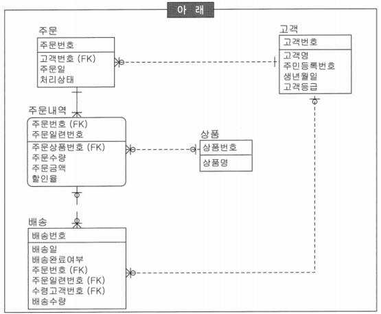
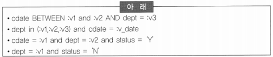
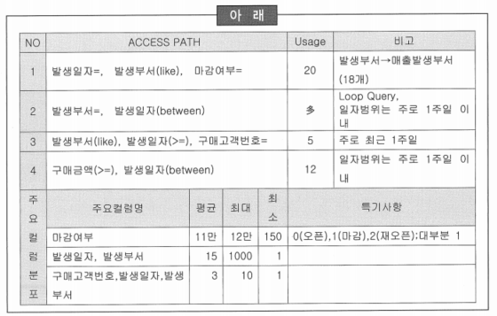
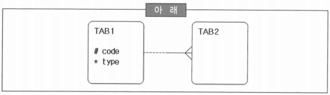

# 요점 정리(261 ~ 275)

# OLTP 시스템 데이터 모델



### 수행 내용

| 아래 |
| :---: |
| 상품, 고객, 주문, 주문내역, 배송 테이블을 설계하는 중이다. 상품은 2만 개의 상품을 관리 중이며 100만 고객을 확보했다. 1일 주문은 만 건 정도이다. |
- 고객번호는 고객 테이블 식별자로 Primary Key를 생성
- 고객 실명 확인을 위해서 주민등록번호를 후보키로 정의. 이에 따라 주민등록번호에 Unique Index를 생성
- ~~배송 테이블의 수령 고객번호는 참조 무결성을 위해 NOT NULL Constraints를 생성~~
    - 참조 관계가 NULL을 허용
- 주문 테이블에는 성능을 고려하여 고객 번호에 인덱스를 생성하고 참조 무결성 조건은 프로그램으로 구현

### 숫자, 일자, 코드 등의 도메인 추출하여 영역 무결성 설계

- ‘수량’, ‘배송수량’ 등은 숫자 타입으로 초기값(Default)을 ‘0’으로 지정
- ‘주문일’, ‘배송일’ 등은 날짜 도메인이므로 비교 연산이나 조회 조건으로 빈번히 이용되므로 문자 타입을 이용하는 것이 편리
- 할인율은 소수점 이하 2자리로 제한
- ‘처리상태’, ‘배송완료여부’ 등은 상태에 따른 코드를 반드시 정의해야 하므로 NOT NULL Constraints를 생성

### ‘주문’과 ‘주문내역’에 대한 참조 무결성을 구현하기 위한 방안

```
주문은 1일 1만건 정도 데이터가 발생되고, 익일 배송을 원칙으로 업무가 진행됨
```

- ~~‘주문’이 없는 ‘주문내역’이 존재할 수 있으므로 응용 프로그램에서 사용자에게 경고 다이얼로그로 등록여부를 확인하고 주문 내역을 등록~~
    - 참조 관계에서 주문은 반드시 주문내역을 갖고 있어야 함
- 삭제 참조 무결성은 ‘주문’이 삭제되면 ‘주문내역’도 연쇄적으로 삭제하도록 데이터베이스 기능을 적용
- ‘주문내역’의 ‘주문상품번호’는 NULL 값을 허용
- ‘주문’에는 반드시 ‘고객번호’가 있어야 하므로 주문 등록 시에 ‘고객’을 생성

### 인덱스 생성후보 도출

- 상품명, 고객명은 빈번히 조회 조건으로 사용되므로 인덱스를 생성
- 참조 칼럼은 FK 제약조건을 생성하지 않더라도 조인 대상이 되므로 인덱스를 생성
- 주문일 + 처리상태는 주문 기간에 따른 상태를 조회하는 경우가 많으므로 후보로 적당
- ~~주문. 처리상태, 배송.배송완료여부, 고객.고객등급 등은 카디널리티를 고려했을 때 비트맵 인덱스를 사용하여 조회 속도를 향상시킴~~
    - OLTP 업무를 위한 데이터 모델이므로 비트맵 인덱스를 사용하는 것은 바람직하지 않음

# 테이블

- 상용 DBMS에서 제공되는 테이블들은 제품마다 명칭 또는 기능에 따라 다소 차이가 있지만 데이터의 접근 방법이나 저장 형태에 따라 몇 가지로 분류할 수 있음

### 테이블에 대한 설명

- 데이터 값의 순서에 관계 없이 데이터를 저장하는 테이블을 Heap-Organized Table이라 함
- ~~Clustered Index는 일반 테이블의 Clustering Factor를 향상시키기 위해서 B-Tree와는 다른 Tree 구조로 데이터 페이지를 저장함~~
    - Clustered Index는 키 값의 순서로 데이터가 저장되며, B-Tree 구조의 Leaf Node에 데이터 페이지가 존재함
    - 인덱스를 통한 액세스보다 접근 경로가 단축되므로 소량 데이터의 랜덤 액세스에 유리
- Partitioned Table은 큰 테이블을 논리적인 작은 단위로 나눈 것으로, 운용적인 측면에서 대용량 I/O성능, 가용성, 확장성 등을 도모할 수 있는 장점을 가짐
- External Table은 파일 데이터를 일반 테이블 형태로 이용할 수 있으며, 데이터웨어하우스(DW)의 ETL 작업 등에서 유용하게 사용할 수 있음

### 테이블스페이스

- 테이블스페이스는 논리적인 데이터 저장공간
    - 데이터 파일은 물리적인 저장 공간
- 데이터와 인덱스를 별도의 테이블스페이스로 정의하고, 정의된 테이블스페이스는 각각의 데이터 파일을 지정하여 I/O 분산을 유도함
- 테이블스페이스는 백업단위나 공간확장단위의 물리적인 파일크기를 적정하게 유지하기 위해서 필요함
- LOB 타입 데이터에는 독립적인 테이블스페이스를 할당

# 칼럼

- 칼럼이 서로 참조 관계일 경우에 데이터 타입이나 길이가 다르면 DBMS 내부적으로 변형을 실시한 후에 비교 연산을 수행하기 때문에 의도와 다른 결과를 초래할 수 있음

### 데이터의 비교 연산에 대한 설명

- 양쪽 모두 CHAR 타입인 경우 두 칼럼의 길이를 비교하여 길이가 짧은 쪽 칼럼에 공백을 추가하여 길이를 동일하게 한 후 비교 연산을 수행함
- 문자열 비교에서 어느 한쪽이 VARCHAR 타입이 있는 경우에는 각각의 문자를 비교하여 서로 다른 값이 나타나면 문자 값이 큰 칼럼이 크다고 판단하고 비교를 종료함
- ~~NUMBER 타입과 CHAR 타입을 비교할 경우에는 CHAR 타입을 NUMBER 타입으로 변환한 후 비교연산을 수행함~~
    - 동등 비교할 경우, CHAR 타입을 NUMBER 타입으로 변환하여 비교 연산 수행
    - CHAR 타입을 NUMBER 타입으로 변환이 불가능할 경우 NUMBER 타입을 CHAR 타입으로 변환
- 각 문자타입이 상수값과 비교될 때는 결정되어 있는 칼럼의 데이터 타입과 같도록 변환된 후에 비교 연산을 수행

# 논리적 데이터베이스 설계

- 현재 사용하고 있는 일부 테이블이 I/O가 빈번하게 발생하고 있어서 I/O 병목을 최소화하기 위한 스토리지 전략을 수립하고자 함

### 논리적 데이터베이스 설계 시에 고려할 사항

- ~~테이블과 인덱스는 연속적으로 액세스가 발생하기 때문에 동일한 공간에 배치해야 함~~
    - 테이블과 인덱스는 분리하여 저장하는 것이 I/O의 병목을 최소화 할 수 있는 길
    - 동시간대에 I/O가 발생하는 것은 분리하고 다른 시간대에 I/O가 발생하는 것은 같은 공간에 배치
    - 인덱스와 테이블은 액세스하는 개별 주체에서 보면 순차적으로 액세스하지만 타 시스템의 입장에서는 항상 동일 시간대에 액세스가 발생할 수 밖에 없음
- 대용량 테이블은 관리적인 용이성을 위해서 독립적인 테이블스페이스를 지정해야 함
- NUMBER 타입과 CHAR 타입을 비교할 경우 NUMBER 타입을 CHAR 타입으로 변환 후 비교를 수행
- 임시 세그먼트 분류 작업이 진행되는 동안 데이터베이스 내부에서 객체가 만들어지는 동적 특성을 가지고 있기 때문에 독립적인 공간을 사용하는 것이 좋음

# 무결성 확보 방안

- 프로그램이 완성되고 데이터가 축적된 후 데이터 클린징을 수행하면 많은 시간과 비용을 지불해야 함

### 데이터베이스 구축 시에 무결성 확보 방안

- ~~데이터의 정확성, 일관성, 유효성, 신뢰성 등을 위한 무효 갱신으로부터 데이터를 보호하기 위해 데이터베이스에서 모든 무결성 제약이 정의되어야 함~~
    - 데이터베이스에서 모든 무결성 제약을 정의할 수는 없으므로 복잡한 규칙에 의해 데이터 상호 간에 유지해야 할 정합성은 응용프로그램 내에서 처리해야 함
- 무결성 종류에 따라 장·단점이 존재하므로 선택적인 적용이 필요함
- 트리거는 이벤트가 발생할 때 저장된 비즈니스 로직을 통해 복잡한 무결성 조건을 처리하는데 유리하지만 트랜잭션이 실패할 확률이 높아지는 단점이 있음
- 데이터베이스 제약조건 기능을 사용하면 대부분의 기본적인 DB 요건은 쉽게 무결성을 유지할 수 있음

# 인덱스

### 클러스터 인덱스

- DB2, SQL Server, Sybase ASE 등에서 지원하고 있는 구조로 테이블 행의 물리적인 순서가 인덱스 키 값과 동일함
- 행의 길이가 페이지 사이즈보다 큰 경우에는 Split 현상이 발생
- 클러스터 인덱스가 만들어질 때 구조적으로 데이터 페이지의 개편이 일어나야 하므로 많은 오버헤드가 발생함
- 일반 테이블보다 데이터를 더 빠르게 액세스 할 수 있음

### B-Tree 인덱스

- 인덱스를 생성한 칼럼 순서로 정렬되어 있음
- 인덱스를 생성한 칼럼을 가공하면 인덱스를 사용할 수 없음
- 대용량 데이터의 입력, 수정, 삭제 등에 가장 적합한 저장 구조
- 분포도가 나빠지면 수행속도가 저하됨

### 인덱스 후보



- dept + cdate 인덱스 생성
    - 등치 조건으로 사용되는 칼럼을 선행 조건으로 해야 함
    - 인덱스 선행 칼럼이 범위 조건이면 Range Scan 일량이 증가

### 인덱스 전략 수립 시에 고려할 사항

- 단일 칼럼의 분포도가 양호하다면 인덱스 간의 변별력이 생길 수 있도록 단일 칼럼 인덱스를 생성하는 것이 좋음
- ~~결합 인덱스는 선행 칼럼이 등호(=)로 비교되지 않으면 인덱스를 사용하지 못하므로 선두 칼럼들은 항상 등호(=) 조건으로만 사용해야 함~~
    - 결합 인덱스는 선행 칼럼이 등호로 비교되지 않으면 인덱스를 사용하지 못함
    - 선두 칼럼들을 항상 등호 조건으로만 사용하게 되면 인덱스의 수가 많아지므로 등호 조건이 아니더라도 항상 사용되는 칼럼인 경우에는 선두 칼럼으로 사용할 수 있음
    - 논리합 연산자나 SUBQUERY를 사용하여 선두 칼럼을 등호 조건으로 변경하게 되면 등호를 사용한 것과 동일한 효과
- 동일한 조건인 경우에는 분포도가 좋은(변별력이 있는) 칼럼을 선행 칼럼으로 정의
- 액세스 경로를 단축하기 위해 정렬 등에 사용되는 칼럼을 적절하게 후보 칼럼으로 활용할 수 있음

### 접근경로를 만족할 수 있는 최적화된 인덱스



- *발생일자 + 발생부서 + 구매고객번호*
    - 결합 인덱스에서 칼럼의 순서는 항상 사용되는 칼럼 → 등치조건 → 분포도 → 정렬 순으로 정의됨
    

# SQL

### 아래 모델을 위해 작성된 동일한 결과 집합의 효과적인 SQL문

```
TAB1과 TAB2는 각 20건, 50만 건이고, 참조 무결성을 위해 FK Constraints가 생성되어 있으며, TAB2의 Code 칼럼에 대하여 인덱스 전략이 수립되어 있음
```



- select code, type from tab1 x where exists (select 1 from tab2 y where y.code = x.code)
    - 일대다 관계에서 M쪽에 존재하는 1쪽 집합을 구한 결과
- 아래 SQL은 1쪽의 집합으로 만들기 위해 SORT 연산을 수행하게 되어 비효율적
    - select x.code, x.type from tab1 x, tab2 y where x.code = y.code group by x.code, x.type
    - select distinct x.code, x.type from tab1 x, tab2 y where x.code = y.code
    - select code, type from tab1 x where x.code in (select code from tab2)